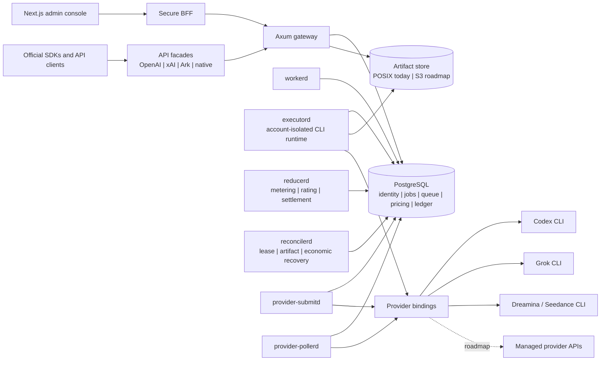
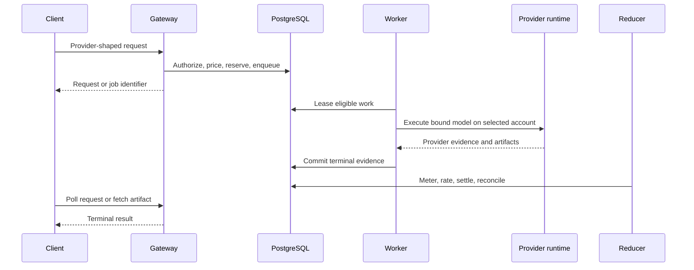

# AI Image Factory

<p align="center">
  Turn image and video CLIs into provider-shaped APIs with multi-account routing.
</p>

<p align="center">
  <a href="https://github.com/B1gM8c/ai-image-factory/actions/workflows/ci.yml"></a>
  <a href="LICENSE"></a>
</p>

<p align="center">
  <a href="README.md">English</a> |
  <a href="docs/README.zh-CN.md">简体中文</a> |
  <a href="docs/README.ja.md">日本語</a> |
  <a href="docs/README.ko.md">한국어</a>
</p>


AI Image Factory exposes Codex, Grok, Dreamina, and other CLIs through
provider-shaped image and video APIs. It routes requests across isolated
accounts by concurrency, weight, health, and quota while managing login, jobs,
outputs, usage, and pricing. Compatibility is adapter-scoped; unsupported
fields are rejected. Account pooling can improve utilization and reduce
per-call cost.

This repository is under active development. The status labels below are part
of the contract:

- **Implemented** means the code path and automated tests exist in this
  repository.
- **Configuration required** means the path is implemented but remains
  unavailable until an operator supplies provider credentials, account
  bindings, pricing, storage, or an activation flag.
- **Roadmap** means intended direction, not a production claim.

## What It Solves

Operating provider CLIs as an API service requires five additional functions:

1. **Provider-shaped API profiles** preserve supported routes, fields, and
   response envelopes and reject unsupported fields.
2. **Multi-account routing** selects an eligible account using configured
   concurrency, weight, health, quota, and model policy.
3. **Durable execution** records jobs, leases, retries, outputs, and terminal
   state in PostgreSQL so work can recover after a process restart.
4. **Usage and pricing** connect each accepted request to a project, model,
   metering result, customer price, and provider cost.
5. **Central operations** provide one console for accounts, quotas, queues,
   users, projects, API keys, audit records, and system health.

## Business Value

| Concern | Platform value |
| --- | --- |
| Provider integration | One contract boundary for managed APIs and isolated CLI runtimes |
| Capacity | Account-aware scheduling, concurrency limits, quota observations, and groups |
| Reliability | Durable leases, idempotency, terminal reduction, artifact cleanup, and reconciliation |
| Cost control | Per-model pricing, immutable metering facts, rating, budgets, and a settlement ledger |
| Multi-tenancy | Organizations, projects, memberships, scoped API keys, and owner-filtered reads |
| Operations | One console for requests, accounts, queues, pricing, users, audit events, and health |
| Migration | External model aliases and per-account model policy decouple clients from upstream names |

## Product Surfaces

### Implemented

- Next.js, React, and shadcn-style administration console with English as the
  default UI language and persistent English, Simplified Chinese, Japanese,
  and Korean switching.
- Axum gateway with identity sessions, JWT access tokens, opaque rotating
  refresh tokens, CSRF protection, and an explicit BFF proxy allowlist.
- Organization, project, membership, API key, model policy, budget, and audit
  boundaries.
- OpenAI-shaped image generation and edit contracts backed by configured
  provider bindings.
- xAI-shaped asynchronous video routes with durable job lookup and file
  delivery.
- Codex, Grok, and Dreamina/Seedance CLI adapter boundaries.
- Provider account isolation, model discovery, model aliases, account groups,
  scheduling weights, priority, concurrency, health, and quota snapshots.
- PostgreSQL-backed jobs, leases, capacity counters, metering, pricing,
  customer charges, and reconciliation work.
- Local POSIX artifact delivery with bounded retention, plus optional
  provider-upload and object-storage integration points.
- Batch admission, request logs, usage views, pricing management, user
  administration, queue inspection, audit logs, and health/readiness views.
- Operator binaries for execution, submission, polling, reduction,
  reconciliation, and webhooks.

### Configuration Required

- Real Codex, Grok, or Dreamina accounts and their isolated credential homes.
- Provider-specific model bindings and external model aliases.
- Positive production prices for every billable metric.
- Grok video activation through the exact execution profile and feature gate.
- Public artifact URLs through a reverse proxy or configured object storage.
- TLS termination, backup, monitoring, alert delivery, and production secrets.
- Real-provider smoke tests; automated CI uses fake or contract-test providers
  unless credentials are deliberately supplied.

### Roadmap

- S3-compatible artifact storage as a first-class production backend.
- Stronger OS/container isolation for untrusted CLI workloads.
- Broader managed-provider API adapters beside CLI execution.
- Evidence-driven multi-node event transport and multi-region control-plane
  deployment.
- A stable provider SDK and conformance suite for third-party adapters.

## Architecture



### Request Lifecycle



The database is the durable coordination boundary. Process-local state is an
optimization, never the source of truth for job ownership, account capacity,
or billing.

## Design Principles

- **Official-shaped edges, provider-neutral core.** Public DTOs remain close
  to the official API being emulated; internal jobs use immutable media and
  provider contracts.
- **Ports before providers.** Scheduling, persistence, execution, and
  artifacts are interfaces owned by their domain, not by a specific CLI.
- **Durability before cleverness.** Lease fencing, idempotency, terminal
  reduction, and recovery evidence are explicit.
- **Economic correctness.** Admission, metering, rating, charging, refunds,
  budgets, and reconciliation are separate transitions.
- **Account isolation.** Each CLI account has an independent credential home
  and runtime binding.
- **Bounded hot paths.** Queue acquisition and capacity accounting avoid
  unbounded scans and high-cardinality runtime labels.
- **Fail closed.** Missing model policy, pricing, identity, or activation
  evidence rejects traffic instead of silently routing or billing at zero.

## Repository Layout

```text
apps/
  admin-console/          Next.js + React operations and creator console
crates/
  api-contracts/          Public provider-shaped wire contracts
  cli-runtime/            Process, workspace, deadline, and artifact runtime
  factory-identity/       Users, sessions, JWT, refresh rotation, and auth ports
  image-gateway/          Axum composition, PostgreSQL adapters, and daemons
  platform-updater/       Signed update planning and installation boundaries
  provider-contracts/     Provider-neutral model, job, and artifact contracts
  provider-dreamina-cli/  Dreamina image and Seedance video adapter
  provider-grok-cli/      Grok image and video adapter
  provider-sdk/           Inline and remote provider execution ports
  provider-test-support/  Provider contract and fake-runtime test support
  scheduler-policy/       Provider-neutral scheduling policy
docs/
  architecture/           Decisions, invariants, activation gates, and evidence
  operations/             Bootstrap, release, recovery, and production runbooks
tools/
  provider-submit-bench/  Isolated PostgreSQL scheduling benchmark
```

The detailed target design is in
[the 2026 architecture document](docs/architecture/2026-ai-image-factory-target-architecture.md).
Operational bootstrap and release gates live in
[the control-plane bootstrap guide](docs/operations/admin-control-plane-bootstrap.md)
and [the production release runbook](docs/operations/production-release.md).

## API Compatibility Boundary

AI Image Factory is not a transparent proxy. It implements deliberate subsets
of upstream contracts and maps them to the capabilities of a configured
provider account.

| Surface | Current boundary |
| --- | --- |
| OpenAI Images | Generation and edit-shaped requests; accepted fields depend on the selected model binding |
| xAI video | Asynchronous create, status, and artifact delivery; disabled until profile and pricing gates pass |
| Dreamina / Seedance | Native adapter and Ark-compatible task boundaries; account capability and route configuration required |
| Admin API | Identity-authorized project and platform operations through the Next.js BFF |

Unsupported upstream fields may be retained in public DTOs for compatibility,
but they must not be advertised as effective until the selected adapter proves
the behavior.

## Console

The same control plane serves operators and creators. User-facing reads are
scoped to the active organization and project; platform administrators can
inspect cross-tenant operational views through explicit admin scopes.
The console defaults to English and persists the selected interface language
in a browser cookie so server-rendered and hydrated content agree from the
first frame. Language selection never changes API payloads, model identifiers,
or audit facts.


## Quick Start

### Prerequisites

- Rust 1.96 (pinned by `rust-toolchain.toml`)
- Node.js 22 or newer and npm
- PostgreSQL 16 or newer for the full control plane
- Provider CLIs only when exercising their real adapters

### Validate the Repository

```bash
npm ci
npm run typecheck:admin
npm run build:admin
cargo test --workspace --locked
```

### Run the Control Plane

The identity-enabled stack needs PostgreSQL, signing keys, a refresh-token
pepper, secure origins, and an initial administrator. Follow the
[reproducible bootstrap guide](docs/operations/admin-control-plane-bootstrap.md)
rather than inventing development defaults.

After the gateway is available:

```bash
export GATEWAY_BASE_URL='http://127.0.0.1:8787'
npm run dev:admin
```

Useful service commands:

```bash
cargo run -p gpt-image-2-gateway
cargo run -p gpt-image-2-gateway --bin workerd
cargo run -p gpt-image-2-gateway --bin executord
cargo run -p gpt-image-2-gateway --bin reducerd
cargo run -p gpt-image-2-gateway --bin reconcilerd
cargo run -p gpt-image-2-gateway --bin provider-submitd
cargo run -p gpt-image-2-gateway --bin provider-pollerd
```

`GET /healthz` is dependency-free liveness. `GET /readyz` performs bounded
database and provider-readiness checks.

## Production Posture

This repository provides production-oriented mechanisms, not a universal
production guarantee. A deployment is ready only after its own release gates
pass:

- TLS reverse proxy and trusted-origin policy
- non-default signing keys, peppers, provider credentials, and database roles
- migrations, backup, restore, and rollback rehearsal
- positive prices and explicit model/account activation
- bounded concurrency and quota policies
- artifact retention and public URL strategy
- health, queue, settlement, storage, and provider alerts
- real-provider image and video smoke tests

See [the production release runbook](docs/operations/production-release.md).

## Roadmap

### 2026 Q3: Public Baseline

- Complete public documentation, screenshots, licensing, security policy, and
  contribution workflow.
- Keep frontend build, Rust tests, migration checks, and secret scanning in the
  release gate.
- Publish a capability matrix that distinguishes contract coverage from
  real-provider evidence.

### 2026 Q4: Provider Operations

- Expand real-account smoke coverage for Codex, Grok, Dreamina, and Seedance.
- Finish provider model discovery, account capability refresh, and operator
  diagnostics.
- Reduce the remaining Clippy baseline and formalize compatibility versioning.

### 2027 H1: Storage and Isolation

- Promote S3-compatible storage to a first-class artifact backend.
- Add stronger CLI process/container isolation and tenant-level database
  enforcement where deployment requirements justify it.
- Expand pricing, metering, reconciliation, and budget evidence.

### 2027 H2: Scale and Ecosystem

- Introduce event transport or multi-region coordination only after measured
  PostgreSQL and operational evidence requires it.
- Stabilize the provider SDK and conformance suite.
- Publish deployment profiles for single-node, high-availability, and
  geographically distributed installations.

## Contributing

Read [CONTRIBUTING.md](CONTRIBUTING.md) before opening a pull request. Changes
should preserve provider-neutral boundaries, include focused verification, and
avoid real credentials or customer data in tests and screenshots.

Security issues must be reported through the process in
[SECURITY.md](SECURITY.md), not a public issue.

## License

Licensed under the [Apache License 2.0](LICENSE).

OpenAI, Codex, Grok, xAI, Dreamina, Seedance, ByteDance, and Volcengine are
trademarks of their respective owners. This project is not affiliated with,
endorsed by, or sponsored by those companies.
