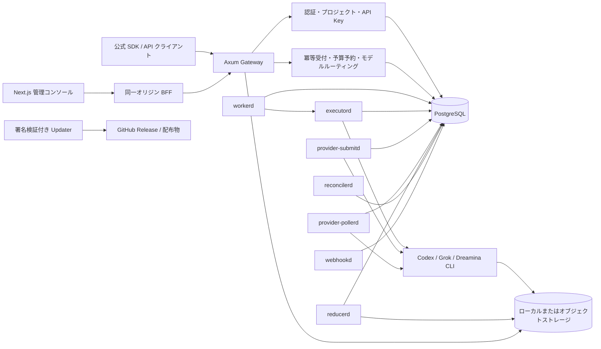

# AI Image Factory

[English](../README.md) | [简体中文](README.zh-CN.md) | **日本語** | [한국어](README.ko.md)

AI Image Factory は、Codex、Grok、Dreamina などの CLI を画像・動画 API として
提供します。API は各公式形式に合わせ、同時実行数、重み、稼働状態、クォータに基づいて
隔離アカウントへリクエストを分配します。ログイン、ジョブ、成果物、使用量、価格は
プラットフォームが管理します。互換範囲はアダプターごとに定義し、未対応項目は拒否します。
複数アカウントの利用により、容量利用率と単位コストを改善できます。

> **現在の位置付け**
>
> 本リポジトリには、実装済みでも本番トラフィック向けには既定で無効な機能が
> 含まれます。プロバイダーアカウント、モデルルート、価格表、実行プロファイルが
> 準備できていない機能は、明示的な有効化なしに利用可能とはみなしません。

## UI プレビュー


スクリーンショットには匿名化したデモデータのみを使用します。実際のプロバイダー
アカウント、資格情報、Prompt、内部パスを公開リポジトリへ含めてはいけません。

管理コンソールは、画像・動画生成、API 呼び出し履歴、使用量、モデル、
API Key、プロバイダーアカウント、スケジューリング、価格、課金、ユーザー、
監査ログ、システム状態を一つのワークスペースにまとめます。

## 解決する課題

CLI を安定した API サービスとして運用するために、次の機能を提供します。

1. **API 適合**：OpenAI Images、xAI 画像・動画 API、Ark/Seedream/Seedance などの
   対応済みルート、項目、レスポンス形式を維持します。
2. **複数アカウントの振り分け**：同時実行数、重み、稼働状態、クォータ、
   モデルポリシーから利用可能なアカウントを選択します。
3. **永続実行**：ジョブ、リース、再試行、成果物、最終状態を PostgreSQL に記録し、
   プロセス再起動後も処理を復旧できます。
4. **使用量と価格**：各リクエストをプロジェクト、モデル、計測結果、顧客価格、
   プロバイダー原価に関連付けます。
5. **一元管理**：アカウント、クォータ、キュー、ユーザー、プロジェクト、API Key、
   監査記録、システム状態を一つの管理画面で扱います。

## 実装ステータス

| 区分 | 状態 | 内容 |
|---|---|---|
| OpenAI 互換 Images API | **実装済み** | モデル一覧、画像生成、複数参照画像を含む画像編集、最終イベント型ストリーミング |
| Codex CLI バインディング | **実装済み** | `gpt-image-2` 系モデル、分離された資格情報ホーム、アーティファクト検証 |
| Files / Batch | **実装済み** | ファイル登録、内容取得、削除、画像生成 Batch、状態取得、キャンセル |
| xAI 互換動画 API | **実装済み・既定無効** | 非同期生成、タスク取得、成果物取得。価格と専用実行プロファイルが必要 |
| Grok CLI | **実装済み・有効化ゲートあり** | 画像生成・編集、画像/参照画像からの動画生成、受領証拠の検証 |
| Dreamina CLI | **実装済み・有効化ゲートあり** | 画像および Seedance 動画のコマンド・送信・ポーリング境界 |
| Volcengine Ark 互換境界 | **実装済み・ルート依存** | Ark 形式の画像およびコンテンツ生成リクエスト |
| 管理コンソール | **実装済み** | Next.js、React、shadcn/ui 系コンポーネント、Vidstack、テーマ切替、英語既定の英・中・日・韓 UI |
| マルチユーザー制御 | **実装済み** | JWT アクセス、ローテーションする不透明 Refresh Token、プロジェクトとメンバー |
| スケジューリング・課金 | **実装済み** | テナント制限、アカウント容量、価格表、予算、台帳、返金・原価割当 |
| Webhook / 監査 / 更新 | **実装済み・運用設定が必要** | 署名 Webhook、監査ログ、リリース検証付きシステム更新 |
| Midjourney 連携 | **計画中** | 実稼働アダプターは未実装 |
| すべてのプロバイダーの完全な公式 API 同等性 | **計画中** | 対応範囲は API プロファイルと有効なモデルルートごとに拡張 |

「クレートが存在すること」と「本番で有効であること」は同義ではありません。
特に Grok、Dreamina、Ark の経路は、アカウント、モデルマッピング、価格、
容量、資格情報、実行プロファイルを明示的に構成して初めて利用できます。

## 主要機能

### 開発者向け

- OpenAI 互換の画像生成・画像編集 API
- xAI 形式の非同期動画 API
- モデル一覧とプロジェクト単位の公開モデルポリシー
- スコープ付き API Key とルート/アカウントグループ割当
- Files API と JSONL Batch
- リクエスト履歴、状態、使用量、料金証拠
- OpenAPI JSON と Scalar API ドキュメント

### 運用者向け

- Codex、Grok、Dreamina の独立した CLI アカウント管理
- OAuth/デバイス認証、再認証、資格情報更新
- 5 時間・7 日・ポイント型クォータの観測
- アカウント単位の最大並行数、優先度、重み、受付モード
- モデルの検出、公開/非公開、外部モデル ID マッピング
- プロジェクト、メンバー、予算、Webhook
- 価格表の版管理、公開判定、公式価格スナップショット
- 顧客課金、クレジット、返金、プロバイダー原価、整合性検査
- キュー、ジョブ、監査ログ、Readiness、システム更新

### クリエイター向け

- 画像生成と複数参照画像による編集
- 画像からの動画生成
- 生成中の非同期状態表示
- 画像ビューアと Vidstack 動画プレイヤー
- 履歴からの再生成、ダウンロード、プロジェクト帰属
- ライト、ダーク、システム連動テーマ
- 英語を既定とし、英語・簡体字中国語・日本語・韓国語をブラウザーに保存して切り替える UI

## ビジネス価値

| 課題 | AI Image Factory が提供する価値 |
|---|---|
| プロバイダーごとに API と運用が異なる | 公式互換ファサードとプロバイダー非依存の内部コマンド |
| 1 アカウントの停止が全利用者へ影響する | 複数アカウント、グループ、容量、クォータを考慮したルーティング |
| CLI 利用は資格情報とプロセス管理が難しい | アカウントごとの資格情報ホーム、実行プロファイル、リース、フェンシング |
| 原価と売価が混ざり利益を説明できない | 版管理された価格、予約、計測、顧客課金、プロバイダー原価の分離 |
| 再試行で二重生成・二重請求が起きる | 冪等性、リクエストハッシュ、終端状態の一意化、調整ワーカー |
| 利用者と管理者で見える範囲が違う | 組織・プロジェクト・ロールに基づくデータ境界 |
| 障害時に処理の所在が分からない | ジョブ、試行、リース、受領証拠、監査ログ、アーティファクトの追跡 |

## アーキテクチャ

本システムは、運用コストを抑えながらトランザクション整合性を維持する
**モジュラーモノリス + 複数ランタイムプロセス**です。現時点でメッセージ
ブローカーを必須にせず、PostgreSQL を制御プレーンと永続キューの正とします。



### 重要な境界

1. **API ファサード**: クライアントが見る認証、DTO、エラー、同期/非同期形式
2. **メディアコマンド**: 永続ジョブへ保存される不変・版付きコマンド
3. **プロバイダーバインディング**: アカウント、モデル、リージョン、価格、容量
4. **実行トランスポート**: マネージド HTTP API、決定的 CLI、エージェント型 CLI

この四つを分離することで、たとえば OpenAI Images 互換 API を Codex CLI で
実行し、将来は同じ公開契約をマネージド API へ差し替えることができます。

## ディレクトリ構成

```text
apps/
  admin-console/          Next.js + React 管理コンソールと BFF

crates/
  api-contracts/          OpenAI、xAI、Ark、Dreamina の公開 DTO
  cli-runtime/            Unix プロセス、作業領域、成果物の共通ランタイム
  factory-identity/       ユーザー、JWT、Refresh Token のドメイン境界
  image-gateway/          Axum API、PostgreSQL アダプター、各サービスバイナリ
  platform-updater/       署名済みリリースの検査・更新・復旧
  provider-contracts/     プロバイダー能力と不変オペレーション記述子
  provider-dreamina-cli/  Dreamina / Seedance CLI アダプター
  provider-grok-cli/      xAI 契約から Grok CLI への安全な投影
  provider-sdk/           インライン/リモート実行ポート
  provider-test-support/  プロバイダー適合テスト支援
  scheduler-policy/       重み付き・クォータ考慮スケジューリング

deploy/
  hooks/                  更新時の停止、バックアップ、検証、復旧
  systemd/                本番プロセス、ターゲット、環境例

docs/
  architecture/           設計判断、状態機械、プロバイダー境界
  operations/             構築、リリース、復旧、GitHub 配布手順

tools/
  provider-submit-bench/  PostgreSQL 送信スケジューラーの分離ベンチマーク
```

複数の `src` ディレクトリは、Cargo ワークスペース内で所有境界を分けるための
通常の構成です。バックエンドの共有ロジックは `crates/`、実際の Web
アプリケーションは `apps/` に置かれます。

## API 互換境界

| API プロファイル | 主なルート | 現在の境界 |
|---|---|---|
| OpenAI Images | `GET /v1/models` | 有効な公開モデルのみ返却 |
| OpenAI Images | `POST /v1/images/generations` | 画像生成。ルート、価格、容量の受付判定を通過する必要あり |
| OpenAI Images | `POST /v1/images/edits` | Multipart 画像編集。複数入力画像に対応 |
| OpenAI Files / Batch | `/v1/files*`, `/v1/batches*` | 現在の Batch 実行対象は画像生成 |
| xAI Videos | `POST /v1/videos/generations` | 非同期開始。既定では無効 |
| xAI Videos | `GET /v1/videos/{request_id}` | タスク状態と結果 |
| Ark / Dreamina | プロファイル別メディアルート | プロジェクトのモデルルート経由で解決 |
| OpenAPI | `/openapi.json`, `/docs` | 実装ルートの機械可読仕様と Scalar UI |
| 運用 | `/healthz`, `/readyz` | プロセス生存と依存関係 Readiness を分離 |

互換性は「任意の公式パラメーターをそのまま CLI に渡す」という意味では
ありません。受け付けた値は版付きコマンドへ正規化され、アダプターが安全に表現
できないフィールドは、黙って無視せず検証エラーまたは未対応として扱います。

## セキュリティと信頼性

- API Key は公開 ID と秘密値を分離し、版付き HMAC-SHA-256 ペッパーで検証
- 管理画面は JWT アクセストークンとローテーションする不透明 Refresh Token を使用
- ブラウザー資格情報は HttpOnly Cookie に保持し、BFF の変更操作は
  Origin、Fetch Metadata、CSRF、Content-Type を検査
- 管理読み取り用 PostgreSQL ロールを、書き込みロールから分離可能
- プロバイダー資格情報、Prompt、アップロード、CLI 生出力を通常ログへ記録しない
- アカウントごとに資格情報ホームと実行プロファイルを分離
- ジョブリースとフェンシングトークンにより、古いワーカーの更新を拒否
- 冪等性キーとリクエストハッシュにより、異なる要求でのキー再利用を拒否
- 終端処理は成果物、課金、計測、Outbox の整合性を一つの境界で確定
- `reconcilerd` が期限切れリース、未確定送信、予約、Outbox を修復
- Webhook は署名され、HTTP またはプライベートネットワーク宛先は既定で拒否
- Gateway と管理コンソールはループバックで動かし、TLS リバースプロキシの背後へ配置
- 更新機能はリリース署名、アーキテクチャ、マニフェスト、復旧ゲートを検証

静的管理トークンは通常運用では既定無効です。互換用の緊急経路を有効にする場合も、
明示的な二重設定が必要であり、ブラウザーへトークンを渡してはいけません。

## Quick Start

### 1. リポジトリを検証する

Rust 1.96、Node.js 22 以降、npm、PostgreSQL 16 以降を準備してください。依存関係を取得し、現在の
ワークスペースを検証します。

```bash
npm install
cargo test --workspace
npm run typecheck:admin
npm run build:admin
```

### 2. 管理コンソールを開発モードで起動する

```bash
npm run dev:admin
```

管理コンソールは `http://127.0.0.1:3010` で起動します。実データの表示とログイン
には、`127.0.0.1:8787` で動作する Gateway と PostgreSQL が必要です。

### 3. Gateway を起動する

本番形状のローカル構築では、最初にマイグレーションを適用します。

```bash
export DATABASE_URL='postgresql://migration_owner@127.0.0.1:5432/ai_image_factory'
cargo build --locked -p gpt-image-2-gateway --bin factoryctl --bin gpt-image-2-gateway
./target/debug/factoryctl migrate
```

次に、リポジトリへ保存しない秘密鍵・ペッパー・API Key 材料を構成し、最初の
管理者を対話的に作成して Gateway を起動します。

```bash
./scripts/generate-admin-identity-secrets.sh \
  /var/lib/ai-image-factory/identity \
  admin-es256-v1

./target/debug/factoryctl bootstrap-admin owner@example.com 'Platform Owner'
./target/debug/gpt-image-2-gateway
```

必要な環境変数、PostgreSQL ロール、TLS/BFF 設定は
[`operations/admin-control-plane-bootstrap.md`](operations/admin-control-plane-bootstrap.md)
に記載されています。秘密値の例をそのまま本番で使用しないでください。

### 4. 動作確認

```bash
curl --fail http://127.0.0.1:8787/healthz
curl --fail http://127.0.0.1:8787/readyz
curl --fail http://127.0.0.1:8787/openapi.json >/dev/null
```

Codex の実資格情報を使う E2E は通常テストとは分離されています。

```bash
npm run smoke:codex
```

## Roadmap

### 現在: 本番クローズ

- GitHub 公開リポジトリと多言語ドキュメント
- Ubuntu 上の systemd 障害注入、バックアップ、復旧リハーサル
- 不変タグと署名済みリリースによる更新チャネル
- 実アカウントを使う Codex、Grok、Dreamina の E2E 証拠
- 既存機能の UX、アクセシビリティ、運用アラートの仕上げ

### 次: プロバイダー運用の完成

- Grok / Dreamina の能力マトリクスと公式 API 差分の継続検証
- モデル検出、手動レビュー、公開ポリシーの完全なライフサイクル
- アカウントクォータ低下、再認証、容量劣化の自動ルーティング
- ローカル保存と既存の S3/Kodo 互換動画出力プロファイルの本番検証・運用強化
- プロバイダー別の原価証拠と価格カタログ更新

### 将来: 規模とエコシステム

- 追加のマネージド API とプロバイダーアダプター
- 複数ノードの実行プールとリージョンルーティング
- 外部イベントストリームと分析基盤への Outbox 配信
- SDK、Terraform/Helm、運用ダッシュボード
- 負荷実測に基づく、必要な場合のみのサービス分割

## コントリビューション

Issue や Pull Request を歓迎します。変更は既存の境界に沿って小さく保ち、
次を確認してください。

1. 公開 API の変更は `api-contracts` と OpenAPI の両方へ反映する
2. プロバイダー固有処理を Gateway ハンドラーへ直接埋め込まない
3. 新しい実行機能は、アカウント、価格、容量、資格情報の有効化ゲートを持つ
4. ログ、Fixture、スクリーンショットへ秘密情報や実アカウント識別子を含めない
5. マイグレーションは追加のみとし、適用済み SQL を編集しない
6. 関連する Rust テスト、TypeScript 型検査、管理画面ビルドを実行する

```bash
cargo fmt --all -- --check
cargo test --workspace
npm run typecheck:admin
npm run build:admin
```

大きな設計変更を提案する前に、
[`architecture/2026-ai-image-factory-target-architecture.md`](architecture/2026-ai-image-factory-target-architecture.md)
と関連するフェーズ文書を確認してください。

## ライセンス

本プロジェクトは [Apache License 2.0](../LICENSE) の下で提供されます。

OpenAI、Codex、Grok、xAI、Dreamina、Seedance、ByteDance、Volcengine は、
それぞれの所有者の商標です。本プロジェクトはこれらの企業と提携、承認、または
後援関係にありません。
