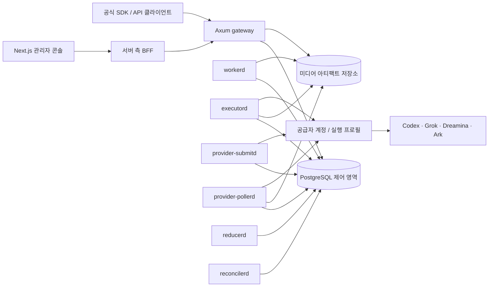

# AI Image Factory

[English](../README.md) | [简体中文](README.zh-CN.md) | [日本語](README.ja.md) | **한국어**

AI Image Factory는 Codex, Grok, Dreamina 등의 CLI를 이미지·비디오 API로
제공합니다. API는 각 공식 형식에 맞추고 동시 실행 수, 가중치, 상태, 할당량에 따라
격리 계정으로 요청을 분배합니다. 로그인, 작업, 결과물, 사용량, 가격은 플랫폼이
관리합니다. 호환 범위는 어댑터별로 정의하며 지원하지 않는 필드는 거부합니다.
다중 계정 풀은 용량 활용률을 높이고 호출당 비용을 낮출 수 있습니다.

> [!IMPORTANT]
> 이 저장소는 빠르게 발전하고 있습니다. 아래에서 **구현됨**, **기본 비활성화**,
> **계획**을 구분합니다. 소스가 존재한다는 사실만으로 해당 기능이 운영 환경에서
> 자동 활성화되거나 특정 공급자의 최신 공식 API와 완전히 동일함을 의미하지
> 않습니다.

## 화면

<p align="center">
  
</p>

<p align="center">
  
</p>

공개 스크린샷에는 실제 계정, 이메일, API 키, 프롬프트, 사용량 및 공급자 자격
증명을 포함하지 않아야 합니다.

## 해결하는 문제

CLI를 안정적인 API 서비스로 운영하기 위해 다음 기능을 제공합니다.

1. **API 형식 유지**: OpenAI Images, xAI 이미지·비디오 API,
   Ark/Seedream/Seedance 등의 지원 경로, 필드, 응답 형식을 유지합니다.
2. **다중 계정 라우팅**: 동시 실행 수, 가중치, 상태, 할당량, 모델 정책에 따라 사용
   가능한 계정을 선택합니다.
3. **영속 실행**: 작업, 리스, 재시도, 결과물, 최종 상태를 PostgreSQL에 기록하여
   프로세스 재시작 후에도 복구할 수 있습니다.
4. **사용량과 가격**: 각 요청을 프로젝트, 모델, 측정 결과, 고객 가격, 공급자 비용과
   연결합니다.
5. **통합 운영**: 계정, 할당량, 대기열, 사용자, 프로젝트, API Key, 감사 기록,
   시스템 상태를 하나의 관리자 화면에서 관리합니다.

## 상태 범례

| 상태 | 의미 |
|---|---|
| **구현됨** | 코드, 데이터 모델 또는 UI 경로가 저장소에 존재하며 테스트 가능한 상태 |
| **기본 비활성화** | 구현은 존재하지만 명시적 기능 플래그, 공급자 계정, 실행 프로필, 가격 또는 운영 설정 없이는 사용할 수 없음 |
| **계획** | 목표 아키텍처 또는 로드맵에만 포함되며 현재 운영 기능으로 간주하면 안 됨 |

## 핵심 기능

### 구현됨

- Axum 기반 이미지·비디오 게이트웨이와 OpenAPI 문서
- OpenAI 호환 이미지 생성, 이미지 편집 및 모델 조회 경로
- 프로젝트 범위 API 키, 사용자 로그인, 짧은 수명의 JWT 액세스 토큰,
  회전형 불투명 리프레시 토큰
- PostgreSQL 기반 작업 승인, 멱등성, 임대, 펜싱 토큰, 재시도 및 터미널
  상태 축소
- 전역·테넌트·공급자 계정 단위의 용량과 가중치 기반 스케줄링
- 할당량 예약, 사용량 계측, 가격 버전, 고객 과금, 공급자 비용 및 원장 정합성
- 로컬/공유 파일시스템 아티팩트 저장, 보존 및 정리 수명 주기
- 작업자, 실행자, 공급자 제출·폴링, 축소 및 조정 프로세스
- OpenAI 호환 Batch의 현재 제한 범위와 JSONL 입력 처리
- Next.js, React 및 shadcn 스타일 컴포넌트 기반 관리자 콘솔
- 영어를 기본값으로 사용하며 영어, 중국어 간체, 일본어, 한국어 선택을 브라우저에
  저장하는 다국어 UI
- 공급자 계정, 모델 매핑, 프로젝트, 사용자, API 키, 가격, 사용량, 작업,
  감사 로그 및 시스템 상태 관리
- 서명된 릴리스와 복구 단계를 전제로 한 Linux/systemd 업데이트 경로

### 기본 비활성화 또는 배포별 활성화

- xAI 형태의 비디오 API는 `GATEWAY_ENABLE_XAI_VIDEO_API=true`와 유효한
  비디오 가격, 모델 경로 및 Grok 실행 프로필이 필요합니다.
- Dreamina와 Grok CLI 어댑터는 독립 계정 자격 증명, 정확한 런타임 프로필,
  모델 바인딩 및 양수 가격이 준비되어야 실제 트래픽을 받습니다.
- 정적 관리자 토큰 인증은 기본적으로 비활성화되어 있습니다. 정상 관리자
  경로는 사용자 세션과 HttpOnly 쿠키를 사용합니다.
- 자동 업데이트는 신뢰할 수 있는 GitHub 릴리스, 아티팩트 검증, 플랫폼에 맞는
  Linux 바이너리 및 systemd 복구 설정이 완료된 배포에서만 사용해야 합니다.

### 계획

- 여러 호스트와 리전을 위한 객체 저장소 운영 프로필 확대
- 공급자별 공식 계약에 대한 더 넓은 골든 호환성 테스트
- CLI 실행을 위한 전용 UID, 샌드박스, cgroup 및 네트워크 정책 강화
- 더 많은 이미지·비디오 공급자와 신규 모델의 검증된 자동 발견
- 대규모 부하에서 검증된 수평 확장 및 다중 리전 복구
- 운영자가 승인한 가격 원본의 자동 동기화와 변경 검토 워크플로

## 비즈니스 가치

| 이해관계자 | 가치 |
|---|---|
| 제품 팀 | 하나의 프로젝트/API 키 모델로 여러 미디어 공급자를 도입하고 교체 |
| 플랫폼 팀 | 공급자 장애, 계정 소진, 동시성 변화에 대응하는 중앙 스케줄링 |
| 재무·운영 | 고객 청구, 공급자 비용, 크레딧, 환불과 원장을 같은 작업 증거에 연결 |
| 보안 팀 | 브라우저, API, CLI 자격 증명과 관리자 권한을 별도 경계로 통제 |
| 최종 사용자 | 이미지와 비디오 생성, 기록, 사용량 및 결과를 일관된 UI에서 이용 |

공급자 선택을 애플리케이션 코드에서 분리하면 신규 모델 도입 속도가 빨라지고,
특정 공급자의 계정 한도나 장애가 전체 제품 중단으로 확대되는 위험을 줄일 수
있습니다.

## 아키텍처



### 핵심 설계 원칙

- HTTP 핸들러는 공급자 CLI를 직접 실행하지 않습니다.
- 공개 API 형식, 불변 미디어 명령, 공급자 바인딩, 실행 전송 방식을 별도로
  모델링합니다.
- PostgreSQL 행과 트랜잭션이 작업·용량·경제 상태의 권위 있는 원본입니다.
- `LISTEN/NOTIFY` 같은 신호는 깨우기 힌트일 뿐, 내구성 있는 큐 자체가 아닙니다.
- 작업 성공은 필요한 아티팩트, 계측, 정산 및 이벤트가 모두 내구성 있게
  기록된 후에만 확정됩니다.
- 공급자 호출은 일반적으로 at-least-once일 수 있으므로 고객에게 보이는 결과와
  경제적 효과는 멱등적으로 정산합니다.

## 디렉터리 구조

```text
apps/
  admin-console/       Next.js + React 관리자 콘솔과 서버 측 BFF
crates/
  api-contracts/       공개 API 요청·응답 계약
  cli-runtime/         공급자 중립 CLI 프로세스 및 출력 경계
  factory-identity/    사용자, JWT, 리프레시 토큰 및 인증 포트
  image-gateway/       Axum API, PostgreSQL 워크플로 및 서비스 바이너리
  platform-updater/    릴리스 검증, 업데이트 상태 및 복구
  provider-contracts/  공급자·모델·미디어·작업 기능 계약
  provider-dreamina-cli/
                       Dreamina 이미지 및 Seedance 비디오 어댑터
  provider-grok-cli/   xAI/Grok 이미지·비디오 CLI 바인딩
  provider-sdk/        인라인·원격 공급자 실행 포트
  provider-test-support/
                       개발용 공급자 적합성 테스트 도구
  scheduler-policy/    공급자 중립 가중치 스케줄링 정책
deploy/
  hooks/               업데이트와 복구 단계
  systemd/             Linux 프로세스 토폴로지
docs/
  architecture/        설계 결정, 불변 조건 및 활성화 게이트
  operations/          부트스트랩, 릴리스, 롤백 및 운영 절차
tools/
  provider-submit-bench/
                       격리된 PostgreSQL 제출 스케줄러 벤치마크
```

여러 `src` 디렉터리는 중복 애플리케이션이 아니라 Cargo 워크스페이스 구성원의
소유권 경계입니다.

## API 호환 경계

| 프로필 | 공개 경로 | 현재 경계 |
|---|---|---|
| OpenAI Images | `GET /v1/models`, `POST /v1/images/generations`, `POST /v1/images/edits` | 구현됨. 지원 필드와 확장 규칙은 저장소의 OpenAPI가 권위 있음 |
| OpenAI Batch | `/v1/files`, `/v1/batches` | 구현됨. 현재는 이미지 생성 JSONL, 24시간 완료 창 및 문서화된 크기/개수 제한 |
| xAI Images | `POST /v1/images/generations` | 구성된 모델 경로가 xAI/Grok 실행 프로필에 바인딩된 경우 사용 |
| xAI Videos | `POST /v1/videos/generations`, `GET /v1/videos/{request_id}` | 구현됨, 기본 비활성화 |
| Dreamina | `/v1/dreamina/images/generations`, `/v1/dreamina/videos/generations` | 경로와 승인 흐름 구현됨. 실제 실행은 계정·프로필·가격 설정 필요 |
| Volcengine Ark | `/api/v3/images/generations`, `/api/v3/contents/generations/tasks` | 경로와 작업 조회 구현됨. 실제 공급자 바인딩은 배포 설정에 따름 |

“호환”은 모든 공급자 요청을 하나의 거대한 공통 DTO로 변환한다는 의미가
아닙니다. 각 API 프로필은 공식 필드, 기본값, 오류 및 동기/비동기 동작을
보존하고 내부에서만 버전이 지정된 미디어 명령으로 투영됩니다. 공급자 공식
사양이 변경될 수 있으므로 운영 배포 전 대상 버전의 OpenAPI와 골든 테스트를
확인해야 합니다.

실행 중인 게이트웨이의 실제 계약은 다음 경로에서 확인할 수 있습니다.

```text
GET /openapi.json
GET /docs
GET /healthz
GET /readyz
```

## 보안과 신뢰성

- 관리자 액세스 토큰과 회전형 리프레시 토큰은 HttpOnly 쿠키에 저장되고,
  브라우저는 허용 목록 기반 BFF를 통해 게이트웨이에 접근합니다.
- API 키는 공개 키 ID와 무작위 비밀로 구성되며 버전이 지정된 HMAC pepper로
  검증됩니다.
- 관리자 읽기 경로는 운영 환경에서 별도의 PostgreSQL 읽기 전용 역할을
  사용하도록 설계됩니다.
- 작업 임대와 공급자 실행은 소유자·epoch·펜싱 토큰으로 보호되어 오래된
  작업자가 결과를 확정하지 못하게 합니다.
- 일반 로그와 계측 이벤트에 자격 증명, 프롬프트, 업로드 원문, CLI 원문 출력,
  base64 미디어를 넣지 않는 것이 불변 조건입니다.
- 이미지·비디오 결과는 성공 확정 전에 검증되고 권위 있는 아티팩트 저장소에
  게시되어야 합니다.
- 조정 프로세스가 만료된 임대, 고아 예약, 불확실한 공급자 결과 및 정리 실패를
  처리합니다.

> [!CAUTION]
> 별도의 CLI 홈 디렉터리와 프로세스 경계는 계정 간 상태 공유를 줄이지만,
> 그 자체로 악의적인 다중 테넌트에 대한 완전한 OS 보안 경계는 아닙니다.
> 신뢰할 수 없는 테넌트를 함께 운영하려면 전용 UID, 샌드박스, cgroup, 파일시스템
> 및 네트워크 격리가 추가로 필요합니다.

## 빠른 시작

### 필수 조건

- `rust-toolchain.toml`에 고정된 Rust 1.96
- Node.js 22 이상과 npm
- PostgreSQL 16 이상
- OpenSSL
- 실제 생성을 검증할 경우 대상 공급자 CLI와 유효한 별도 계정

### 1. 의존성 및 정적 검증

```bash
npm ci
cargo test --workspace --locked
npm run typecheck:admin
npm run build:admin
```

### 2. 데이터베이스 마이그레이션

다음 연결 문자열은 예시입니다. 실제 비밀번호나 자격 증명을 저장소에
커밋하지 마십시오.

```bash
export DATABASE_URL='postgresql://migration_owner@127.0.0.1:5432/ai_image_factory'
cargo build --locked -p gpt-image-2-gateway \
  --bin factoryctl \
  --bin gpt-image-2-gateway
./target/debug/factoryctl migrate
```

### 3. 로컬 관리자 ID 자료 생성

```bash
export IDENTITY_DIR="$(pwd)/.data/identity"
./scripts/generate-admin-identity-secrets.sh "$IDENTITY_DIR" admin-es256-v1
```

동일한 터미널에서 로컬 개발용 ID 환경을 설정합니다. 운영 환경에서는
`GATEWAY_ADMIN_READ_DATABASE_URL`에 반드시 별도의 읽기 전용 데이터베이스
역할을 사용하고, 비밀은 셸 기록이 아닌 비밀 관리 시스템에서 주입하십시오.

```bash
export GATEWAY_ADMIN_READ_DATABASE_URL="$DATABASE_URL"
export GATEWAY_API_TOKEN="$(openssl rand -hex 32)"
export GATEWAY_API_KEY_PEPPERS="1:$(openssl rand -hex 32)"
export GATEWAY_API_KEY_CURRENT_PEPPER_VERSION='1'

export GATEWAY_IDENTITY_ENABLED='true'
export GATEWAY_AUTH_ISSUER='http://127.0.0.1:8787'
export GATEWAY_AUTH_AUDIENCE='ai-image-factory-admin'
export GATEWAY_AUTH_CLIENT_ID='ai-image-factory-admin-bff'
export GATEWAY_JWT_ACTIVE_KID='admin-es256-v1'
export GATEWAY_JWT_PRIVATE_KEY_PATH="$IDENTITY_DIR/admin-jwt-es256-private.pem"
export GATEWAY_JWT_PUBLIC_KEYS="admin-es256-v1:$IDENTITY_DIR/admin-jwt-es256-public.pem"
export GATEWAY_REFRESH_TOKEN_CURRENT_PEPPER_VERSION='1'
export GATEWAY_REFRESH_TOKEN_PEPPERS_PATH="$IDENTITY_DIR/refresh-token-peppers"
```

그 후 TTY에서 최초 소유자를 생성합니다.

```bash
./target/debug/factoryctl bootstrap-admin owner@example.com 'Platform Owner'
```

운영 형태의 PostgreSQL 역할과 권한 검증 절차는
[`operations/admin-control-plane-bootstrap.md`](operations/admin-control-plane-bootstrap.md)를
참조하십시오.

### 4. 게이트웨이와 콘솔 시작

게이트웨이 터미널:

```bash
export GATEWAY_BIND='127.0.0.1:8787'
./target/debug/gpt-image-2-gateway
```

콘솔 터미널:

```bash
export PORT='3010'
export GATEWAY_BASE_URL='http://127.0.0.1:8787'
export ADMIN_CONSOLE_ORIGIN='http://127.0.0.1:3010'
export ADMIN_CONSOLE_CLIENT_ID='ai-image-factory-admin-bff'
npm run dev:admin
```

확인:

```bash
curl --fail http://127.0.0.1:8787/healthz
curl --fail http://127.0.0.1:8787/readyz
curl --fail http://127.0.0.1:8787/openapi.json >/dev/null
```

관리자 콘솔은 `http://127.0.0.1:3010`에서 열립니다. 포트가 열렸다는 사실만으로
준비 완료로 판단하지 말고 로그인, 데이터베이스 읽기 전용 권한, 공급자 계정,
가격 및 실제 미디어 생성 경로를 별도로 검증하십시오.

## 로드맵

### 현재: 운영 폐쇄 루프

- 기존 이미지·비디오 생성, Batch, 가격, 과금 및 관리자 흐름의 회귀 테스트 강화
- 공급자별 실제 계정 E2E와 실패 복구 증거 수집
- 공개 저장소용 문서, 스크린샷, 라이선스 및 릴리스 정책 정리
- Ubuntu/systemd 환경에서 업데이트와 복구 실패 주입 검증

### 다음: 공급자 적합성

- 공식 API 버전별 요청·응답·오류 골든 테스트
- 모델 발견, 관리자 승인, 별칭 및 프로젝트 노출 정책
- 계정 그룹, 가중치, 쿨다운, 할당량 신선도에 따른 라우팅 고도화
- 객체 저장소와 보존 정책의 운영 프로필 확대

### 이후: 확장과 격리

- 전용 실행 샌드박스와 최소 권한 네트워크 정책
- 검증된 다중 호스트 스케줄링과 장애 도메인 분리
- 다중 리전 아티팩트 전달과 재해 복구
- 사용량·비용 예측, 예산 자동화 및 운영 승인 워크플로

로드맵 항목은 일정이나 호환성 보증이 아닙니다. 실제 릴리스 상태는 태그,
릴리스 노트, OpenAPI 및 운영 검증 자료로 판단해야 합니다.

## 기여

1. 이슈에서 변경할 API 프로필, 공급자 또는 운영 불변 조건을 먼저 설명합니다.
2. 변경 범위를 하나의 크레이트 또는 명확한 소유권 경계에 유지합니다.
3. 공급자 공식 계약을 변경하는 경우 요청·응답·오류 골든 테스트를 추가합니다.
4. 스키마 변경은 새 마이그레이션으로 추가하고 기존 마이그레이션을 수정하지
   않습니다.
5. 다음 검증을 실행합니다.

```bash
cargo fmt --all -- --check
cargo test --workspace --locked
npm run typecheck:admin
npm run build:admin
```

실제 공급자 자격 증명, 개인 이메일, 내부 호스트명, 로컬 절대 경로, 프롬프트,
생성 결과 또는 운영 데이터베이스 덤프를 커밋하지 마십시오.

## 라이선스

이 프로젝트는 [Apache License 2.0](../LICENSE)에 따라 배포됩니다.

OpenAI, Codex, Grok, xAI, Dreamina, Seedance, ByteDance 및 Volcengine은 각
소유자의 상표입니다. 이 프로젝트는 해당 회사와 제휴하거나 승인 또는 후원을
받지 않았습니다.
