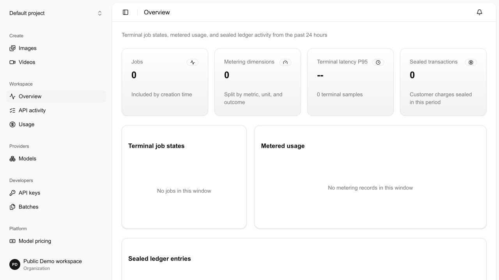
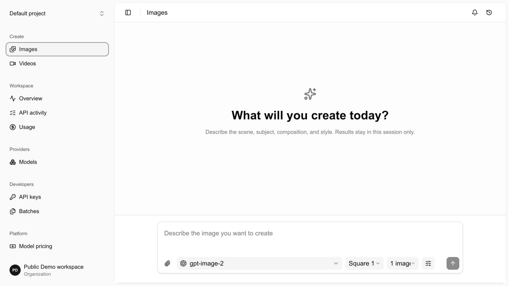
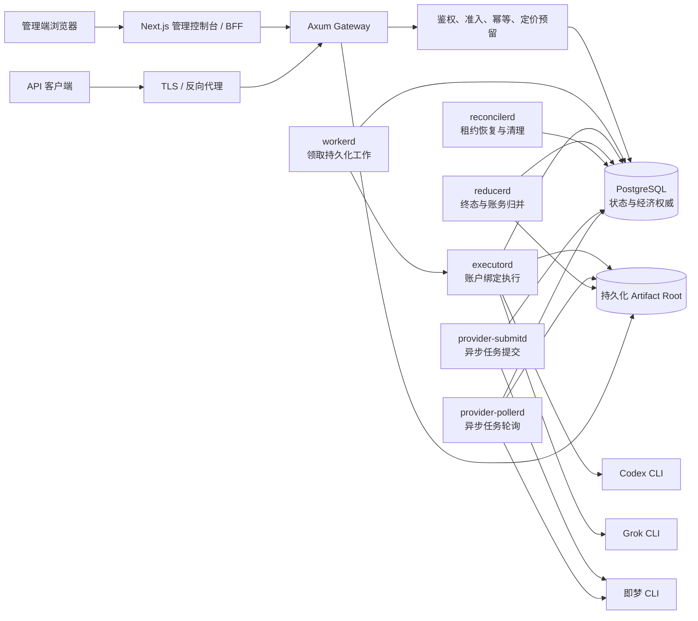

# AI Image Factory

[English](../README.md) | **简体中文** | [日本語](README.ja.md) | [한국어](README.ko.md)

AI Image Factory 将 Codex、Grok、即梦（Dreamina）等 CLI 转为图片和视频 API。接口按各
官方格式设计；请求按并发、权重、健康状态和额度分发到隔离账号。平台统一处理登录、任务、
产物、用量和定价。兼容范围以适配器为准，未支持字段会明确拒绝。多账号池可提高容量利用率，
并降低单位调用成本。

> 本仓库仍处于发布候选阶段。代码包含生产部署与恢复机制，但“仓库中已实现”不等于“任意环境
> 可直接上线”。生产部署必须完成文末所列的迁移、密钥、存储、隔离和发布门禁。

## 界面预览





截图使用脱敏演示数据。真实 Provider 账号、凭据、请求内容和内部运行路径不应提交到公开仓库。

## 解决的问题

将 CLI 稳定地作为 API 服务运行，还需要以下能力：

1. **接口适配**：保留 OpenAI Images、xAI 图像与视频 API、Ark/Seedream/Seedance 等
   已支持的路由、字段和响应结构。
2. **多账号调度**：根据并发上限、权重、健康状态、额度和模型策略选择可用账号。
3. **持久化执行**：使用 PostgreSQL 记录任务、租约、重试、产物和终态，进程重启后可以恢复。
4. **用量与定价**：将每个请求关联到项目、模型、计量结果、客户价格和 Provider 成本。
5. **集中管理**：在一个后台管理账号、额度、队列、用户、项目、API Key、审计记录和系统状态。

## 状态说明

本文使用以下状态，避免把目标架构写成当前事实：

| 状态 | 含义 |
| --- | --- |
| **已实现** | 代码、数据库迁移或界面已经存在；生产仍需正确配置并通过发布门禁 |
| **默认关闭** | 实现已存在，但需要显式配置、有效价格、执行档案或外部基础设施才能启用 |
| **规划中** | 设计方向或 Roadmap 项目，当前不能作为可用能力承诺 |

## 核心能力

### 已实现

- OpenAI 风格图片生成与编辑路由：`POST /v1/images/generations` 与
  `POST /v1/images/edits`。
- 模型发现、OpenAPI 文档、存活与就绪探针：`GET /v1/models`、`/openapi.json`、
  `/docs`、`/healthz` 和 `/readyz`。
- 持久化任务与进程角色：Gateway、Worker、Executor、Reducer 和 Reconciler。
- PostgreSQL 驱动的准入、幂等、租约、调度、结果归并、配额预留与故障恢复。
- Provider 账户、独立凭据目录、并发上限、权重、优先级、账户组与模型路由管理。
- Codex CLI 图片执行通道，以及 Grok CLI 图片和图片转视频执行通道。
- 即梦图片/视频适配器、远程任务提交与轮询基础设施；实际启用需要匹配的账户与运行档案。
- OpenAI 兼容的 Files 与 Batch 基础能力。当前 Batch 仅支持
  `/v1/images/generations`，不支持编辑或视频。
- 多用户控制面：ES256 访问 JWT、轮换式 opaque refresh token、HttpOnly Cookie、
  CSRF 防护、项目、成员、Service Account 和 API Key。
- 版本化定价、不可变计量、客户扣费与退款、Credit Grants、供应商成本记录和账务对账。
- 图片与视频创作工作区、调用记录、用量、批处理、模型能力、Provider 账户、任务队列、审计和
  系统状态界面。
- 管理端默认显示英文，并支持持久化切换简体中文、日语和韩语；语言切换不会改写 API
  载荷、模型标识或审计事实。
- 本地持久化媒体文件，以及 Grok 账户级 S3 兼容输出配置（包括可配置的七牛云 Kodo 端点）。
- 经过签名/证明校验的 GitHub Release 更新流程、迁移与 systemd 恢复门禁。

### 默认关闭或需要外部配置

- **xAI 风格异步视频 API**：代码已实现，但
  `GATEWAY_ENABLE_XAI_VIDEO_API` 默认为 `false`。启用前必须提供准确的 Grok 视频
  execution profile、可用账户、正数 `video_second` 价格和可访问的媒体输出。
- **即梦/Seedance 生产流量**：需要已隔离的 CLI 账户、受信任的可执行文件摘要、
  `provider-submitd`、`provider-pollerd` 及匹配的远程任务档案。
- **项目 Webhook**：需要启用并运行 `webhookd`。
- **自动应用系统更新**：检查与恢复代码已实现，但 `AIF_UPDATE_APPLY_ENABLED` 默认为
  `false`。必须配置固定 GitHub 仓库、发布证明、备份与准入开关钩子后才能开放。
- **静态管理员 Token**：默认关闭，仅保留受控迁移兼容路径；正常管理端使用用户会话。
- **对象存储输出**：不是使用平台的前提。未配置外部输出时，媒体保存在
  `GATEWAY_ARTIFACT_ROOT`；多机部署需要共享且满足持久化语义的 POSIX 存储，或后续对象
  存储后端。

### 当前明确边界

- Codex CLI 路径是经过声明的 OpenAI 图片能力子集，不代表完整 OpenAI GPT Image API
  一致性。
- Grok CLI 图片当前仅接收绑定能够无损执行的字段；不支持的官方字段在准入前返回明确错误，
  不会静默丢弃。
- Grok CLI 视频当前支持图片转视频或参考图转视频的已验证子集。执行器支持的时长与分辨率由
  已验证 CLI 契约决定，不能仅因官方 API 出现新参数就自动放行。
- 即梦 CLI、Ark Seedream/Seedance 与火山引擎视觉 OpenAPI 是不同协议边界，不共享
  认证 DTO、重试策略或任务解析器。
- 文件系统 artifact backend 适用于单机或共享 POSIX 卷；它不是无条件的多区域对象存储方案。
- 上游展示的额度窗口属于运营观测，不是客户账单的权威来源。

## 业务价值

| 角色 | 价值 |
| --- | --- |
| API 使用方 | 使用稳定的模型别名、项目 API Key 和统一调用记录，而无需理解 CLI 登录目录或上游会话 |
| 平台运营方 | 集中管理账户池、额度、并发、模型映射、定价、Credit Grants、退款、审计和健康状态 |
| 财务与风控 | 将客户价格与 Provider 成本分离，使用版本化价格和不可变计量追踪每次经济结果 |
| 工程团队 | 通过 Provider contract、SDK、测试支持与独立 adapter 增加新通道，减少跨模块修改 |
| 可靠性团队 | 借助租约、fencing、reconciliation、artifact retention 和 fail-closed 更新恢复故障 |

## 架构

PostgreSQL 是任务状态、计量和账务数据的权威数据源。不同进程按负载和故障域拆分，但不通过
额外消息中间件复制权威状态。



### 一次请求的生命周期

1. Gateway 解析对应 API profile，完成认证、项目模型策略、规范化和幂等检查。
2. 准入事务锁定相关预算/配额行，选择允许的路由并创建持久化 Job 与 Work Item。
3. Worker 领取带 epoch 的租约；Executor 根据冻结的 Provider、账户、模型和命令描述执行。
4. 同步 CLI 产物经过路径、摘要和媒体格式验证后写入 artifact store；异步 Provider 由
   Submitter/Poller 持续推进。
5. Reducer 在事务中完成终态、计量、定价、账本和可见结果归并。
6. Reconciler 处理过期租约、不确定上游结果、输入清理、留存与失败恢复。

## 目录结构

```text
apps/
  admin-console/           Next.js、React、shadcn/Radix 风格管理控制台与 BFF
crates/
  api-contracts/           公开 API DTO、序列化与兼容契约
  cli-runtime/             无 shell 的进程执行、环境清理与 artifact 读取边界
  factory-identity/        管理用户、JWT、refresh token 与身份端口
  image-gateway/           Axum API、PostgreSQL 实现、业务编排与服务二进制
    migrations/            嵌入式、只追加的 PostgreSQL 迁移
  platform-updater/        签名发布检查、更新事务与恢复状态机
  provider-contracts/      Provider、媒体、Job 与能力契约
  provider-dreamina-cli/   即梦图片和 Seedance 视频 CLI adapter
  provider-grok-cli/       xAI API 到 Grok CLI 的媒体能力投影
  provider-sdk/            Provider 执行端口及通用实现
  provider-test-support/   Provider 一致性测试支持
  scheduler-policy/        Provider 无关的加权调度策略
deploy/
  hooks/                   更新过程的暂停、备份、激活、验证和恢复钩子
  systemd/                 Gateway、后台进程、控制台和更新器单元
docs/
  architecture/            目标架构、阶段决策、能力证据与边界
  operations/              引导、生产发布、备份、回滚与 GitHub Release 流程
scripts/                   密钥生成和发布打包脚本
tools/
  provider-submit-bench/   隔离 PostgreSQL 提交调度基准工具
```

依赖方向以 contracts/SDK 为内层，adapter 依赖抽象，Gateway 负责最终 composition。Provider
crate 不拥有 SQL、租户身份、公共 HTTP DTO、定价或账户选择。

## API 兼容边界

项目采用“每个官方 API profile 独立建模”的方式，而不是宣称所有 Provider 完全兼容：

| API 面 | 当前状态 | 兼容声明 |
| --- | --- | --- |
| `POST /v1/images/generations` | 已实现 | OpenAI/xAI 风格路由；具体字段受所选 binding 能力约束 |
| `POST /v1/images/edits` | 已实现 | 支持的模型与参考图数量由路由能力决定 |
| `POST /v1/videos/generations` | 默认关闭 | xAI 风格异步接口；当前只开放已验证的 Grok CLI 子集 |
| `GET /v1/videos/{request_id}` | 默认关闭 | 返回 Factory Job 状态，不伪造 Provider 原生任务 ID |
| `/v1/dreamina/images/generations` | 已实现，需配置 | 即梦原生 facade 与 CLI 任务执行 |
| `/v1/dreamina/videos/*` | 已实现，需配置 | 即梦/Seedance 提交、查询与文件内容 |
| `/api/v3/images/generations` | 已实现，需路由 | Ark/Seedream profile |
| `/api/v3/contents/generations/tasks` | 已实现，需路由 | Ark/Seedance 异步任务 profile |
| `/v1/files`、`/v1/batches` | 已实现 | Batch 当前仅支持图片生成、24 小时完成窗口及仓库声明的文件限制 |

兼容等级应按具体路由描述为：

- **形状兼容**：路由和主要 envelope 一致，但并非全部语义；
- **能力子集**：支持的字段具有确定行为，不支持的字段明确拒绝；
- **Factory 验证快照**：golden fixture 和凭据探测覆盖了特定日期的声明子集。

这些术语都不表示供应商认证。公开错误响应不会包含 Provider stderr、凭据、内部账户 ID、
上游原始响应或内部任务状态。

## 安全与可靠性

### 身份与租户边界

- 管理端使用短期 ES256 JWT 与数据库中可撤销、轮换的 opaque refresh token。
- 浏览器凭据保存在 HttpOnly Cookie；BFF mutation 校验 Origin、Fetch Metadata、CSRF 和
  JSON Content-Type。
- 数据面 API Key 与管理员会话分离；正常路径不复用静态管理员 Token。
- 项目、成员、Service Account、API Key、模型策略和调用数据按组织/项目归属过滤。
- 管理端读模型可使用 PostgreSQL 强制只读角色，客户端只读设置仅作为纵深防御。

### CLI 与 artifact 边界

- 每个账户使用独立凭据 home，每次执行使用私有 attempt workspace。
- 子进程不经过 shell，清理继承环境，固定可执行文件绝对路径与摘要，并设置超时和进程组回收。
- 命令、输入摘要、账户、模型、execution profile 和租约 epoch 在执行前冻结。
- Provider 输出只有经过路径穿越、符号链接、摘要、大小和媒体格式检查后才能成为平台 artifact。
- 凭据、Cookie、Token、临时下载 URL 和 Provider 原始错误不得写入客户响应或指标标签。

### 状态与经济正确性

- PostgreSQL 同时承担 Job、租约、配额、计量、价格、账本和 outbox 权威，避免跨系统双写。
- Worker、Executor、Reducer 和 Reconciler 使用 lease/epoch fencing，迟到执行不能覆盖
  新所有者的结果。
- 客户价格来自已发布的版本化价格，不直接使用 Provider 展示的 credits 或成本 tick。
- 不确定的远程提交不会被当成确定失败自动重试，以避免重复付费。
- `reconcilerd` 是必需进程，负责过期租约、经济 hold、artifact 和身份数据的收敛。

### 发布与恢复

- 所有 Rust 二进制、管理端和迁移必须来自同一 Git commit。
- 更新器验证 GitHub Release 资产、证明、目标架构与内嵌 Next.js 原生模块。
- systemd recovery gate 会在未完成更新事务存在时阻止业务进程正常启动。
- 数据库与 artifact root 必须作为同一个逻辑恢复点备份；仅恢复其中一边不是有效回滚。

## 快速开始

### 前置条件

- Rust 1.96（由 `rust-toolchain.toml` 固定）
- PostgreSQL 16 或更高版本
- Node.js 22 或更高版本与 npm
- OpenSSL（创建生产形态身份密钥时使用）

### 1. 安装依赖并运行静态检查

```bash
npm install
cargo test --workspace
npm run typecheck:admin
```

### 2. 构建 Gateway、迁移工具和管理端

```bash
cargo build --locked -p gpt-image-2-gateway \
  --bin factoryctl \
  --bin gpt-image-2-gateway
npm run build:admin
```

### 3. 创建数据库并运行迁移

将连接串替换为你自己的本地 PostgreSQL 账号。应用启动会校验迁移，但不会自动执行 DDL。

```bash
export DATABASE_URL='postgresql://migration_owner@127.0.0.1:5432/ai_image_factory'
./target/debug/factoryctl migrate
```

### 4. 引导第一个管理员

完整身份配置需要先按
[`operations/admin-control-plane-bootstrap.md`](operations/admin-control-plane-bootstrap.md)
生成 ES256 密钥、refresh-token pepper，并设置该文档列出的 Gateway 环境变量。随后在交互式
TTY 中执行：

```bash
./target/debug/factoryctl bootstrap-admin owner@example.com 'Platform Owner'
```

密码会被无回显读取两次；不要通过参数或环境变量自动注入初始密码。

### 5. 启动 Gateway 与管理端

```bash
export GATEWAY_BIND='127.0.0.1:8787'
./target/debug/gpt-image-2-gateway
```

在另一个终端启动管理端：

```bash
export GATEWAY_BASE_URL='http://127.0.0.1:8787'
export ADMIN_CONSOLE_ORIGIN='http://127.0.0.1:3010'
export ADMIN_CONSOLE_CLIENT_ID='ai-image-factory-admin-bff'
npm run dev:admin
```

浏览器访问 `http://127.0.0.1:3010`。

### 6. 验证服务边界

```bash
curl --fail http://127.0.0.1:8787/healthz
curl --fail http://127.0.0.1:8787/readyz
curl --fail http://127.0.0.1:8787/openapi.json >/dev/null
```

Provider CLI 的安装、登录、隔离目录、可执行文件摘要和 execution profile 不是 Quick Start
自动完成的步骤。启用真实媒体流量前，请遵循对应架构文档和
[`operations/production-release.md`](operations/production-release.md)。

## Roadmap

### 发布候选收敛

- **已实现**：关键进程、迁移、备份/回滚、更新恢复与浏览器发布门禁已有 runbook。
- **进行中**：在受保护的公开 GitHub Release 上执行真实 Linux 构建、systemd 故障注入、
  安装恢复和不可变资产验证。
- **规划中**：清除全工作区 Clippy warning baseline，并将其升级为 `-D warnings` 发布门禁。

### Provider 与 API

- **进行中**：持续对照官方契约和已安装 CLI 版本更新能力快照，避免参数被静默忽略。
- **规划中**：在不改变公开 facade 的前提下增加直接 xAI、Ark 和 JiMeng OpenAPI adapter。
- **规划中**：当 CLI 或直接 API 提供可验证能力后，扩展视频编辑、视频续写、文本转视频和
  更高分辨率，而不是提前宣称支持。
- **规划中**：为更多 Provider 建立同等级的 conformance、故障恢复和计费证据。

### 存储与规模

- **已实现**：单机/共享 POSIX artifact store、留存清理与账户级 S3 兼容视频输出。
- **规划中**：平台原生对象存储 artifact backend、签名下载和跨节点 artifact authority。
- **规划中**：只有在 PostgreSQL 队列与单区域架构出现可测瓶颈后，才评估 broker 或多区域
  控制面，避免过早引入双写。

### 产品与治理

- **已实现**：项目、成员、API Key、模型策略、用量、账务、审计和运营界面。
- **规划中**：完善用户自助配额、预算提醒、Provider SLA、成本归因和公开状态页。
- **已实现**：默认英文的中英日韩管理界面与可复现的多语言项目文档。
- **规划中**：继续完善公开演示环境和贡献者开发指南。

## 贡献

当前项目正在建立公开贡献流程。在提交 Issue 或 Pull Request 前：

1. 不要提交 Provider 凭据、真实账户信息、客户输入、生成媒体或本地运行目录。
2. 新 API 字段必须说明官方来源、获取日期、默认值、规范化规则和每个 execution binding
   的支持级别。
3. 新 Provider 必须保持依赖方向：contract/SDK → adapter → Gateway composition。
4. 修复调度、账务、幂等或恢复逻辑时，应提供 PostgreSQL 并发或 crash/replay 测试。
5. 至少运行与改动相关的 Rust 测试、`npm run typecheck:admin`；界面改动还应验证生产构建和
   目标视口。

提交改动前请阅读[贡献指南](../CONTRIBUTING.md)。安全问题请按
[安全策略](../SECURITY.md)私下报告，不要创建公开 Issue。

## 许可

本项目使用 [Apache License 2.0](../LICENSE) 许可。

OpenAI、Codex、Grok、xAI、即梦（Dreamina）、Seedance、字节跳动和火山引擎是其各自所有者的商标。
本项目不隶属于这些公司，也未获得其认可或赞助。

## 延伸阅读

- [2026 目标架构](architecture/2026-ai-image-factory-target-architecture.md)
- [多用户控制面](architecture/2026-multi-user-control-plane.md)
- [托管 CLI 账户与路由](architecture/2026-managed-cli-accounts-and-routing.md)
- [Provider 原生定价与计量](architecture/2026-provider-native-pricing-and-metering.md)
- [Grok CLI 与 xAI 图像和视频 API 能力边界](architecture/2026-grok-cli-xai-media-binding.md)
- [即梦 CLI adapter 边界](architecture/2026-phase2b-dreamina-cli-adapter.md)
- [管理控制面引导](operations/admin-control-plane-bootstrap.md)
- [生产发布 Runbook](operations/production-release.md)
- [GitHub Release 部署](operations/github-release-deployment.md)
