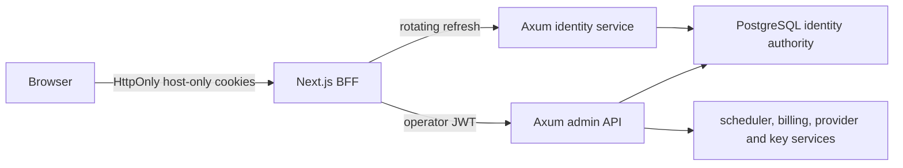

# Admin Identity And Session Architecture

Status: implemented control-plane baseline, hardened 2026-07-20

## Decision

The admin control plane uses:

- five-minute, asymmetrically signed JWT access tokens;
- 256-bit opaque refresh tokens rotated after every successful use;
- PostgreSQL as the authority for users, sessions, rotation families, replay detection, throttling, and audit;
- a Next.js backend-for-frontend (BFF) that keeps credentials out of React and browser storage;
- Axum authorization based on the real operator subject and scopes, never a shared admin identity.

The refresh token is intentionally not a JWT. Rotation and replay detection require server-side lineage and atomic revocation. A stateless refresh JWT would weaken those properties without reducing the database work required for secure logout and revocation.

OAuth 2.1 is still an Internet-Draft as of this decision. The normative baseline is the published [OAuth 2.0 Security BCP (RFC 9700)](https://www.rfc-editor.org/rfc/rfc9700.html), [JWT BCP (RFC 8725)](https://www.rfc-editor.org/rfc/rfc8725.html), and [JWT Access Token Profile (RFC 9068)](https://www.rfc-editor.org/rfc/rfc9068.html).

## Trust Boundaries

React, `localStorage`, `sessionStorage`, IndexedDB, URLs, logs, telemetry, and error bodies must never contain passwords, access tokens, refresh tokens, API keys, provider credentials, or JWT signing keys.

## Database Boundaries

Identity uses the same PostgreSQL service and application schema as the control plane. It does not require a second database. The domain crate depends only on the `IdentityRepository` port; SQL, migrations, pooling, and maintenance stay in the Axum infrastructure crate.

| Table | Authority | Hot-path index |
| --- | --- | --- |
| `identity_users` | Global operator identity, disable state, roles/scopes, authorization epoch | unique normalized email, UUID primary key |
| `identity_password_credentials` | Versioned Argon2id verifier; never plaintext | user UUID primary key |
| `identity_session_families` | Client binding, idle/absolute expiry, immediate revocation | session UUID primary key, active user index |
| `identity_refresh_tokens` | One-use opaque token digests and reuse lineage | token UUID primary key, session lineage index |
| `identity_login_throttles` | Shared account/global admission buckets | HMAC-derived key primary key |
| `identity_audit_events` | Authentication decision history without credentials | actor/session/time indexes |

Migration `0041` makes refresh parent and replacement references same-family foreign keys and unique one-to-one edges. This prevents cross-family lineage and successor fan-out even if a future adapter bypasses the service layer.

## Token Profile

Access tokens initially use `ES256` and a local `kid` allowlist. JOSE `ES256` fully specifies P-256 with SHA-256 and is supported by the selected Rust library and common KMS/HSM products. The polymorphic JOSE `EdDSA` identifier is deprecated by [RFC 9864](https://www.rfc-editor.org/rfc/rfc9864.html); `Ed25519` may be added only after the runtime library supports that fully specified identifier. The validator never follows `jku`, `x5u`, or any token-controlled URL. Every access token requires:

- header: `typ=at+jwt`, the configured algorithm, and a known `kid`;
- claims: `iss`, `aud`, `sub`, `client_id`, `sid`, `jti`, `iat`, `nbf`, `exp`, `scope`, `roles`, and `authz_version`;
- an exact issuer, audience, and client ID match;
- an active database session and current authorization version for privileged admin operations.

Tokens do not contain email addresses, display names, balances, provider credentials, or quota state. Public verification keys overlap during rotation for at least access TTL plus clock skew and cache TTL.

Default policy:

| Control | Value |
| --- | --- |
| Access TTL | 5 minutes |
| Clock skew | 30 seconds |
| Session idle TTL | 8 hours |
| Session absolute TTL | 30 days |
| Refresh entropy | 256 bits |
| Password hash | Argon2id, 64 MiB, 3 passes, 1 lane |
| Password input | 15-1024 UTF-8 bytes for the initial password authenticator |

Argon2 work runs on a bounded blocking pool. Unknown users take the same password verification path as known users. Parameters must be benchmarked on production hardware before launch; [RFC 9106](https://www.rfc-editor.org/rfc/rfc9106.html) is the baseline rather than a fixed folklore value.

## Refresh Rotation

Refresh tokens have the form `aifr_<token-id>.<random-secret>`. The public token ID provides an indexed lookup. PostgreSQL stores only a versioned HMAC-SHA-256 digest of the random secret.

A refresh transaction locks the presented token and its session family, then performs exactly one of these outcomes:

1. Valid and unused: insert one successor, mark the old token consumed, advance idle expiry, and commit an audit event.
2. Secret mismatch or unknown ID: return the same generic authentication failure without revoking a session.
3. Matching token already consumed: revoke the authoritative family row, record `refresh_reuse_detected`, and reject. Descendants become invalid through the family lookup without an O(n) token rewrite.
4. Expired, revoked, disabled, or authorization version changed: revoke or reject according to policy and never issue a successor.

The Next.js client serializes refresh with Web Locks so normal multi-tab use does not create a replay race. The database transaction remains authoritative across processes and hosts.

## Browser Controls

Production cookies use a `__Host-` prefix, `Secure`, `HttpOnly`, `SameSite=Strict`, `Path=/`, and no `Domain`. Development uses separate names because plain HTTP cannot satisfy the production cookie contract.

Every state-changing BFF route requires:

- an exact same-origin `Origin` value;
- `Sec-Fetch-Site` exactly equal to `same-origin`;
- JSON content type;
- a 256-bit double-submit CSRF token in both a non-HttpOnly cookie and `X-AIF-CSRF` header;
- a constant-time token comparison.

Authentication responses use `Cache-Control: no-store`. Logout is POST/DELETE with CSRF protection. The BFF attempts database revocation and always clears browser cookies, so an identity outage cannot leave the operator visibly signed in; a missed upstream revocation remains bounded by idle/absolute expiry and is operationally observable.

## Authorization

The existing image API key authority stays separate. Admin JWTs cannot call image generation routes, and project API keys cannot call admin routes.

Initial scopes are deny-by-default:

- `admin:read`
- `api-keys:read`
- `api-keys:write`
- `providers:read`
- `scheduler:read`
- `scheduler:write`
- `billing:read`
- `billing:write`
- `identity:read`
- `identity:write`

Platform-owner is the only bootstrap role. Tenant and project bindings must be modeled explicitly before non-platform operators are introduced; the existing temporary project-to-tenant mapping is not an authorization source.

This baseline is for control-plane operators, not public self-registration. Adding tenant users requires a separate membership authority keyed by `(tenant_id, user_id)`, membership-scoped roles and an authorization epoch in both session and JWT claims. Global roles on `identity_users` must not be reused as tenant authorization.

## Runtime Contract

The Axum process exposes these private control-plane endpoints:

| Method | Path | Authority |
| --- | --- | --- |
| `POST` | `/admin/v1/auth/login` | Email, password, exact BFF client ID |
| `POST` | `/admin/v1/auth/refresh` | Current opaque refresh token, exact BFF client ID |
| `POST` | `/admin/v1/auth/logout` | Current refresh token; idempotent family revocation |
| `GET` | `/admin/v1/auth/me` | Active access JWT and database session |
| `GET` | `/v1/organization/projects/{project_id}/api_keys` | `api-keys:read` or `admin:*` |
| `POST` | `/v1/organization/projects/{project_id}/service_accounts` | `api-keys:write` or `admin:*` |
| `DELETE` | `/v1/organization/projects/{project_id}/api_keys/{api_key_id}` | `api-keys:write` or `admin:*` |

Identity startup is fail-closed when `GATEWAY_IDENTITY_ENABLED=true`. It requires an issuer, audience, BFF client ID, active key ID, an absolute private-key path, a local public-key allowlist, an active pepper version, and an absolute private pepper-file path. Private files must be regular, non-symlink files with no group or other permissions. The pepper file contains one `version:64-hex-characters` entry per line. Signing material and refresh-token peppers are mounted as files rather than placed directly in process arguments or environment values.

`GATEWAY_LEGACY_ADMIN_AUTH_ENABLED` always defaults to false, including when identity is disabled. Setting it to true opens only the existing static admin-token path for a controlled break-glass window; compact three-segment JWTs never fall back to that path after validation failure. The Next.js console never accepts a production static token in React or browser JSON. Its one-click emergency session exists only in local development and is a random, one-hour, server-signed HttpOnly cookie.

Account and global login attempts are reserved in PostgreSQL before Argon2 work, using domain-separated HMAC keys that do not reveal email addresses. Successful login clears the account bucket; the global bucket remains a bounded cross-instance admission control. The Argon2 admission queue also has a fixed upper bound. Network throttling remains a release gate until the deployment defines a trusted proxy chain and an unspoofable client-address contract; arbitrary forwarding headers are not accepted as security authority.

When the global bucket rejects an attempt, the repository does not create a per-email bucket. This bounds random-email write amplification after overload protection engages. Edge rate limiting remains required to remove the global PostgreSQL row from Internet-scale volumetric traffic.

## Retention And Cost

Active refresh ancestors are retained until their family is revoked or reaches absolute expiry because they are the evidence needed for reuse detection. They are not rewritten during logout or replay revocation. `reconcilerd` uses migration `0041` indexes and `FOR UPDATE SKIP LOCKED` batches to delete:

- expired or revoked session families after a seven-day forensic window, cascading their refresh lineage;
- inactive throttle buckets after 24 hours;
- identity audit events after 180 days.

The defaults are configured with `RECONCILER_IDENTITY_GC_INTERVAL_MS`, `RECONCILER_IDENTITY_SESSION_RETENTION_MS`, `RECONCILER_IDENTITY_THROTTLE_RETENTION_MS`, and `RECONCILER_IDENTITY_AUDIT_RETENTION_MS`. Maintenance runs every five minutes by default and shares the existing reconciler process, so it adds no new service and no work to login, refresh, or authorization requests.

The console BFF proxies OpenAPI JSON but does not proxy the Scalar `/docs` HTML. Scalar currently loads a third-party script and therefore runs only on the separate Gateway origin without console cookies. The console CSP denies third-party scripts and network connections.

## Migration

1. Add identity tables as migration `0034`; historical migrations remain immutable.
2. Add an offline `factoryctl bootstrap-admin <email> <display-name>` command that reads the password from a TTY. Environment-based bootstrap is not a production interface.
3. Enable login, refresh, logout, me, and key-management endpoints.
4. Run a dual-auth migration window. The static admin token is allowed only when an explicit break-glass flag is enabled and is never emitted to a browser.
5. Switch the Next.js BFF to operator JWTs and revoke all legacy browser sessions.
6. Disable the regular shared admin token path before public exposure.
7. Add external OpenID Connect and phishing-resistant WebAuthn/MFA without changing the session and authorization ports.

## Release Gates

The control plane is not production-ready until automated tests prove:

- algorithm, type, issuer, audience, client, lifetime, and `kid` confusion are rejected;
- refresh replay revokes the whole family across two database connections;
- concurrent refresh creates at most one successor;
- cross-origin refresh, logout, create, and revoke requests return 403;
- no credential appears in browser storage, rendered HTML, logs, or telemetry;
- logout, password change, role change, disable, and reuse detection revoke the expected sessions;
- viewers cannot read or mutate another project through the BFF;
- account, network, and global login throttles are shared by all instances.
