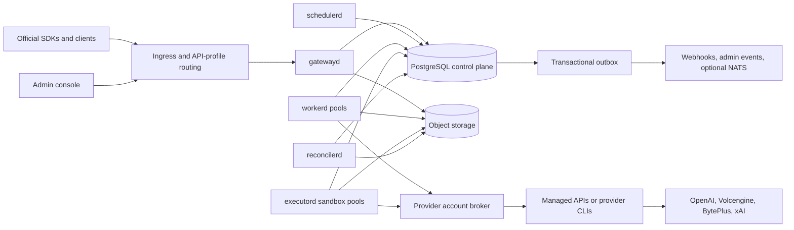
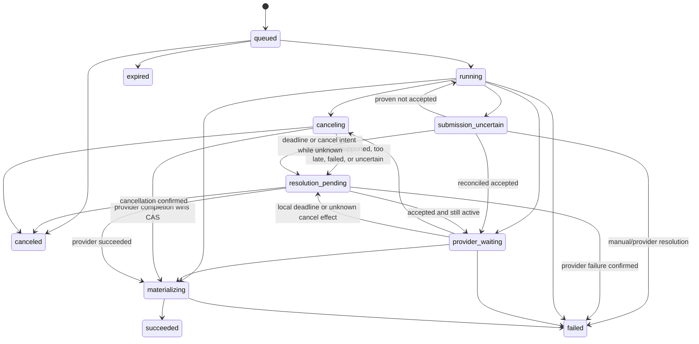

# AI Image Factory 2026 Target Architecture

> Status: proposed target architecture
>
> Reviewed: 2026-07-16
>
> Scope: OpenAI/Codex, Volcengine Ark/BytePlus, Volcengine CV/JiMeng, xAI/Grok,
> durable scheduling, CLI-to-API execution, artifacts, identity, quota, metering,
> billing, operations, and repository structure.
>
> This document supersedes the target-state portions of
> `2026-platform-upgrade.md` and `2026-scheduler-quota-design.md`. Those files
> remain useful as implementation history.

> Implementation checkpoint (2026-07-15): durable admission, PostgreSQL weighted
> scheduling metadata, fenced atomic success settlement, versioned HMAC API keys,
> filesystem artifact persistence, immutable response projections, and generation/edit
> idempotency replay are implemented. Gateway and `workerd` are separate
> processes. `reconcilerd` handles expired claimed/running leases, orphaned
> pre-attach quota reservations, and lease-based edit-input cleanup. The filesystem backend is an interim
> single-host/shared-POSIX-volume deployment profile; S3-compatible storage,
> persistent executor supervision, and ambiguous provider-outcome reconciliation
> were the next target work. OpenAI image generation and edits both use versioned
> durable commands and external `workerd` execution. Edit bytes are stored through
> a provider-neutral `InputBlobStore`; PostgreSQL atomically binds quota,
> admission, ordered input manifests, payloads, and work items. Workers verify
> blob identity and content hashes before provider execution, and successful JSON
> or SSE responses replay across gateway restarts without another provider call
> or charge. Admission-session identity also makes quota reservation retry-safe
> after an unknown commit result and prevents cross-request attach. Input cleanup
> is session-scoped, retries storage failures after a cleanup lease expires, and
> applies only to aborted uploads and succeeded/failed edits; uncertain work keeps
> both its economic hold and inputs. Upload parsing has a separate global and
> per-tenant concurrency gate, and component assembly rejects mismatched artifact,
> input, and settlement storage instances at startup. The external HTTP gateway
> no longer constructs a Codex generator or requires `GATEWAY_CODEX_HOME`; those
> dependencies belong only to `workerd`. Codex outputs are bounded and always
> decoded/re-encoded to remove untrusted metadata. The remaining shared-credential
> risk of an agentic CLI is explicitly not considered hostile multi-tenant
> isolation. Phase 1F now provides an independent `executord`, output-scoped
> Codex adapter, persistent start-or-attach journal, private process spool,
> immutable artifact authority, owner-session guard, and append-only late
> evidence recovery. Real PostgreSQL process tests prove one launch across
> restart, graceful drain, and lease-expired evidence import. V2 remains disabled
> pending database-bound account/resource scope, an external dedicated-UID
> sandbox/cgroup boundary, public API composition, and a credentialed real Codex
> CLI image smoke.

## 1. Executive Decision

AI Image Factory should be a **modular Rust monolith with separately deployable
gateway, scheduler, worker, executor, and reconciler processes**. PostgreSQL is the first
authoritative control-plane store and durable work queue. S3-compatible object
storage is the authoritative media store. Provider APIs and agentic CLIs run in
provider workers or isolated executors, never in HTTP handlers.

The most important architectural separation is not “API versus provider”. It is
the following four independent dimensions:

1. **API facade**: the official request, response, error, auth, streaming, and
   polling contract presented to a client.
2. **media command schema**: the immutable, versioned command accepted into the
   durable job system.
3. **provider binding**: the concrete upstream account, model, region, and
   transport selected for that command.
4. **execution transport**: managed HTTP API, deterministic CLI, or agentic CLI.

These dimensions must never be represented by one enum such as
`OpenAiCodexCli`. Codex CLI can implement an OpenAI Images facade; a future
OpenAI managed API can implement the same facade without changing the public
contract. JiMeng CLI can implement a Volcengine CV command, while Seedream and
Seedance managed APIs implement Ark or BytePlus commands.

The recommended near-term architecture is deliberately not a microservice
fleet. Job admission, quota reservation, leasing, provider capacity, metering,
and settlement have strong transaction relationships. Splitting them across
services and brokers now would increase failure modes without evidence that the
current load requires it.

## 2. Non-Negotiable Invariants

The implementation is correct only if all of these remain true under process
crashes, retries, timeouts, and concurrent workers:

- One accepted idempotency key and request hash creates at most one logical job;
  its minimal uniqueness identity is retained for the lifetime of the project.
- A reused idempotency key with a different request hash is rejected.
- A terminal job cannot transition to another terminal state.
- A stale worker cannot heartbeat, settle, or publish a result after its lease
  has expired or its fencing token has changed.
- A job is not `succeeded` until every required artifact is durable and
  validated, quota/budget settlement is durable, metering is appended, and the
  transactional outbox event exists.
- A quota or budget reservation reaches exactly one terminal outcome: captured,
  released, or explicitly reconciled.
- Provider execution is at-least-once in the general case; customer-visible
  effects and economic settlement are idempotent.
- An ambiguous provider submission is never retried as an ordinary transient
  failure.
- Provider adapters cannot mutate jobs, quota, billing, API keys, or ledgers.
- API handlers cannot execute a provider, spawn a process, or issue provider
  credentials.
- Provider credentials, prompts, uploads, raw CLI output, and base64 artifacts
  never enter normal logs, traces, metering events, or audit payloads.
- A worker process crash cannot lose an accepted job or permanently consume a
  capacity slot.
- No provider/account/tenant capacity limit can be multiplied by adding gateway
  or worker replicas.

## 3. Initial-State Adversarial Findings

This section preserves the findings from the initial architecture review. Some
items have since been addressed by the implementation checkpoint above; the
remaining findings continue to drive later phases.

### 3.1 P0 correctness findings

1. **Quota can be oversold under concurrency.** `reserve` holds a tenant
   advisory transaction lock, but `commit` does not. Under PostgreSQL
   `READ COMMITTED`, a reserve transaction can read committed usage before a
   concurrent commit inserts usage, then read active reservations after that
   commit changes the reservation out of `reserved`. The units are counted in
   neither query.
2. **Client retries are new billable work.** There is no client idempotency key
   or canonical request fingerprint. A lost response after provider success can
   lead to a second generation, provider cost, and customer charge.
3. **Provider/model truth is discarded.** Request validation accepts a model,
   but `GenerationJob` and `EditJob` do not retain it. Persistence then writes
   hard-coded `openai-codex` and `gpt-image-2`, including for snapshot requests.
4. **Lifecycle code bypasses its own state machine.** Job states are duplicated
   in two crates, while SQL writes terminal states directly without expected
   state compare-and-set or fencing.
5. **Partial batches lose economic truth.** Codex executes `n` images
   sequentially. If a later image fails, earlier successful provider attempts
   and costs are discarded while the full customer reservation is released.
6. **The durable job is not executable.** It has no replayable payload,
   idempotency record, attempt, lease, deadline, provider operation, provider
   account, or artifact references.
7. **Current OpenAI behavior is a bridge subset, not full conformance.** The
   implementation discards `user`, validates but does not execute `moderation`,
   rejects GPT Image 2 `input_fidelity`, buffers all results before rendering
   final-only SSE, omits completed-event usage, and has no current golden proof
   that every event field matches the researched official schema. Local
   extensions such as aspect-ratio sizes are not isolated behind a separate
   profile.
8. **The roadmap already misclassifies xAI Images as async.** Official xAI image
   requests are synchronous; xAI video requests are the deferred `request_id`
   workflow. A shared boolean capability matrix cannot represent this safely.

### 3.2 P0 security and isolation findings

1. The agentic CLI shares a persistent `CODEX_HOME` credential domain with a
   prompt controlled by an API caller. `--ignore-user-config` and disabled
   plugins reduce inherited behavior, but do not create an independent OS
   security boundary.
2. Process-group kill and wall timeout do not enforce CPU, RSS, PID, file,
   descriptor, privilege, mount, or egress limits. A host or worker crash also
   bypasses normal cleanup.
3. Artifact discovery can fall back to extension-matching files and read the
   selected file fully into memory. Output size, metadata, trailing payload,
   decode memory, and decode time are not comprehensively bounded.
4. Uploaded media is byte-limited but does not yet have complete pixel, frame,
   metadata, decompression, and isolated decode limits.
5. A shared generated-output directory is coordinated only inside one process;
   it is not safe ownership for multiple worker processes or hosts.

### 3.3 Structural findings

- Multiple `src` directories are normal in a monorepo. The issue is that
  `crates/image-gateway` still owns HTTP, authentication, scheduling, provider
  execution, quota, metering, SQL migrations, OpenAPI, and composition.
- `provider-contracts` is a static roadmap, not the provider execution boundary.
  The actual `ImageGenerator` trait remains image-only, synchronous, byte-based,
  and coupled to an HTTP-aware gateway error.
- `usage/mod.rs`, `openai_codex/mod.rs`, `api_keys/mod.rs`, model parsing, edit
  parsing, docs, and the integration test file are already too large to remain
  stable ownership boundaries.
- Each store creates its own PostgreSQL pool and runs schema DDL at startup.
  Migrations do not have one owner or one controlled execution path.
- Tenant, project, service account, principal, credential, and billing account
  are collapsed into free-form project strings.
- API keys now use a public key ID, 256-bit secret, and versioned
  HMAC-SHA-256 pepper keyring with opt-in legacy SHA-256 migration reads. Scopes,
  validity windows, rotation lineage, per-key policy, and budget restrictions
  remain open.
- A global middleware adds an OpenAI-specific version header to every route. It
  would pollute xAI, Ark, BytePlus, JiMeng, native, and admin profiles if those
  routes were added to the same router without profile-local middleware.

## 4. Options Considered

| Option | Strengths | Failure modes | Decision |
|---|---|---|---|
| Keep one `image-gateway` crate and add folders | Lowest immediate effort | Coupling and large files return with every provider; async video and durable workers remain awkward | Reject as target |
| Modular monolith, separate runtime processes, PostgreSQL queue | One transaction authority, clear Cargo boundaries, low operational cost, incremental migration | We own lease/fairness protocol and must test it rigorously | **Adopt** |
| Microservices with NATS/Kafka now | Independent scaling and team ownership | Dual-write/outbox complexity, distributed transactions, more operations than current load justifies | Defer |
| Temporal workflows now | Excellent timers, retries, cancellation, and long workflows | Provider fairness/capacity still custom; extra control plane; Rust SDK is still Public Preview in July 2026 | Defer |
| Apalis owns the job model | Useful Rust worker middleware and PostgreSQL backend | Current PostgreSQL package is still a 1.0 RC and does not own our economic/fencing/account invariants | Optional shell only |

PostgreSQL explicitly documents `SKIP LOCKED` as suitable for multiple consumers
of a queue-like table. It remains an inconsistent view and therefore must be
used only for claiming work, not for general reads. `LISTEN/NOTIFY` is only a
wakeup hint; committed rows remain the source of truth.

## 5. Target System Context



### 5.1 Process roles

- `gatewayd`: authentication, exact facade parsing/rendering, idempotent
  admission, input staging, synchronous waiting/SSE, and query/cancel APIs.
- `schedulerd`: maintain fairness tags, route/account eligibility snapshots,
  delayed/retry/poll activation, health/cooldown state, and reconciliation-safe
  scheduling metadata. It does not pre-assign a live account lease to an idle
  worker.
- `workerd`: invoke the one atomic claim protocol that selects eligible work and
  acquires capacity/provider-account leases, prepare immutable provider
  submissions, and request atomic settlement. It does not spawn agentic CLIs on
  the V2 path.
- `executord`: own one database-bound provider/account/resource scope, hold the
  OS sandbox and credential lease, and execute output-scoped start-or-attach
  operations through a durable private spool.
- `provider-submitd`: own one frozen remote-task execution profile and its
  provider/account scope, prioritize expired submit recovery, claim prepared
  executor submissions, and perform digest-pinned crash-recoverable CLI
  dispatch. A database runtime lease publishes active/draining state and loss of
  that lease stops new iterations. Dreamina text-to-image and text-to-video use
  this runtime with separate immutable operation descriptors over one native CLI
  command envelope.
- `provider-pollerd`: own one frozen remote-task execution profile and its
  provider/account scope, run bounded provider queries, heartbeat fenced poll
  leases, and materialize immutable provider artifacts. Its process lease is
  independent from task leases and remains live through graceful lane drain.
  Dreamina polling accepts only one verified PNG/JPEG/WebP or structurally valid
  MP4 artifact per output slot and publishes it through the shared fenced stager.
- `reconcilerd`: expired leases, ambiguous submissions, provider deadlines,
  orphan artifacts, stale reservations, outbox delivery, and economic
  reconciliation.
- `factoryctl`: migrations, provider/account administration, diagnostics, and
  controlled repair commands.

They are separate binaries but share domain/application crates and initially
share one PostgreSQL database. This gives deployment isolation without forcing
distributed domain transactions.

## 6. Official API Facades

### 6.1 API-profile routing

OpenAI and xAI both use `/v1/images/generations`, but defaults, model fields,
extensions, errors, and video behavior can diverge. Exact compatibility cannot
be selected only by path. Production ingress should select an API profile by
hostname or dedicated listener:

| Profile | Example base URL | Official paths |
|---|---|---|
| OpenAI | `https://openai.factory.example` | `/v1/models`, `/v1/images/generations`, `/v1/images/edits` |
| xAI | `https://xai.factory.example` | `/v1/images/generations`, `/v1/videos/generations`, `/v1/videos/{request_id}` plus edit/extend paths when implemented |
| Volcengine Ark | `https://ark.factory.example/api/v3` | `/images/generations`, `/contents/generations/tasks`, `/contents/generations/tasks/{id}` |
| BytePlus ModelArk | regional host/profile | `/api/v3/images/generations`, `/api/v3/contents/generations/tasks` |
| Volcengine CV/JiMeng | `https://cv.factory.example` | official `Action` + `Version` signed API operations |
| Factory native | `https://api.factory.example/platform/v1` | `/jobs`, `/jobs/{id}`, `/jobs/{id}/cancel`, `/artifacts`, `/providers` |

For local development, the same profiles may be mounted at explicit prefixes.
The public documentation must not call a prefixed convenience route “official
compatible” unless the corresponding official SDK can use it by changing only
its base URL and credentials.

In production, the trusted ingress maps SNI/host to a fixed profile/listener.
`gatewayd` does not trust a caller-supplied profile header or use the request
model field to guess which contract parser should run.

### 6.2 Contract ownership

Each facade owns all of the following and tests them independently:

- typed request DTOs and unknown-field behavior;
- multipart/JSON parsing and byte limits;
- defaults, model aliases, validation order, and status codes;
- error envelope and safe provider-error translation;
- response projection and temporary URL behavior;
- SSE event names, ordering, and final event semantics;
- pagination and polling states;
- authentication scheme and rate-limit/usage headers;
- an OpenAPI or golden-fixture snapshot tied to a researched contract date.

Internal errors are classified without HTTP status. Each facade has its own
renderer. No provider stderr, account ID, upstream credential, raw provider
body, or internal job state leaks through an official error response.

Compatibility is reported in explicit levels:

- **shape-compatible**: official route and broad envelope, not all semantics;
- **capability subset**: exact behavior for a documented subset and explicit
  rejection for unsupported official capabilities;
- **factory-verified contract snapshot**: golden and credentialed probe suites
  cover the documented subset as of an explicit retrieval date. This is not
  vendor certification.

The current Codex path is a capability subset. It must not be marketed as full
OpenAI GPT Image 2 conformance; any stronger claim must name the exact
factory-verified subset and retrieval date.

### 6.3 OpenAI Images profile

- Preserve `POST /v1/images/generations` and `POST /v1/images/edits` exactly.
- Treat GPT Image 2 and its official snapshot as OpenAI model identities.
- Codex CLI is an execution binding, not part of the API model name.
- Preserve current GPT Image 2 geometry and edit fields, including arbitrary
  legal `WIDTHxHEIGHT`, `input_fidelity`, `partial_images`, and completed-event
  usage where the official contract defines them. A binding that cannot honor a
  capability is declared a subset; the facade must not silently discard it.
- A synchronous request creates a durable job and waits for its terminal event.
  Client disconnect does not erase the job.
- True partial events are emitted only when the selected binding provides true
  partial artifacts. Codex may support final-only SSE for `partial_images=0`;
  unsupported partial requests are rejected by the OpenAI facade.
- Base64 responses are projected from durable artifacts. Large bytes are not
  stored in PostgreSQL or in an idempotency response blob.

### 6.4 xAI image and video profile

- Images retain xAI's OpenAI-style endpoint and xAI-specific model/options.
- xAI image generation/editing is synchronous and owns xAI-specific fields such
  as aspect ratio, resolution, storage/output objects, and cost ticks.
- Video generation is asynchronous: create returns `request_id`, and GET polls
  `pending`, `done`, `expired`, or `failed` according to the xAI profile.
- Generated provider URLs are copied into factory object storage before the
  local job is final. The facade may return a factory-signed temporary URL with
  the official response shape.
- Provider cost ticks are captured as provider receipts and never trusted as
  the customer price by themselves.

### 6.5 Ark/BytePlus and JiMeng profiles

These are not one API family:

- Ark/ModelArk image generation uses `/api/v3/images/generations`, supports
  Seedream-specific parameters, URL/base64 output, and model-specific streaming.
- Ark/ModelArk Seedance video generation creates a task, then queries/cancels
  that task; callback delivery is an optimization, not the sole completion
  path.
- Volcengine CV JiMeng operations use action names, API versions, fixed
  `req_key` values, task submit/query pairs, and the Volcengine signing model.
  Response projection first evaluates the outer business `code` (success is
  commonly `10000`) and then the task status/result; a task status alone is not
  interpreted without the operation's documented result fields.

An exact CV-compatible facade therefore needs gateway-issued signing
credentials and signature verification. Replacing it with a Bearer token while
claiming official compatibility is incorrect. Bearer credentials may still be
offered by the factory-native API.

### 6.6 Native jobs API

The native API is the stable escape hatch for long-running or cross-provider
operations. It does not accept an unvalidated `provider_options` bag. It accepts
a versioned command schema and typed payload:

```json
{
  "command_schema": "ark.video.generate.v2026-06",
  "model": "doubao-seedance-1-0-pro-250528",
  "payload": {
    "content": [
      {
        "type": "text",
        "text": "A slow camera move through a rain-lit city street"
      }
    ],
    "return_last_frame": true
  },
  "deadline": "2026-07-10T13:00:00Z"
}
```

The facade validates the typed payload before admission. The durable envelope
stores `command_schema`, its version, a canonical request hash, the original
model, and an immutable payload reference. A provider binding advertises the
exact schema versions it can execute.

The internal operation family is a tagged union, not a lowest-common-denominator
struct: `ImageGenerate`, `ImageEdit`, `ImageSequence`, `VideoGenerate`,
`VideoEdit`, and `VideoExtend`. Each variant retains typed roles, geometry,
audio/video inputs, delivery controls, batch-item semantics, and versioned native
options required by its source contract.

## 7. Request-to-Artifact Lifecycle

```mermaid
sequenceDiagram
    participant Client
    participant Gateway
    participant PG as PostgreSQL
    participant Scheduler
    participant Worker
    participant Provider
    participant Store as Object storage

    Client->>Gateway: Official request + credential + optional idempotency key
    Gateway->>Gateway: Select profile, authenticate, preflight fields
    Gateway->>PG: Claim admission session and idempotency identity
    Gateway->>Store: Owner stages inputs; challenger consumes and hashes only
    Gateway->>PG: Finalize accept transaction with canonical hash
    Note over Gateway,PG: attach manifest + quote + holds + job + work item + outbox
    PG-->>Gateway: job_id
    Scheduler->>PG: Maintain fair order and activate eligible work
    Worker->>PG: Atomic claim + route/account/capacity lease + epoch
    Worker->>PG: prepare_submission(sending, stable submission key, epoch)
    Worker->>Provider: submit(command, account lease)
    alt provider completes synchronously
        Provider-->>Worker: result stream + receipt
        Worker->>Store: durable submission-scoped staging + validated manifest
        Worker->>PG: record completed outcome with durable manifest
    else provider accepts asynchronously
        Provider-->>Worker: provider operation handle
        Worker->>PG: record accepted handle and schedule poll
        Worker->>PG: release worker lease, keep outstanding provider allocation
    end
    Worker->>Store: publish immutable attempt-scoped or content-addressed objects
    Worker->>PG: fenced settlement transaction
    PG-->>Gateway: terminal event via re-read + wakeup hint
    Gateway-->>Client: profile-specific response/SSE/poll result
```

### 7.1 Admission order

The correct order is:

```text
profile route -> authenticate -> scope/policy -> request rate limit
-> preflight admission/idempotency claim -> stream/validate/hash staged inputs
-> finalize canonical hash -> quote -> quota/budget reserve
-> attach manifest -> create job/work -> enqueue
```

No worker permit is acquired before quota admission. No provider call is made
inside the admission transaction.

### 7.2 Idempotency

`idempotency_requests` is unique by `(project_id, api_profile, operation,
idempotency_key)`. A short preflight transaction creates or claims an
`admission_session` before input bytes are staged. Only the owner receives a
session-scoped durable staging prefix. A challenger is still subject to the
same byte, time, parser, and rate bounds, but consumes and canonicalizes the
entire request through a hash-only sink. It cannot receive an existing result
until that hash has been compared with the accepted owner's hash. The final
accept transaction stores the canonical request hash, job ID, state, and
response projection reference.

- Same key and same hash returns or waits on the same job.
- Same key and different hash returns profile-specific conflict semantics.
- A completed replay reconstructs base64/URL output only while the response and
  artifacts are retained. After response retention expires, the same key and
  same hash returns a profile-shaped `idempotency_result_expired`/HTTP 410
  projection; it never creates a replacement job.
- A concurrent replay never creates another provider operation.
- Nonterminal jobs, ambiguous submissions, unresolved cancellation/deadline
  outcomes, and economically unreconciled jobs never lose their uniqueness.
- Terminal jobs retain a minimal `(project, profile, operation, key_digest,
  request_hash, job_id, outcome)` uniqueness record for the lifetime of the
  project, independent of artifact, response, billing, and dispute retention.
  Project deletion follows the compliance deletion policy while retaining only
  a non-reversible deduplication digest when legally permitted.
- If a facade does not officially define an idempotency header, the factory may
  support it as a documented extension without changing the response body.
- A request without a client idempotency key is explicitly at-least-once from
  the client's perspective; automatic client retries are not claimed safe.

If preflight or final admission fails, the session is marked aborted and its
staged objects are removed by a retention-based sweeper. Concurrent reuse of a
key while the owner is `receiving` may wait or return a profile-shaped
`idempotency_in_progress` error, but it cannot return an existing job/result and
does not create a second staging owner. Once the owner is accepted, a
challenger's hash-only pass decides same-request replay versus conflict.

### 7.3 Multi-output jobs

An `n > 1` image request is one user-visible job with `n` durable output units.
Each output unit has independent work, attempts, artifacts, and provider cost.
The facade decides whether partial delivery is legal. Even when the facade must
return an all-or-error response, successful provider attempts remain metered
and reconcilable instead of disappearing.

Each output is finalized by `settle_output`. That transaction locks the output,
its work item, economic reservation slice, and the parent job; deduplicates the
receipt; references durable artifacts; appends metering/rating/ledger effects;
and terminalizes the output exactly once. While holding the parent job lock, a
pure aggregate reducer evaluates all required outputs and the profile's partial
delivery policy. Only the transaction that observes the aggregate terminal
condition may release unused parent reservation, write the single job terminal
transition, and append its terminal event/outbox row. Thus the last required
output, or the first output that makes success impossible under an all-or-error
policy, uniquely closes the job.

## 8. State Model

Quota reservation, work leasing, provider operation, artifact, and job status
are independent state axes. They must not be flattened into one oversized job
enum.

### 8.1 Job aggregate



`cancel_requested_at` is an orthogonal intent. A provider can complete while a
cancel request races with it; a compare-and-set transition and billing policy
decide the one final state. “HTTP request timed out” is not automatically “job
canceled”. A local deadline creates cancellation/reconciliation work; it does
not release provider allocation, quota, budget, or economic holds while the
provider effect is unknown.

Provider cancellation has its own outcome state:

```text
requested -> accepted | not_supported | too_late | retryable_failed | uncertain
```

Only a confirmed provider terminal result, a proven absence of provider effect,
or an audited manual reconciliation can close `resolution_pending`. This rule
prevents long-running video tasks and unknown CLI/provider costs from silently
losing their account allocation or economic record.

### 8.2 Work item

`ready -> leased -> succeeded | retry_wait | dead`, with
`retry_wait -> ready` after `available_at` and expired leases recovered through
reconciliation under a new epoch.

Work kinds are `submit`, `poll`, `cancel`, `materialize`, `settle`, `webhook`,
and `reconcile`. An async provider wait never holds a worker lease. Poll work is
low-cost and isolated from generation capacity.

### 8.3 Provider submission

`not_sent -> sending -> accepted | completed | rejected | uncertain`

The `uncertain` state is required when the request may have reached the provider
but the response was lost. Retry is allowed only after provider idempotency,
provider lookup, callback evidence, or reconciliation proves it safe.

Before any network/process side effect, `prepare_submission` durably records
`sending`, a stable internal submission ID, the provider idempotency key where
supported, attempt ID, and current lease epoch. An expired `sending` record
becomes `uncertain`; it is never reset to `not_sent` by lease recovery.

### 8.4 Reservations and artifacts

- Quota/budget: `held -> captured | released | expired -> reconciled`.
- Artifact: `staged -> validating -> ready | quarantined -> deleted`.
- Provider account allocation: `active -> released | expired -> reconciled`.

Reservation/allocation expiry is a recovery signal, not permission to erase an
unknown provider effect. Uncertain/resolution-pending records retain their
economic and provider-account linkage until reconciliation decides capture,
release, refund, or adjustment.

## 9. Scheduler and Consumer Design

### 9.1 Canonical queue

PostgreSQL stores ready work. A worker invokes the scheduler claim service,
which uses a short transaction with
`FOR UPDATE SKIP LOCKED`, a deterministic order, and a partial index over ready
rows. A claim atomically:

1. chooses an eligible ready work item;
2. verifies job deadline and cancellation intent;
3. acquires provider pool/account capacity;
4. creates an attempt where required;
5. increments a monotonic lease epoch;
6. writes lease expiry using `clock_timestamp()`;
7. appends a job event.

All heartbeat, retry, and settlement updates include work ID, expected state,
lease epoch, and unexpired database time. `rows_affected != 1` means the worker
is stale and must discard its result.

### 9.2 Fairness

Use hierarchical weighted fair scheduling across tenant and project, followed
by provider/account eligibility. The initial algorithm is weighted virtual
finish time or weighted deficit round robin:

```text
finish_tag = max(scope_next_finish, logical_now)
           + estimated_cost / configured_weight
```

Estimated cost includes image count, output size/quality, video duration and
resolution, and provider class. Priority is bounded into a small number of
classes and combined with aging so low-priority work cannot starve. Retries do
not jump ahead of fresh work indefinitely.

Backpressure is measured by queued cost, staged input bytes, and outstanding
provider allocations, not only by job count.

### 9.3 Capacity scopes

Capacity is enforced durably at all required scopes:

- deployment/global;
- tenant and project;
- API profile/model;
- provider pool and region;
- provider account;
- execution class such as `agentic_cli` or `video`;
- outstanding async provider tasks;
- provider spend budget.

Worker-consumer slots expire with worker leases; they represent only the thread
or task currently orchestrating work. A separate durable provider execution
allocation is attached to every prepared submission before its side effect. It
does not expire or become reusable merely because a worker lease expires. For a
synchronous HTTP call it remains held while the call may still be executing; for
CLI it is heartbeated by the persistent executor supervisor; for asynchronous
providers it remains while the remote task is outstanding. Only confirmed
terminal submission/execution evidence or a fenced reconciliation decision may
release it. Expiry is a reconciliation signal, never an automatic capacity
release.

### 9.4 Retry policy

Provider failures are classified as:

- `permanent`: invalid input, unsupported capability, moderation rejection;
- `auth`: disable/cool down account and do not retry the same credential;
- `throttled`: respect `Retry-After`, cool down the account, full jitter;
- `transient`: bounded exponential backoff with full jitter;
- `ambiguous`: no blind retry;
- `artifact_invalid`: optional retry on another binding under explicit policy;
- `platform`: retry only if the provider side effect is known not to exist.

Every job has an absolute deadline and maximum attempts. Poll failures do not
consume generation-attempt count. Dead-lettering keeps job, attempts, receipts,
and redacted diagnostics queryable.

### 9.5 Wakeups and future brokers

`LISTEN/NOTIFY` reduces polling latency but carries no job payload and provides
no correctness guarantee. Workers always poll after timeout or reconnect.

NATS JetStream may later distribute wakeups/events when PostgreSQL claim
latency, regional topology, or fanout requires it. PostgreSQL remains the
authoritative state and fencing store. Kafka is reserved for high-volume
metering/analytics replay, not the primary command queue.

## 10. Provider Port and Routing

### 10.1 Provider port

`factory-provider-port` is an inner contract crate. It owns the command
envelope, capability descriptors, provider operation/outcome, receipt, failure,
and the port below. `factory-application` depends on this crate and invokes the
port. Concrete CLI/API provider crates implement it; `factory-runtime` injects
them into an application-owned registry. The port crate has no Axum, SQLx,
process, HTTP client, credential store, or concrete provider dependencies.

```rust
#[async_trait]
pub trait ProviderPort: Send + Sync {
    fn descriptor(&self) -> &ProviderDescriptor;

    async fn submit(
        &self,
        ctx: &ExecutionContext,
        command: &CommandEnvelope,
        result_sink: &dyn SubmissionArtifactSink,
    ) -> Result<Submission, ProviderFailure>;

    async fn poll(
        &self,
        ctx: &ExecutionContext,
        operation: &ProviderOperation,
        result_sink: &dyn SubmissionArtifactSink,
    ) -> Result<PollOutcome, ProviderFailure>;

    async fn cancel(
        &self,
        ctx: &ExecutionContext,
        operation: &ProviderOperation,
    ) -> Result<CancelOutcome, ProviderFailure>;
}
```

`SubmissionArtifactSink` is another inner port. `factory-artifacts` supplies its
object-store implementation; a provider receives only a submission-bound,
size-limited sink and cannot choose bucket/key ownership. Managed synchronous
responses stream into this sink and may return `Completed` only after
`finalize()` has produced a durable validated manifest. CLI bindings receive the
same guarantee from `executord`. `Submission` is therefore `Completed` or
`Pending`; completed results contain durable manifest references, provider
receipts, progress, and redacted provider metadata. They do not carry raw bytes,
local filenames, HTTP status codes, or billing mutations.

### 10.2 Capability model

Replace boolean capability bags with operation descriptors:

```text
OperationDescriptor
  command_schema
  output_schema
  execution_mode: sync | async
  streaming: none | final | partial
  input constraints
  output constraints
  retry/idempotency capabilities
  billing metrics
  regions and account requirements
```

The exact descriptor hash/version selected at admission is stored on the job.
This prevents a provider or model upgrade from changing the semantics of a job
already in flight.

### 10.3 Registry and routes

Provider crates are linked at compile time into the runtime composition root.
Active accounts, model aliases, routes, weights, regions, and health live in
configuration/database records. Planned providers do not appear as compiled
fake capabilities.

Dynamic Rust shared-library plugins are explicitly out of scope. Cargo crates
and a compile-time registry provide stronger type safety and operational
predictability. A stable out-of-process protocol can be added only when third
party provider deployment becomes a real requirement.

Route selection filters by exact command schema and capability, then applies
tenant policy, model alias, region, account eligibility, cooldown, capacity,
budget, cost, and health. A fallback is legal only when it passes a contract
equivalence test for the originating API profile.

## 11. CLI-to-API Execution Plane

### 11.1 Boundary

Only `factory-cli-runtime` may spawn processes. Provider codecs create a typed
invocation plan; they never call `tokio::process`, use a shell string, resolve an
arbitrary executable, mount arbitrary paths, or pass arbitrary environment
variables.

```rust
pub struct CliRunSpec {
    pub submission_id: SubmissionId,
    pub execution_id: ExecutionId,
    pub executable: PinnedExecutable,
    pub argv: Vec<OsString>,
    pub stdin: SecretInputRef,
    pub read_only_inputs: Vec<ArtifactMount>,
    pub output_contract: ArtifactContract,
    pub environment_profile: EnvironmentProfileId,
    pub egress_profile: EgressProfileId,
    pub isolation: IsolationTier,
    pub limits: ResourceLimits,
}

pub struct CliRunResult {
    pub termination: Termination,
    pub usage: ResourceUsage,
    pub diagnostics: RedactedDiagnostics,
    pub durable_manifest: ArtifactManifestRef,
}
```

Executable paths/images are digest-pinned and allowlisted. Arguments are an
argv vector, never shell interpolation. Prompts enter stdin or a private input
file. Diagnostics are bounded, structured where possible, and redacted.

### 11.2 Isolation tiers

| Tier | Use | Required boundary |
|---|---|---|
| Managed API | Official HTTP providers | Dedicated worker, destination allowlist, response/body limits, secret broker |
| Deterministic CLI | Non-agentic vendor CLI | Rootless OCI container, read-only root, tmpfs workdir, seccomp/AppArmor, cgroups, no host HOME |
| Agentic CLI | Codex/Grok and equivalent | gVisor/Kata/microVM-equivalent isolation, no host mounts, egress proxy, per-attempt filesystem and strongest limits |
| Dev process | Local smoke tests only | Current process-group and env clearing; never treated as production tenant isolation |

Cancellation is `TERM -> grace -> KILL -> sandbox destruction -> zero-process
verification`. CPU, memory, PID, FD, output bytes, disk bytes, wall time, and
network destinations all have hard limits.

### 11.3 Credentials

Provider credentials are KMS/Vault references attached to provider accounts.
Workers receive a short-lived **internal authorization lease** identifying the
account and permitted operation. That lease does not make a static upstream API
key short-lived or revoke an already exposed provider secret. Where possible, a
local egress/Responses proxy holds and injects the real upstream credential so
the agentic CLI sees only a short-lived sandbox token.

When proxy injection is not supported, only the isolated worker may decrypt the
upstream secret into memory for the attempt; it is never written to the job,
artifact store, command payload, diagnostics, or shared filesystem. Real secret
rotation follows the provider's capabilities and remains independent of lease
expiry.

If a CLI requires an auth home, build a minimal per-attempt overlay/tmpfs home.
Never mount a shared host `HOME` or writable shared `CODEX_HOME`. A CLI that
cannot meet this requirement must run in an account-isolated worker using a
dedicated low-blast-radius account.

For Codex, retain current defense-in-depth flags such as `--ephemeral`,
`--ignore-user-config`, `--ignore-rules`, disabled plugins/apps, explicit
sandbox, and request directory. They complement, but do not replace, the outer
OS/container boundary.

### 11.4 Artifact channel

The provider codec declares an exact artifact manifest. The runtime accepts only
owned regular files beneath the output directory and uses descriptor-relative
access to avoid symlink/path races. Collection is streaming with byte limits and
SHA-256 hashing.

Media validation runs in an isolated decoder with:

- magic/MIME/extension agreement;
- image pixel and dimension bounds;
- video duration, frame, codec, and resolution bounds;
- decompression memory and decode-time limits;
- metadata and trailing-payload stripping through canonical re-encoding;
- malware/content-policy hooks where required;
- quarantine instead of serving on any validation uncertainty.

Only a ready object referenced by an artifact row can be projected into an API
response. Staged but unreferenced objects are removed by reconciliation after a
safe retention window.

## 12. Identity, Keys, and Authorization

Identity hierarchy is explicit:

```text
tenant -> project -> principal/service account -> credential
tenant -> billing account
project -> quota/budget policies
credential -> scopes, restrictions, validity, rotation lineage
```

Bearer API keys use a public ID/prefix plus a 256-bit random secret. Store
`HMAC-SHA-256(pepper_version, full_token)`, not a plain SHA-256 digest. The
pepper lives in KMS/secret management and supports version rotation. Slow
password hashing is unnecessary for uniformly random machine credentials.

Key records include status, scopes, `not_before`, `expires_at`, `revoked_at`,
`rotated_from_id`, IP restrictions, model/provider restrictions, and optional
budget policy. Rotation creates a new row and an explicit overlap window.
`last_used_at` is coalesced asynchronously rather than updated on every request.

Suggested scopes:

```text
images.generate  images.edit  videos.generate
jobs.read         jobs.cancel  artifacts.read
keys.manage       providers.read  admin.*
```

Volcengine-compatible signing credentials require encrypted verification secret
material because HMAC verification cannot use a one-way digest alone. They are
a separate credential type from Bearer keys.

Admin console authentication moves to OIDC/session-based operator identity with
RBAC and audit. Static gateway/admin tokens remain development/bootstrap only.

Tenant-owned database relationships use composite foreign keys including
`tenant_id` or `project_id`, so cross-tenant association is rejected by the
database, not merely by application convention.

## 13. Quota, Budget, Metering, Rating, and Billing

These are separate domains:

- **Rate limiting**: may this credential issue this request now?
- **Quota**: may this project consume these product units in a policy window?
- **Budget**: may estimated monetary exposure be reserved?
- **Metering**: what immutable technical/provider facts occurred?
- **Rating**: what customer price does a metering fact have under a price version?
- **Billing ledger**: what balanced economic entries change balances/revenue?

### 13.1 Admission and settlement

Admission snapshots a price quote and reserves worst-case quota and budget.
Settlement records actual provider receipts and output units, captures actual
allowed usage, and releases the remainder. Provider costs remain recorded even
when customer policy refunds or does not charge a failed/partial request.

All quota transitions for a tenant use one serialization mechanism and lock
order. The current reserve/commit race is fixed by locking the same counter rows
or taking the same transaction advisory lock in reserve, capture, and release.
Database time is authoritative.

Initial multi-instance request rate limits use ingress-enforced limits or
PostgreSQL counters with one authoritative scope. They never use independent
per-gateway semaphores/counters that multiply when replicas are added. Redis or
Valkey is an optimization after measured need, not the durable quota authority.

### 13.2 Immutable metering

Metering events use semantic uniqueness such as:

```text
(attempt_id, event_kind, metric, sequence)
(provider_account_id, provider_event_id)
```

Random event IDs alone are not deduplication. Application roles cannot update or
delete metering, provider receipts, price quotes, ledger transactions, or audit
events.

### 13.3 Versioned pricing

`price_books`, `price_versions`, and `price_components` define customer prices.
An accepted job stores an immutable quote/version. A retry after a price change
keeps the accepted job's quote. Provider-reported cost is evidence for cost of
goods, not an unreviewed customer charge.

Media dimensions are explicit: image output count and video duration are never
overloaded into one cardinality field. Active `video_second` prices require a
positive success price, and missing prices fail admission instead of falling
back to a zero wildcard rule.

### 13.4 Double-entry ledger

Use integer monetary micros plus currency. `ledger_transactions` contain two or
more `ledger_postings`; a deferrable constraint/trigger requires postings to
balance to zero per transaction and currency. Refunds and reconciliation are
compensating transactions referencing the original charge. Historical entries
are never rewritten.

### 13.5 Credit Grants subledger

Credit Grants are promotional, organization-scoped monetary batches. They are
not the same control as `billing_accounts.credit_limit_micros`: the latter caps
hard-credit risk exposure, while Grants are spendable value backed by a
dedicated liability account.

The V1 invariants are:

- each batch belongs to exactly one organization and currency;
- admission consumes available Grants before hard credit using FEFO
  (`expires_at_ms`, then `received_at_ms`, then `grant_id`);
- the existing `budget:{tenant}:{currency}` advisory lock serializes Grant and
  hard-credit funding decisions, so replicas cannot reorder or double-spend a
  batch;
- a customer hold records gross, Grant-funded, and hard-credit-funded amounts
  independently;
- settlement captures Grant reservations up to the rated charge and releases
  the remainder in the same transaction as the customer charge;
- refunds release hard-credit-funded exposure first, then restore Grant
  consumption in reverse consumption order;
- restoring an expired or revoked batch records the economic reversal but does
  not make the restored value spendable again;
- expiration retires only unreserved available value; revocation fails while a
  batch still has open reservations;
- issue, reserve, consume, release, restore, expire, and revoke are append-only
  events with semantic idempotency and sealed, balanced ledger transactions.

Grant issue and revocation are platform-owner operations. Organization owners
may view only their organization's batches and effective balance; unauthorized
and cross-organization reads return a non-enumerating not-found response.
The console mirrors the OpenAI organization Billing pattern: a balance summary
and a non-navigating table of received time, state, balance, expiry, and source.

### 13.6 Project spend controls

Project spend controls are not another wallet. They are scoped policy over the
same immutable customer pricing and rating evidence:

- `soft` mode reports settled calendar-month spend and sends idempotent
  threshold notifications without rejecting work;
- `hard` mode serializes customer-pricing V4 admission per project and compares
  settled month spend plus active quote reservations plus the new frozen
  maximum quote against the configured limit;
- idempotent replay validates the existing quote before the new-reservation
  check, so retrying an accepted request never consumes the limit twice;
- hard-limit currency mismatch fails closed instead of silently admitting an
  unmeasured currency;
- the hard-limit rejection rolls back the quote, funding reservation, work
  item, and admission-state transition as one PostgreSQL transaction;
- the console shows settled spend and active reservations separately and uses
  an explicit switch to distinguish monitoring from enforcement.

The organization billing account and Credit Grants remain the funding
authority. A project hard limit can be stricter, but it cannot mint credit or
override an organization-level rejection.

### 13.7 Project model rate controls

Project model limits use one effective policy at admission:

- a configured project override takes precedence;
- otherwise the current platform request and native-unit ceilings are inherited;
- absence of both values means that dimension is unlimited;
- protocol aliases for one native model share one stable bucket;
- transactional bucket state is independent of the optional override row, so
  changing a platform ceiling takes effect without copying stale values into
  every project;
- the bucket is locked and consumed in the same admission transaction, and the
  admission session makes retries idempotent.

Request and native-unit limits remain distinct. Image output count and video
seconds consume their respective native-unit bucket; they are not inferred from
customer price, provider quota, or project spend budget.

## 14. PostgreSQL Data Ownership

Use one database and one ordered migration stream at first. Runtime repository
constructors never run DDL. `factoryctl migrate` or a controlled deployment job
owns `sqlx::migrate!()`.

Core tables by module:

| Module | Tables |
|---|---|
| Identity | `tenants`, `projects`, `principals`, `service_accounts`, `project_grants`, `api_credentials`, `credential_scopes` |
| Admission | `admission_sessions`, `idempotency_requests`, `jobs`, `job_outputs`, `job_payloads`, `quota_policies`, `quota_counters`, `quota_reservations`, `budget_policies`, `budget_counters`, `budget_reservations` |
| Work | `work_items`, `work_leases`, `job_attempts`, `job_events` |
| Provider | `provider_bindings`, `provider_routes`, `provider_pools`, `provider_accounts`, `provider_account_capabilities`, `provider_account_leases`, `provider_execution_allocations`, `provider_submissions`, `provider_operations`, `provider_receipts`, `provider_spend_counters`, `cli_executions` |
| Artifacts | `artifacts`, `artifact_links`, `input_manifests`, `artifact_manifests` |
| Metering | `metering_events`, `price_books`, `price_versions`, `price_components`, `price_quotes`, `rated_usage` |
| Billing | `billing_accounts`, `credit_grants`, `customer_billing_holds`, `customer_billing_hold_grant_reservations`, `credit_grant_events`, `credit_grant_operations`, `ledger_accounts`, `ledger_transactions`, `ledger_postings`, `customer_refunds` |
| Delivery | `outbox_events`, `webhook_endpoints`, `webhook_deliveries` |
| Governance | `audit_events`, `reconciliation_runs`, `reconciliation_items`, `reconciliation_observations`, `reconciliation_decisions` |

Use `timestamptz` and database time rather than application-generated epoch
milliseconds. Use UUIDv7 internally for index locality and render prefixed public
IDs at the API boundary. Use JSONB only for immutable, schema-versioned payloads
and provider metadata; frequently filtered ownership, lifecycle, scheduling, and
economic fields remain typed columns.

Important indexes include:

- partial ready-work index over `(queue, priority_class, finish_tag,
  available_at, id)` where state is `ready`;
- active lease expiry indexes;
- active reservation indexes by project/policy/expiry;
- provider account eligibility/cooldown indexes;
- unique semantic deduplication indexes for idempotency, receipts, metering, and
  rating;
- cursor indexes for admin job/event views.

High-volume append-only event tables may be time-partitioned after measured
growth. Partitioning is not required for the first durable worker release.

## 15. Transaction Boundaries

### 15.1 Admission preflight transaction

1. Resolve the trusted API profile, project, principal, and credential policy.
2. Create/claim an `admission_session` and optional idempotency identity before
   staging any bytes. Exactly one request becomes the staging owner.
3. For an owner still in `receiving`, challengers wait or receive
   `idempotency_in_progress`; they are never told that the request matches and
   are never given the owner's result.
4. For an already accepted owner, issue the challenger a bounded hash-only
   receive path. It must parse, validate, canonicalize, and hash the complete
   request before the gateway returns replay or conflict semantics.
5. Issue only the owner a session-scoped staging prefix and bounded receive
   deadline.

After this commit, the owner gateway streams, validates, and hashes input into
the session prefix; a challenger uses the bounded hash-only sink. Neither path
uses tenant-wide or request-filename object ownership.

### 15.2 Final accept transaction

1. Lock and verify the admission session owner/deadline.
2. Re-resolve and lock the credential/principal record; reject expiry,
   revocation, disabled project, scope loss, policy-version drift, or signing
   timestamp/nonce failure. Signed profiles verify the full canonical request,
   including the finalized body hash, before any hold is created.
3. Finalize/check the idempotency key and canonical request hash.
4. Resolve contract-compatible route candidates and persist the policy snapshot.
5. Snapshot price quote and estimated scheduling cost.
6. Lock quota and budget counters in deterministic order.
7. Attach the staged input manifest and create reservations, job, output units,
   payload references, first work
   item, job event, and outbox row.
8. Mark the admission session attached. Aborted/unattached sessions remain
   attributable for retention-based cleanup.

### 15.3 Claim transaction

1. Select eligible ready work with `SKIP LOCKED`.
2. Check deadline/cancel intent and route/account eligibility.
3. Acquire the short worker-consumer slot and reserve route/account eligibility;
   do not conflate this lease with provider execution capacity.
4. Create/update the attempt and provider-account lease; the provider operation
   handle is created only after an accepted submission outcome.
5. Increment lease epoch and set database-time expiry.

### 15.4 Prepare-submission transaction

Before any provider network request or CLI process start:

1. Verify work ID, leased state, current epoch, and database-time expiry.
2. Insert a unique `provider_submission` with stable submission ID, attempt ID,
   binding/account, command hash, epoch, and state `sending`.
3. Create/attach a unique durable provider execution allocation for this
   submission, after rechecking pool/account capacity under lock. The allocation
   has its own epoch/state and survives worker lease loss.
4. Persist a stable provider idempotency key when the provider officially
   supports it, plus a stable sandbox execution ID for CLI transports.
5. Append a job event and commit before performing the side effect.

An expired/crashed `sending` submission becomes `uncertain`. It cannot be reset
to `not_sent` or automatically submitted again. Reuse of a provider idempotency
key is allowed only within the provider's documented retention/guarantee.

CLI transport uses `start_or_attach(execution_id)` against a persistent executor
supervisor rather than spawning directly from `workerd`. Before process start,
the supervisor durably journals the execution ID and sandbox specification. It
deduplicates that ID across worker/supervisor restarts, owns the process, writes
outputs to a durable spool, uploads them to submission-scoped object staging,
and atomically publishes a validated result manifest. A replacement worker can
query or attach to the same execution. The supervisor does not report a
terminal result until the manifest and every referenced object are durable.

### 15.5 Record-submission-outcome transaction

1. Verify the submission ID, leased work state, current epoch, and
   `database_now() < lease_expires_at` in the same transaction.
2. For synchronous completion, require a validated submission-scoped artifact
   manifest whose referenced objects are already durable; a raw response,
   process exit, local filename, or upload-in-progress can never support
   `completed`.
3. CAS `sending` to `accepted`, `completed`, or `rejected` and persist the
   provider operation handle/receipt and durable manifest where present.
4. For async acceptance, schedule poll work and release only the worker lease;
   the provider execution and provider-account allocations remain active.
5. A response from a stale or expired lease cannot change canonical state. It
   may append a bounded immutable observation for reconciliation, without
   settling the job.

If no outcome is durably recorded, reconciliation treats the prepared
submission as uncertain even if the worker believes the call failed.

### 15.6 Fenced output settlement and job reduction transaction

1. Lock the output, work item, reservation slice, and parent job in deterministic
   order; verify work state, current lease epoch, and database-time expiry.
2. Deduplicate the provider receipt and reference already durable validated
   artifacts.
3. Append metering facts, rate from the immutable quote, and append balanced
   ledger postings for this output.
4. Capture/release the output reservation slice under the shared quota/budget
   serialization rule; CAS output/work terminal state, release its worker slot,
   and release provider execution/account allocations only from confirmed
   terminal evidence.
5. Run the profile-specific aggregate reducer while retaining the parent job
   lock. A nonterminal aggregate leaves the parent open.
6. If the aggregate is terminal, release the unused parent reservation exactly
   once, CAS the single job terminal state, and append its terminal job event and
   outbox row in this transaction.

Semantic uniqueness keys on receipt, meter, rating, ledger transaction, output
terminal state, and job terminal outbox make retries economically inert.

### 15.7 Reconciliation transaction

Reconciliation is a three-stage fenced protocol, not an unconstrained repair
script:

1. **Claim transaction:** select an eligible `reconciliation_item` with
   `FOR UPDATE SKIP LOCKED`, increment its reconciliation epoch, set a
   database-time lease, and snapshot the target submission/execution IDs. No
   provider call occurs inside this transaction.
2. **Evidence collection:** outside the transaction, query the provider by its
   stable operation/idempotency key or query/attach to the CLI execution ID.
   Append immutable `reconciliation_observations` with a semantic uniqueness key
   `(target_id, source, evidence_id_or_hash)`; callbacks, polls, supervisor
   manifests, and manual evidence use the same evidence model.
3. **Resolve transaction:** verify the reconciliation epoch and expiry, then
   lock parent job, output, work, provider submission/execution allocation,
   account allocation, and economic reservations in the same deterministic order
   used by normal settlement. Re-read canonical state and CAS exactly one of:
   confirmed result, proven no-effect, still ambiguous, or audited manual
   decision. Concurrent poll/cancel/worker resolution wins through the same CAS;
   a stale reconciler may only append an observation.

A confirmed result must first have a durable validated artifact manifest and is
closed by the same `settle_output` plus parent reducer as the normal path. Proven
no-effect uses the same reducer with a no-effect receipt and may release economic
and provider execution/account allocations. Still-ambiguous evidence keeps
`resolution_pending`, reservations, and allocations held and schedules another
bounded review. Manual resolution requires actor, reason, evidence references,
and a unique decision ID, and still invokes the same settlement/release
operations. Semantic uniqueness on evidence, decision, allocation release,
ledger, and outbox rows makes concurrent reconciliation economically inert.

Reconciliation never silently rewrites history. Recovery, adjustment, refund,
and manual-resolution records retain actor/reason/trace IDs.

## 16. Target Repository Structure

All Rust backend and runtime binaries remain under `crates`. `apps` is reserved
for browser/mobile/operator applications.

```text
ai-image-factory/
  apps/
    admin-console/
      src/
        app/
        components/
        features/
        lib/

  crates/
    factory-runtime/
      src/
        bin/
          gatewayd.rs
          schedulerd.rs
          workerd.rs
          executord.rs
          reconcilerd.rs
          factoryctl.rs
        bootstrap/
        config/

    factory-domain/
      src/
        identity/
        jobs/
        work/
        quota/
        billing/
        artifacts/
        providers/

    factory-application/
      src/
        commands/
        queries/
        services/
        ports/
        providers/

    factory-api/
      src/
        facades/
          openai/
          xai/
          ark/
          byteplus/
          volcengine_cv/
          native/
          admin/
        middleware/
        openapi/

    factory-postgres/
      migrations/
      src/
        identity/
        jobs/
        work/
        quota/
        providers/
        artifacts/
        metering/
        billing/
        outbox/

    factory-scheduler/
      src/
        admission/
        fairness/
        capacity/
        routing/
        leases/

    factory-provider-port/
      src/
        command/
        capability/
        port/
        failure/
        receipt/

    factory-cli-runtime/
      src/
        executor/
        sandbox/
        process/
        limits/
        egress/
        artifacts/
        diagnostics/

    factory-artifacts/
      src/
        store/
        ingest/
        validate/
        image/
        video/
        signed_url/

    provider-codex-cli/
      src/
        codec/
        capability/
        prompt/
        output/

    provider-dreamina-cli/
    provider-grok-cli/
    provider-openai-api/
    provider-ark-api/
    provider-volcengine-visual-api/
    provider-xai-api/

    factory-test-support/
      src/
        provider_contract/
        repository_contract/
        fake_clock/
        failure_injection/

  tests/
    contract-fixtures/
      openai/
      xai/
      ark/
      byteplus/
      volcengine-cv/
    chaos/
    load/

  deploy/
    docker/
    systemd/
    kubernetes/

  docs/
    architecture/
    runbooks/
```

### 16.1 Dependency direction

```text
A -> B means A depends on B.

factory-provider-port -> factory-domain
factory-application   -> factory-domain + factory-provider-port
factory-api           -> factory-application + factory-domain
factory-postgres      -> factory-application + factory-domain
factory-scheduler     -> factory-application + factory-domain
factory-artifacts     -> factory-application + factory-domain + factory-provider-port
factory-cli-runtime   -> factory-domain
provider-*-cli        -> factory-provider-port + factory-cli-runtime
provider-*-api        -> factory-provider-port
factory-runtime       -> all concrete crates as the composition root
```

Rules enforced in review and CI:

- `factory-domain` has no Axum, SQLx, HTTP client, `tokio::process`, or vendor
  config dependency.
- `factory-application` depends on `factory-domain` and
  `factory-provider-port`, never a concrete provider or repository.
- `factory-api` owns HTTP DTOs; no API DTO appears in domain or persistence.
- `factory-postgres` owns SQL; no SQL appears in handlers or provider crates.
- provider crates cannot depend on API, PostgreSQL, quota, or billing crates.
- only `factory-runtime` creates concrete repositories, registries, pools, and
  process roles.

### 16.2 File and module rules

- One cohesive domain module per folder; `mod.rs` is an export surface, not an
  implementation dump.
- Target 200-400 lines per production file; review required above 500; 800 is a
  hard ceiling except generated code.
- Avoid `utils`, `common`, `manager`, and generic store mega-traits. Name modules
  after owned behavior.
- Prefer explicit transactional methods such as `accept_job`, `claim_work`, and
  `settle_attempt` over CRUD repositories for invariants.
- Default visibility is private or `pub(crate)`; public types form intentional
  crate APIs.
- Official DTOs and provider DTOs are generated or schema-tested where possible,
  not manipulated with ad hoc strings.

## 17. Deployment and Operations

### 17.1 Initial production topology

- two or more stateless `gatewayd` instances;
- one active and one standby `schedulerd`, or multiple safe scheduler instances
  using database ownership;
- worker pools separated by execution class and provider region;
- persistent `executord` supervisors colocated with dedicated CLI sandbox pools,
  backed by durable execution journals/spools and object storage;
- at least one `reconcilerd` instance with leader-safe tasks;
- PostgreSQL with backups/PITR and a pooler where justified;
- S3-compatible object storage with encryption and lifecycle policies;
- KMS/Vault/secret manager for peppers and provider credential references;
- OpenTelemetry collector plus metrics/log backend.

CLI workers and gateways do not share a host security context in production.
Agentic CLI pools use dedicated nodes/runtime classes and no control-plane DB
credentials beyond the narrow worker protocol.

### 17.2 Observability

Metrics and traces include:

- admission and idempotency latency;
- ready queue depth, queued cost, and oldest age by profile/provider/model/tier;
- claim latency, lease age, lease expiry, stale completion rejection;
- provider account/execution saturation, orphan allocation age, cooldown,
  throttling, and spend reservation;
- submit/poll/materialize/settle phase latency;
- retry class and ambiguous submission count;
- artifact validation/quarantine and orphan bytes;
- reservation age, captures/releases, metering-to-rating lag;
- ledger/reconciliation imbalance, outbox lag, webhook attempts;
- fairness share and starvation/aging indicators.

Logs contain IDs and classifications, not payloads. Trace baggage never carries
prompts, API keys, provider secrets, signed URLs, or artifact bytes.

### 17.3 Required runbooks

- credential exposure and provider account rotation;
- runaway CLI, cancel failure, and sandbox destruction;
- lease storm or scheduler failover;
- provider throttling/account exhaustion;
- ambiguous submission resolution;
- artifact quarantine and disk/object-store pressure;
- quota/budget reconciliation and ledger repair;
- provider/CLI upgrade canary and rollback;
- migration rollback and outbox backlog recovery.

## 18. Verification Strategy

### 18.1 Contract tests

- Golden request/response/error/SSE fixtures for every API profile.
- Unknown-field, default, validation-order, multipart, auth, and header tests.
- Profile-host routing tests proving OpenAI/xAI path collisions do not mix
  semantics.
- Optional credentialed upstream probes against official APIs.
- Provider conformance suite proving exact accepted command schemas,
  constraints, streaming, async, and retry behavior.
- Overall automated coverage remains at least 80%, with higher focused coverage
  for domain transitions, admission, fencing, settlement, and error projection.

### 18.2 State and database tests

- Property tests for all job/work/reservation/account/artifact transitions.
- Concurrent quota reserve/capture interleavings exactly at the limit.
- Hundreds of identical idempotent requests create one job/economic effect.
- Same-key challengers with an accepted owner must finish canonical hashing
  before replay; different-body reuse conflicts, including concurrent uploads.
- Many workers claim one batch; every work item has at most one current epoch.
- Expired lease is re-claimed; stale worker completion updates zero rows.
- A response arriving after lease expiry but before epoch replacement is stored
  only as an observation.
- Provider/account/global capacity never exceeds configured limits.
- Worker death while a sync API call or supervisor execution remains outstanding
  cannot make its provider execution allocation reusable.
- Concurrent output settlements terminalize the parent job/outbox once and
  capture/release every reservation slice once.
- Double-entry postings balance for charge, partial capture, refund, and
  reconciliation.

### 18.3 Chaos tests

Inject a process crash before and after every durable boundary:

```text
accept commit
claim commit
provider request send
provider accepted / response lost
provider response received
CLI execution journaled / process started
CLI process exited / durable spool committed
submission object uploaded / manifest published
artifact staged
artifact ready
settlement commit
outbox publish
```

After recovery, verify no lost job, duplicate terminal state, duplicate customer
charge, quota oversell, capacity leak, unreferenced permanent artifact, or blind
retry of an ambiguous submission.

Run the same matrix with concurrent poll, cancel, callback, reconciler, and
manual-decision contenders. Exactly one path may resolve the submission/output;
all others can append deduplicated observations but cannot double-release
capacity, quota, budget, or ledger effects.

### 18.4 CLI security tests

- hostile prompts attempting credential/config/home reads;
- child and detached process escape/cancel tests;
- CPU/RSS/PID/file/output/network limit tests;
- symlink, hardlink, FIFO, device, path traversal, and race tests;
- image bombs, malformed metadata, trailing payload, huge dimensions;
- video duration/frame/codec bombs;
- executable digest mismatch and unauthorized argv/env/mount/egress rejection.

### 18.5 Performance tests

- admission and idempotency load independent of provider latency;
- weighted fairness by cost rather than job count;
- provider poll storms and `429` cooldown behavior;
- large base64 projection without retaining multiple full copies in memory;
- queue index/vacuum behavior under realistic ready and historical volumes;
- 24-hour worker/reconciler soak with injected provider failures.

## 19. Migration Roadmap and Hard Gates

The migration is expand/contract and behavior-preserving. Do not add the next
CLI provider while the execution boundary is still shared with the gateway.

### Phase 0: establish a reviewable and correct safety baseline

- Create the repository's initial scoped commit; it currently has no commit and
  every file is untracked.
- Capture current behavior with characterization tests and separately add the
  researched OpenAI subset fixtures; do not freeze known SSE/usage/field drift
  as desired conformance.
- Run and record the ignored real Codex smoke from the reviewable revision.
- Fix the quota reserve/capture/release serialization race immediately. All
  three transitions use the same tenant counter lock/advisory-lock protocol and
  receive a concurrent PostgreSQL test at the exact limit.
- Add a migration command and one shared PostgreSQL pool; remove runtime DDL
  from store constructors.

**Gate:** all existing workspace/admin tests and the real Codex image smoke pass;
the multi-instance quota interleaving test cannot oversell. No release may retain
the known quota race while only changing directory structure.

### Phase 1: build one durable Codex vertical slice before broad extraction

- Implement admission sessions, non-expiring active idempotency identity,
  replayable payload/input manifests, job outputs, work items, attempts, fenced
  leases, `prepare_submission`, provider outcomes, artifacts, events, and outbox
  around the existing working route.
- Add object storage, session-scoped staging, artifact quarantine/validation,
  and orphan cleanup.
- Add the minimum economic core needed by the Codex slice: immutable price
  quotes, output-scoped reservation slices, provider receipts, metering, rating,
  balanced ledger accounts/postings, and the fenced output/job reducer. Refund
  and operator adjustment workflows may wait, but successful, failed, partial,
  and ambiguous outputs cannot bypass this core.
- Add `workerd` and persistent executor-supervisor binaries in the existing
  backend package first; gateway submits and waits while Codex executes outside
  the HTTP and worker process lifetimes. The supervisor implements durable
  `start_or_attach(execution_id)` and result-manifest publication.
- Add the production CLI isolation profile and crash reconciliation before
  adding another provider.
- Separate short worker-consumer leases from durable provider execution
  allocations and exercise supervisor heartbeats plus orphan-allocation
  reconciliation.
- Preserve provider, model, source contract, command schema, descriptor version,
  price quote, and request hash in every job.

**Hard stop gate before any new provider:**

1. A real Images API request traverses gateway -> PostgreSQL queue -> isolated
   worker -> persistent executor supervisor -> Codex CLI -> submission staging
   -> object storage -> fenced output/job settlement and returns a valid image.
2. Killing gateway, worker, or executor supervisor at each boundary recovers
   without a second CLI invocation, duplicate charge, or lost accepted job.
3. Replaying one idempotency key does not invoke Codex twice.
4. Multi-instance quota and capacity tests cannot oversell.
5. Hostile-prompt and artifact containment tests pass for the production
   isolation tier.

### Phase 2: extract the proven boundaries into the target crates

- Introduce `factory-domain`, `factory-provider-port`,
  `factory-application`, `factory-cli-runtime`, `factory-postgres`,
  `factory-artifacts`, and `factory-scheduler` around the already tested
  vertical slice.
- Move HTTP DTOs to the OpenAI facade and orchestration into application
  services.
- Move generic process/sandbox/artifact collection out of the Codex provider.
- Move Codex prompt/capability/output policy into `provider-codex-cli`.
- Add target runtime composition roots without changing the durable protocol.

**Gate:** `POST /v1/images/generations` and edits remain subset-compatible; no
handler spawns a process or accesses SQL, no provider adapter can reach
persistence/billing, and the Phase 1 crash/idempotency/Codex smoke suite remains
green after every extraction step.

### Phase 3: complete identity, account pools, and financial operations

- Normalize tenant/project/principal/service account/credential identities.
- Add scoped and rotating Bearer keys plus signed-CV credential support.
- Add provider pools/accounts/capabilities/cooldown/budgets/leases.
- Generalize the Phase 1 Codex price/rating/ledger kernel across providers and
  currencies. Partial customer refunds and reversal evidence are implemented;
  add credits, operator adjustments, exports, and full reconciliation
  workflows.

**Gate:** cross-tenant FKs, account thundering-herd, price-version, refund, and
ledger-balance adversarial tests pass.

### Phase 4: official provider profiles

Order of integration:

1. Ark/BytePlus Seedream image API and profile fixtures.
2. Ark/BytePlus Seedance async video submit/poll/cancel/callback.
3. Volcengine CV JiMeng signed action APIs and/or JiMeng CLI binding.
4. xAI image/video profile and xAI API binding.
5. Grok CLI binding only after agentic CLI isolation conformance verification.

Each provider is accepted only through the provider conformance suite. Adding a
provider must not modify domain state machines, billing, existing facade DTOs,
or other provider crates.

### Phase 5: scale and multi-region only from evidence

Introduce Redis/Valkey for low-latency distributed request limiting only when
database load requires it; it never owns durable quota. Add NATS JetStream for
wakeups/event fanout only when measured PostgreSQL claim/fanout or regional
requirements justify it. Add Kafka for analytics replay only when metering
volume/consumers justify it. Re-evaluate Temporal after its Rust SDK is stable
and workflows require multi-day compensation that materially exceeds the local
work-item model.

## 20. Definition of Done

The target architecture is materially achieved when:

- official API profiles are independently contract-tested and cannot collide;
- Codex, JiMeng, Grok, Ark, and xAI are provider bindings, not API-layer enums;
- gateways are stateless with respect to execution and can be killed safely;
- all work is durable, leased, fenced, cancelable, and reconciled;
- provider waiting consumes no worker process slot;
- artifacts are durable/validated before success and media bytes are outside PG;
- tenant/project identity and authorization are database-enforced;
- API keys rotate, scope, expire, and do not use plain SHA-256;
- quota, budget, metering, rating, and billing are separate and idempotent;
- provider costs and customer charges remain reconcilable for partial/failure
  cases;
- no provider adapter can reach SQL, HTTP responses, API keys, or billing;
- a new provider requires a new provider crate, route/account configuration, and
  conformance fixtures, not edits across the whole system;
- real Codex API smoke, concurrency, crash, security, ledger, and contract tests
  all pass after the migration.

## 21. Research Basis

Primary/current references checked for this design:

- [OpenAI Images API reference](https://platform.openai.com/docs/api-reference/images)
- [OpenAI image streaming events](https://platform.openai.com/docs/api-reference/images-streaming)
- [OpenAI image generation method](https://developers.openai.com/api/reference/resources/images/methods/generate)
- [OpenAI image edit method](https://developers.openai.com/api/reference/resources/images/methods/edit)
- [OpenAI image generation guide](https://developers.openai.com/api/docs/guides/image-generation)
- [OpenAI GPT Image 2 model](https://developers.openai.com/api/docs/models/gpt-image-2)
- [OpenAI Codex non-interactive mode](https://developers.openai.com/codex/noninteractive)
- [xAI image generation](https://docs.x.ai/developers/model-capabilities/images/generation)
- [xAI video generation](https://docs.x.ai/developers/model-capabilities/video/generation)
- [xAI Images REST reference](https://docs.x.ai/developers/rest-api-reference/inference/images)
- [xAI Videos REST reference](https://docs.x.ai/developers/rest-api-reference/inference/videos)
- [Volcengine Ark image generation API](https://api.volcengine.com/api-docs/view?action=ImageGenerations&serviceCode=ark&version=2024-01-01)
- [Volcengine Ark video task creation](https://api.volcengine.com/api-docs/view?action=CreateContentsGenerationsTasks&serviceCode=ark&version=2024-01-01)
- [Volcengine Ark video task query](https://api.volcengine.com/api-docs/view?action=GetContentsGenerationsTask&serviceCode=ark&version=2024-01-01)
- [Volcengine CV JiMeng video submit example](https://api.volcengine.com/api-docs/view?action=JimengI2VFirstV301080SubmitTask&serviceCode=cv&version=2024-06-06)
- [BytePlus Seedream image tutorial](https://docs.byteplus.com/en/docs/ModelArk/1824121)
- [BytePlus Seedance API reference](https://docs.byteplus.com/api/docs/ModelArk/1520757)
- [PostgreSQL 18 locking clause and `SKIP LOCKED`](https://www.postgresql.org/docs/current/sql-select.html#SQL-FOR-UPDATE-SHARE)
- [PostgreSQL advisory locks](https://www.postgresql.org/docs/current/explicit-locking.html#ADVISORY-LOCKS)
- [NATS JetStream consumers](https://docs.nats.io/nats-concepts/jetstream/consumers)
- [Apalis PostgreSQL](https://docs.rs/apalis-postgres/latest/apalis_postgres/)
- [Temporal Rust SDK status](https://github.com/temporalio/sdk-rust)

External contracts remain moving targets. Profile fixtures must record their
source URL and retrieval date, and provider upgrades must rerun upstream probes
before changing a contract snapshot.
