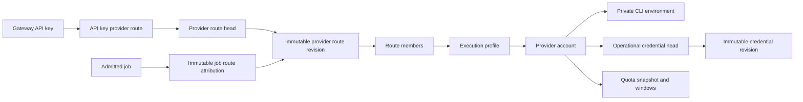

# Managed CLI Accounts and Provider Routing

Status: implemented control-plane, scheduler, and credential broker contracts through migration `0049`, 2026-07-22.

## Goals

- Isolate every CLI account's durable credentials.
- Observe upstream quota outside the image request hot path.
- Let an API key select one account or an account group with the same contract.
- Freeze the selected route revision on every admitted job.
- Prevent an executor outside the frozen route from claiming the job.
- Keep provider-specific login and quota protocols outside the generic scheduler.

## Ownership boundaries

| Module | Owns | Must not own |
| --- | --- | --- |
| `provider_management/codex_app_server.rs` | Codex app-server JSON protocol | SQL, API keys, scheduling |
| `provider_management/postgres.rs` | account registration, environment references, quota snapshots, routes | image request parsing |
| `credentials` | operational credential revisions, heads, refresh leases, runtime resolution | provider login protocols |
| `api/provider_management.rs` | authenticated admin HTTP boundary | provider protocol details |
| `api_keys` | project credentials and atomic initial route binding | CLI processes |
| `admission/postgres` | immutable job route attribution and profile-aware claim | credential files |
| `executor` | profile-bound CLI execution and capacity | API key policy |

## Durable graph

An account route and a group route have the same shape. The `route_kind` field
is presentation metadata; authorization and scheduling never branch on
"account versus group".

## Login and isolation

1. The admin API creates a private directory under `GATEWAY_PROVIDER_HOME_ROOT`.
2. A short-lived `codex app-server --stdio` process runs with that directory as
   `CODEX_HOME`. Inherited provider API-key variables are removed.
3. Device-code state is bounded to a 15-minute durable login session.
4. On completion, the control plane validates private `auth.json`, hashes the
   stable upstream account identity, rejects duplicate accounts, provisions the
   execution profile, persists the initial quota observation, and creates a
   single-account route.
5. Failed or expired registration directories are removed. Successful account
   homes are not returned by any HTTP response.

Quota observation and credential maintenance run against the account's private
home. Credential changes are validated and promoted as a new operational
revision; immutable execution-profile identity is not rewritten.

## Operational credential broker

Logical account binding and operational authentication have different
lifecycles. Routes and queued jobs retain immutable account/profile identity,
while a credential head may advance from revision N to N+1 without rewriting a
route, API key, queued job, or execution profile.

The broker persists three structures:

- `provider_account_credential_revisions`: append-only material kind,
  fingerprint, observed access expiry, and revision;
- `provider_account_credential_heads`: current revision, lifecycle, refresh
  deadline, bounded failure state, and a database-clock lease;
- `provider_account_credential_events`: append-only claim, success, failure,
  and reauthorization evidence.

One SQL transaction claims refresh ownership with a monotonically increasing
lease epoch. This serializes gateway replicas and prevents two CLI processes
from consuming the same rotating refresh token. Codex uses app-server
`account/read` with forced token refresh; Grok invokes an authenticated CLI
operation that exercises its native refresh path. Dreamina runs the official
`user_credit` command inside the account's isolated Keychain; the CLI reuses or
refreshes its OAuth state and the broker verifies the stable upstream user ID
before committing the credit snapshot. The broker then records the new auth
metadata and atomically completes the lease. Auth-file providers schedule
refresh 15 minutes before observed expiry; opaque CLI-managed credentials use a
six-hour health interval. Transient failures use bounded exponential backoff;
an explicit invalid-login response enters `reauth_required`.

An executor resolves the credential head immediately before preparing a task
and copies that exact revision into its private spool. `refreshing`, expired,
unsupported, and reauthorization-required credentials fail closed. Work that
already copied an older valid revision remains isolated from source-file
rotation. If a process dies after the CLI rewrites the auth file but before head
promotion, the next lease holder detects the new fingerprint, validates the
same upstream identity, and completes promotion without repeating the refresh.

Dreamina is explicitly modeled as `system_keyring`. On macOS the control plane
creates a private login Keychain and a random wrapping password inside every
account home. Login, credit observation, submit, and poll commands all run with
that home, so accounts do not share OAuth state. Reauthorization first validates
the same upstream user ID in a temporary Keychain, rewraps it with the managed
account password, and atomically replaces the account Keychain. A database
failure restores the previous file. The opaque Keychain revision remains stable
when the CLI rotates OAuth tokens internally; the lease and event ledger record
the successful health check instead of inventing a readable token revision.

## API-key binding

Service-account creation accepts an optional `route_id`. PostgreSQL creates the
service account, initial key, and route binding in one transaction. A missing or
disabled route rolls the whole transaction back, so an unbound secret is never
returned to the caller.

Existing keys without a route retain legacy behavior. Once a provider binding
exists, a command-schema mismatch is fail-closed during admission.

## Admission and scheduling

When the payload is attached, the gateway resolves the API key's logical route
through `provider_route_heads` and copies the current revision into
`job_provider_route_attributions`. The row is immutable even if the API key is
later rebound, the head advances, or the key is revoked. Publishing a revision
updates one head row and does not rewrite every bound API key.

Profile-aware claim is one PostgreSQL transaction using `FOR UPDATE SKIP LOCKED`.
A routed job cannot be claimed by the legacy profile-less, schema-only, or
target-job claim paths. The selected execution profile is written on the work
item in the claim transaction, so retries cannot silently switch accounts.

Eligibility is fail-closed for disabled profiles, accounts, private account
environments, credential pools, resource policies, full capacity, exhausted
quota, and member quota reserve breaches. Quota evidence is usable only when
the snapshot status is `observed`, its age is within the route's configured
freshness interval, and the window has not reset.

Every group member has three independent controls:

- `priority`: strict failover tier; the highest eligible tier wins;
- `weight`: deterministic weighted rendezvous share within a tier;
- `minimum_remaining_percent`: removes the member when any active quota window
  has less remaining headroom than this reserve.

Routes expose two explicit strategies rather than blending incompatible goals:

| Strategy | Ordering after eligibility and priority |
| --- | --- |
| `quota_aware_least_loaded` | fresh evidence first, lowest quota pressure, lowest `allocated/max`, weighted hash for an exact tie |
| `priority_weighted` | fresh evidence first, weighted rendezvous |

Weighted rendezvous uses a stable hash of route ID, frozen revision, job ID,
and execution profile ID. It has no shared round-robin counter and remains
deterministic across gateway replicas.

`unknown_quota_policy=block` requires fresh evidence. `allow` keeps an unknown
member eligible as a lower evidence tier, so it cannot beat a same-priority
member with fresh evidence merely because its missing usage was imputed as a
favorable number. This policy controls availability versus quota safety; it
never fabricates a quota value for display.

Account capacity is controlled by one versioned
`provider_account_execution_controls` row shared by every profile for the
account. `desired_max_concurrency` is checked in the same atomic allocation
update as the immutable policy hard ceiling. A lower target may be saved while
usage is above it: held work finishes and no new allocation is admitted until
the count converges. `draining` removes the account from new route selection,
while work already pinned to the account remains recoverable.

## Runtime model

`workerd` and `executord` remain profile-bound processes. This preserves process
fault isolation and keeps provider credentials out of the gateway. Deployment
must run one executor pair for every enabled profile; the admin UI reports a
newly configured account as `待启动` until those processes are observed.

Automatic executor lifecycle management belongs in a separate supervisor and
must not be embedded in the HTTP gateway. The durable route/profile contract is
already the required input for that supervisor.

## Security and failure rules

- No credential, refresh token, auth file, home path, or upstream account ID is
  returned by the management API.
- Duplicate upstream identities are serialized by a transaction-level advisory
  lock and rejected by the database unique constraint. Profile provisioning,
  environment registration, initial quota, and account-route creation commit in
  that same transaction, so a failed registration cannot leave an orphan profile.
- Login subprocesses are kill-on-drop and time-bounded.
- API key route changes increment `authz_version`.
- Job route attribution is append-only.
- Route revisions and member snapshots reject update/delete at the database
  boundary; optimistic route edits advance a separately locked head.
- Account scheduling edits compare `control_version`, so concurrent operators
  cannot silently overwrite each other.
- Credential refresh claims compare lease owner and epoch, use the database
  clock, and cannot promote after lease expiry or release.
- Credential revisions and events reject update/delete at the database boundary.
- The executor never trusts the profile's historical auth digest as the current
  credential; it resolves and verifies the broker head for every task.
- Quota refresh failures mark the observation unavailable; they do not rewrite
  the last known windows. Admission checks snapshot status, so those old windows
  cannot continue to count as fresh evidence.
- Capacity and route eligibility are checked by PostgreSQL, not by stale
  in-process counters.

## Verification gates

- fresh and concurrent migrations include version `0049`;
- concurrent credential refresh claims admit exactly one owner, metadata-only
  expiry changes create a new immutable revision, stale leases cannot promote,
  and Dreamina CLI-managed Keychain checks complete in place under the same
  fail-closed lease;
- routed service-account creation is atomic and projected in key listings;
- profile-less and out-of-route workers cannot claim a routed job;
- quota pressure, member reserve, failed-refresh, and unknown-block behavior are
  exercised through the real PostgreSQL claim path;
- a deterministic 10,000-job PostgreSQL sample verifies a configured `1:3`
  weighted-rendezvous share within bounded statistical tolerance;
- Rust all-target compilation and provider-management unit tests pass;
- Next.js typecheck, production build, and browser route checks pass.

## Remaining runtime work

The account-group policy is now real, but the following production concerns
remain separate from route configuration:

1. Capacity is atomically enforced when the executor allocation is acquired,
   after the work lease. A future dispatch-reservation stage should reserve an
   account slot in the same transaction as member selection to reduce burst
   concentration before handoff.
2. Managed account environment state is checked during selection, but Codex
   inline executors do not yet publish profile-scoped execution leases. Add
   `execute` readiness leases so an offline preferred member fails over without
   relying on process deployment discipline.
3. Linux Dreamina multi-account operation still needs the planned per-account
   private D-Bus and Secret Service sidecar. macOS multi-account Keychain
   isolation is implemented; Linux must remain unavailable until its equivalent
   runtime is implemented and attested.
4. Legacy API keys may remain unbound for compatibility, and the control-plane
   endpoint still permits creating an unbound new key. Production policy should
   require a route for every newly created provider-capable key while keeping a
   separately audited legacy migration path.

These are deliberately documented as runtime follow-ups rather than represented
by controls that the platform cannot yet honor.
