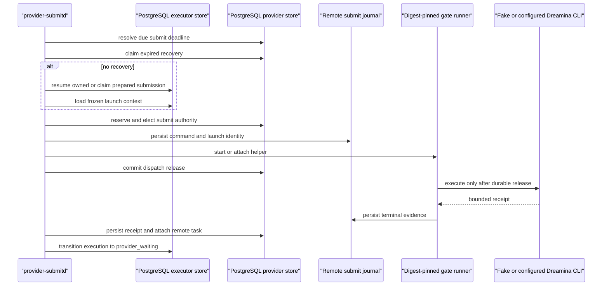

# Phase 2AB: Inactive Provider Submit Service

Date: 2026-07-16

Status: implemented and verified as inactive provider infrastructure. This
phase activates no provider, credential, public route, billing behavior, model
advertisement, or external call.

## Decision

Compose one bounded `provider-submitd` process from existing provider-neutral
runtime capabilities:

```text
active database runtime profile
  + exact account-home capability
  + digest-pinned Dreamina submit codec
  + digest-pinned remote-submit runner
  + recoverable attempt workspace
  + PostgreSQL executor/provider stores
  + bounded submit service and daemon
  -> one inactive Dreamina image submit process
```

The process is disabled unless
`PROVIDER_SUBMITTER_ACTIVATION=dreamina-image-submit-v1` is present. It does not
discover credentials, advertise a model, register a route, or make a provider
call during startup.

No queue, broker, scheduler framework, table, or provider-specific store was
added. PostgreSQL remains the durable scheduling authority. The submit daemon
is a composition root, not a second orchestration implementation.

## Module Boundaries

### Shared provider runtime

`ProviderRuntimeProfile` and `ProviderRuntimeProfileStore` now live directly
under `provider_tasks`, rather than under `provider_tasks::poll`.

The profile is shared by submit and poll because it freezes the same durable
facts:

- execution profile and operation identity;
- provider and command schema;
- adapter and operation descriptor revisions;
- idempotency and completion modes;
- credential pool, account, revision, and authentication digest;
- resource policy revision; and
- maximum concurrency.

`ProviderAccountHomeCapability` moved to the same provider-task level. It binds
one private account directory to the exact frozen profile identity. Submit and
poll consume the capability but do not own credential lookup or login.

This is a dependency correction, not a generic provider framework. Poll code
continues to own poll behavior; submit code continues to own submit behavior.

### Dreamina adapter

`DreaminaCliSubmitCodecV1::from_runtime_profile` is the provider-specific
composition boundary. It rejects startup unless the database profile exactly
matches the compiled Dreamina image operation:

- provider ID;
- command schema;
- operation ID;
- descriptor revision and canonical digest;
- completion and idempotency semantics;
- adapter revision; and
- account-home identity.

Only after those checks does it build `DreaminaCliPolicyV1` from the
digest-pinned executable, private workspace root, wall timeout, termination
grace, and bound account home.

The provider-neutral daemon never parses Dreamina fields or constructs
Dreamina CLI arguments.

### Process composition

`crates/image-gateway/src/bin/provider-submitd.rs` owns only:

- bounded environment parsing;
- migration verification;
- active profile loading;
- private-root and digest capability construction;
- store, service, daemon, and signal composition;
- non-secret lifecycle diagnostics; and
- exit-status mapping.

It delegates claim ordering, lease heartbeats, deadline resolution, recovery,
dispatch fencing, process gating, receipt recovery, and task attachment to the
existing service stack.

## Durable Flow



The process does not claim general jobs. It claims only prepared executor
submissions matching the frozen execution-profile scope. Recovery for the same
provider/account scope is checked before fresh work.

## Concurrency And Backpressure

The daemon creates exactly `profile.max_in_flight()` asynchronous lanes, capped
at 1024 by `ProviderRuntimeProfile`.

Each lane:

1. resolves at most one due deadline;
2. claims at most one expired recovery;
3. otherwise resumes or claims at most one fresh submission;
4. runs one bounded iteration;
5. loops immediately after productive work; or
6. uses bounded jitter for idle and error delays.

PostgreSQL row claims remain the cross-process concurrency authority. The
connection pool bounds simultaneous database work even when the profile has
more lanes than connections. There is no unbounded task creation per item, no
in-memory work queue, and no process-global mutex around provider execution.

This phase does not claim that one lane per provider slot is optimal at every
scale. The first isolated mixed-load benchmark is now recorded in Phase 2AC;
production-scale cardinality, pool-saturation, journal, and provider latency
evidence remain activation gates.

## Shutdown And Restart

SIGINT and SIGTERM stop new iterations. In-flight iterations are allowed to
finish within `PROVIDER_SUBMITTER_SHUTDOWN_DRAIN_MS`.

If the drain deadline expires, lanes are aborted and the process exits with an
error. Durable provider deadline, journal, recovery, and lease state remain the
restart authority.

The design follows the three-part graceful-shutdown model documented by Tokio:
detect shutdown, notify tasks, and wait for completion. The implementation uses
a watch channel and `JoinSet` because those primitives already exist in the
daemon and avoid adding `tokio-util` solely for cancellation.

Restart does not mean "execute again." A restarted process:

- observes already attached remote tasks as non-submit work;
- resumes owned claims only under the exact lane identity;
- recovers expired sending state through the durable recovery path; and
- reopens the same journal and attempt identity for a released gated launch.

The contract is crash-recoverable fenced dispatch, not a universal
"exactly-once" claim. A provider without a recoverable receipt or compatible
idempotency behavior can still produce an outcome-unknown terminal state.

## Command Count Authority

The first real process test exposed an invalid dependency in the executor
handoff layer: `command_output_count` required every provider command to contain
the OpenAI-style `n` field.

The durable `jobs.requested_units` column is now the provider-neutral output
count authority. It remains bounded to 1 through 10. If a command contains an
`n` field, the handoff layer validates that it is bounded and matches the
durable job. If the field is absent, no provider-specific count field is
invented or parsed.

This preserves the OpenAI consistency check while allowing a frozen Dreamina
command to use its own `generate_num` schema. Dreamina validation remains in
the Dreamina adapter and policy.

## Configuration Contract

Required identity and path variables:

- `PROVIDER_SUBMITTER_ACTIVATION`;
- `PROVIDER_SUBMITTER_PROFILE_KEY`;
- `PROVIDER_SUBMITTER_CREDENTIAL_POOL_ID`;
- `PROVIDER_SUBMITTER_ACCOUNT_ID`;
- `PROVIDER_SUBMITTER_CREDENTIAL_REF`;
- `PROVIDER_SUBMITTER_CREDENTIAL_REVISION`;
- `PROVIDER_SUBMITTER_CREDENTIAL_AUTH_SHA256`;
- `PROVIDER_SUBMITTER_ACCOUNT_HOME`;
- `PROVIDER_SUBMITTER_WORKSPACE_ROOT`;
- `PROVIDER_SUBMITTER_JOURNAL_ROOT`;
- `PROVIDER_SUBMITTER_EXECUTABLE`;
- `PROVIDER_SUBMITTER_EXECUTABLE_SHA256`;
- `PROVIDER_SUBMITTER_RUNNER`; and
- `PROVIDER_SUBMITTER_RUNNER_SHA256`.

The account, workspace, and journal roots must be pre-existing, current-user
owned `0700` directories in separate directory trees. The provider executable
and gate runner must be absolute, non-writable executables matching their
configured lower-case SHA-256 digests.

All durations are bounded to 1 millisecond through 24 hours. Heartbeat interval
times three must fit inside both executor and recovery leases. Error base delay
must not exceed its cap. The optional owner prefix is visible ASCII and capped
so generated lane, claim, and defer identities remain within database limits.

## Security And Diagnostics

Startup logs include only:

- owner prefix;
- execution profile ID and key;
- provider ID;
- provider account ID;
- maximum in-flight count; and
- terminal aggregate counters.

Credential references, credential authentication digests, account-home paths,
workspace paths, journal paths, executable paths, command payloads, and
receipts are not logged by the composition root.

Capabilities fail closed on:

- disabled or incompatible profile dependencies;
- profile/adapter descriptor drift;
- credential identity drift;
- non-private or aliased roots;
- executable or runner digest drift;
- workspace replacement;
- command/workspace mismatch; and
- invalid bounded timing.

## Adversarial Verification

Unit tests prove:

- the shared runtime profile preserves exact scope and capacity while redacting
  credential identity;
- disabled profile dependencies are not runnable;
- account-home binding accepts only the exact profile;
- Dreamina submit composition accepts the exact compiled descriptor;
- descriptor or account drift fails before a provider process can start;
- provider-specific commands can omit `n`;
- an optional OpenAI `n` must still match durable requested units; and
- output counts remain bounded without a command count field.

The disabled-binary test proves missing activation fails before database
configuration is read.

The real PostgreSQL process test:

1. installs the exact Dreamina image runtime profile in a temporary schema;
2. prepares one provider-specific Dreamina command;
3. starts the real `provider-submitd`;
4. uses the real digest-pinned `remote-submit-runner`;
5. executes a local fake Dreamina CLI with no network or external credential;
6. sends SIGTERM after the fake CLI has started;
7. proves the daemon drains and durably attaches the exact remote operation;
8. restarts the same binary with the same database, journal, and workspace;
9. proves the fake CLI invocation count remains exactly one;
10. proves no submit attempt directory remains; and
11. proves lifecycle logs contain no configured credential reference, digest,
    or account-home path.

Existing gated-submit tests separately cover concurrent callers, crash-left
release recovery, receipt replay, absolute deadlines, workspace replacement,
and outcome-unknown no-resubmit behavior.

## Evidence Basis

PostgreSQL documents `SKIP LOCKED` as appropriate for avoiding contention
between multiple consumers of a queue-like table:

- <https://www.postgresql.org/docs/18/sql-select.html#SQL-FOR-UPDATE-SHARE>

PostgreSQL documents the distinction between transaction, statement, and
wall-clock time used by the database-time deadline design:

- <https://www.postgresql.org/docs/18/functions-datetime.html>

Tokio documents graceful shutdown as signal detection, task notification, and
waiting for tasks to finish:

- <https://tokio.rs/tokio/topics/shutdown>

These sources justify selected primitives. They do not prove SOTA, production
throughput, fairness under every workload, or provider-side exactly-once
execution.

## Explicit Limits

This phase does not provide:

- a credentialed Dreamina call;
- provider credential discovery, login, or rotation;
- production activation or model advertisement;
- pricing, spend limits, or billing policy;
- Seedance, Grok, or another provider composition;
- cross-host shared-journal coordination;
- hostile same-UID filesystem isolation;
- network-egress isolation;
- production-scale p50/p95/p99 latency evidence; or
- a claim of industry leadership.

## Next Gates

Before any provider activation:

1. extend the Phase 2AC mixed fresh/recovery benchmark to production-scale
   cardinality, pool saturation, journal synchronization, and provider latency;
2. compose the Phase 2AD runtime lease kernel into submit/poll daemons and
   expose readiness without weakening dependency-free liveness;
3. add credential-source and rotation capabilities without exposing provider
   secrets to the scheduler; and
4. complete the platform-side quota, key-management, and billing control plane
   before adding another external provider.
