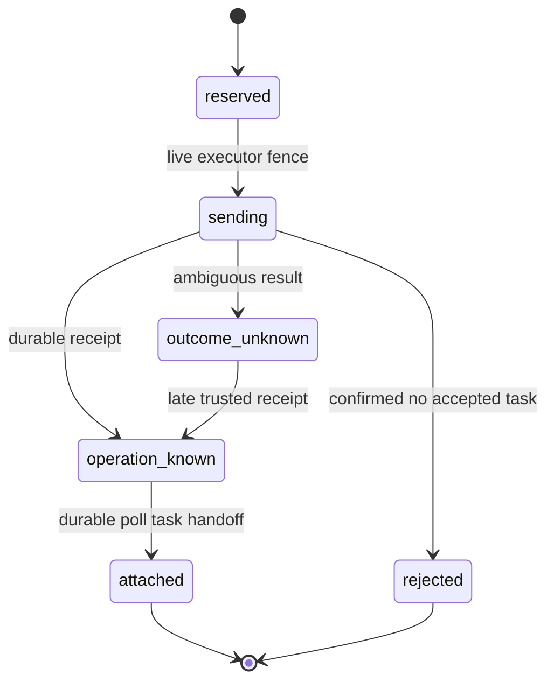

# Phase 2C: Remote Submit Recovery

Status: submit/receipt foundation implemented and PostgreSQL integration
tested; recovery claiming and provider activation remain blocked.

## Objective

Turn a side-effecting CLI submit into a durable protocol that does not blindly
repeat a possibly accepted request, lose a late remote operation identifier, or
release concurrency before the outcome is resolved.

This protocol is provider-neutral. Provider adapters parse native receipts;
the gateway owns durable identity, fencing, canonical resolution, and capacity.

## State Machine

Only the transaction that changes `reserved` to `sending` returns send
authority. Every replay from `sending` or a later state is observation-only and
must not spawn another CLI process.

## Durable Invariants

1. The submit intent is written before the side-effecting process is started.
2. A remote operation ID first becomes authority in `operation_known`.
3. Receipt persistence is bound to the frozen launch identity, not to whether
   the old executor lease is still live.
4. The generic executor-expiry reconciler skips `sending`, `outcome_unknown`,
   and `operation_known`; submit recovery owns those executions.
5. `operation_known -> attached`, remote task creation, initial observation,
   and executor handoff commit in one database transaction. A deferred database
   constraint rejects a standalone `attached` intent.
6. Confirmed rejection creates a canonical resolution decision, releases
   capacity, and enqueues the existing terminal reducer in the same transaction.
   A deferred database constraint rejects a standalone `rejected` intent.
7. Ambiguity evidence and a later receipt are stored separately; accepting the
   receipt cannot erase or invalidate the earlier observation.
8. A customer idempotency key prevents duplicate platform commands. It is not
   treated as provider-enforced submit idempotency.

## Recovery Ownership

| State | Allowed action | Forbidden action |
| --- | --- | --- |
| `reserved` | acquire one send authority | attach or poll |
| `sending` | inspect durable provider evidence | automatic resubmit |
| `outcome_unknown` | accept a late receipt | automatic resubmit or unfenced finalization |
| `operation_known` | attach the existing operation | submit again |
| `attached` | poll through the poll lease | reacquire executor ownership |
| `rejected` | reduce terminal failure | mutate evidence |

Phase 2D adds the provider/account-scoped leased recovery claim, frozen execution
context, and database-time absolute deadline. Deadline terminalization remains
blocked; a global read-only scan would not provide authority or fair progress.

## Crash Matrix

| Crash point | Durable state | Recovery |
| --- | --- | --- |
| before `start_submit` commits | `reserved` | the same live launch fence may retry; expiry follows generic no-side-effect recovery |
| after `sending`, before spawn | `sending` | reconcile provider evidence; no blind retry |
| provider accepted, before receipt write | `sending` | persist late receipt as `operation_known` |
| ambiguous CLI exit | `outcome_unknown` | late receipt; terminal reconciliation is not enabled yet |
| after receipt, before attach | `operation_known` | attach existing operation, even after lease expiry |
| during attach transaction | `operation_known` or `attached` | transaction rollback or idempotent replay |
| confirmed rejection | `rejected` plus canonical `failed` | terminal reducer continues |

## Activation Gates Still Open

This phase deliberately does not add a submit daemon or activate Dreamina.
Before activation, the platform still needs:

- a fenced resolver that terminalizes the Phase 2D absolute provider deadline as
  unknown remote effect without creating capacity oversubscription;
- atomic or recoverable materialization between `artifact_ready` and canonical
  success;
- capacity heartbeat during long poll and materialization operations;
- an adapter-specific submit orchestrator that is the only caller allowed to
  spawn after `ProviderSubmitStart::Acquired`.

These are platform responsibilities and must not be implemented inside the
Dreamina adapter.

## Verification

The PostgreSQL tests cover concurrent reservation/start, one elected sender,
duplicate receipt convergence, account-scoped remote ID uniqueness, frozen
submit identity, generic reconciler exclusion, late receipt after executor lease
expiry, late attach, preserved ambiguity evidence, confirmed rejection,
failure-kind replay conflicts, capacity release, terminal reducer enqueueing,
rejection of incomplete raw-SQL terminal projections, and an `0017 -> 0018`
attached receipt backfill.
