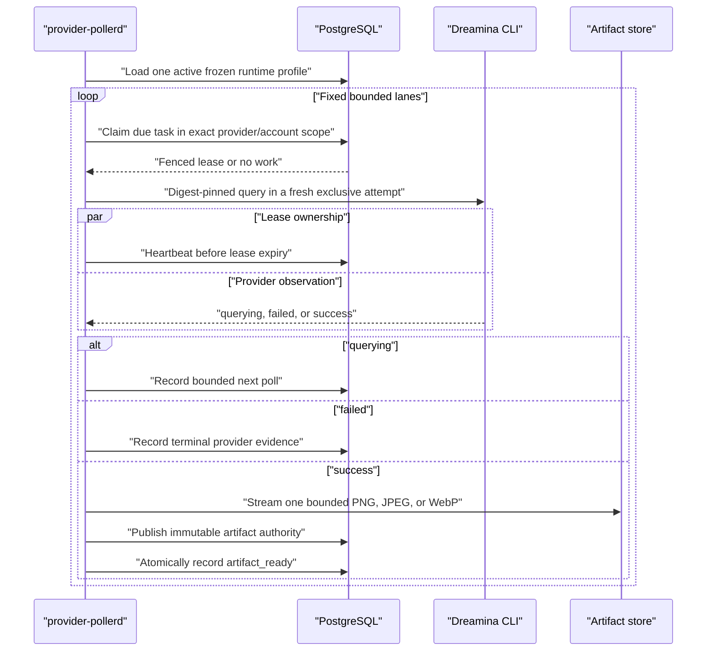

# Phase 2X: Inactive Provider Poll Service

Date: 2026-07-16

Status: implemented and verified with local process tests and real PostgreSQL
18 integration. The Dreamina image provider remains inactive: no deployment
manifest, public route, model advertisement, credential login, external
provider call, quota consumption, billing change, or production artifact write
is included.

## Decision

Remote CLI polling runs in a dedicated process composed around exactly one
immutable provider execution profile:

```text
explicit activation token
  -> bounded environment configuration
  -> one active PostgreSQL runtime profile
  -> exact provider operation descriptor
  -> exact account-home capability identity
  -> digest-pinned executable
  -> exclusive private attempt workspace
  -> statically typed provider driver
  -> provider-neutral poll orchestrator
  -> fixed-lane poll daemon
  -> SIGINT/SIGTERM bounded drain
```

The first process is `provider-pollerd` and the first compiled composition is
the inactive Dreamina image query driver. The process is not a cross-provider
router. A deployment instance owns one frozen execution profile and therefore
one provider/account/resource-policy scope.

This keeps provider protocol code outside the scheduler and database store,
keeps PostgreSQL outside the provider adapter, and avoids runtime trait-object
dispatch in the poll loop. Adding another provider requires another
provider-specific composition, not changes to the claim, lease, heartbeat,
artifact authority, or daemon state machines.

## Ownership Boundaries

### `crates/cli-runtime`

Owns Unix process capabilities:

- digest-pinned executable validation;
- working-directory descriptor and inode binding;
- exact `0700` current-user validation for private directories;
- required-directory revalidation immediately before spawn;
- process-group cancellation and bounded termination; and
- redacted `Debug` output for private directories and command payloads.

`CommandSpec::require_directory` is provider-neutral. It lets a policy require
that a credential home, mount, socket directory, or other process prerequisite
still has the verified identity at spawn time without teaching the runtime
about Dreamina.

### `crates/provider-dreamina-cli`

Owns only the provider protocol:

- the immutable image-generation operation descriptor;
- canonical command and query argument projection;
- strict receipt parsing;
- supported image model and option vocabulary;
- the durable adapter revision; and
- construction of a shell-free `CommandSpec`.

It does not depend on PostgreSQL, task leases, artifact storage, scheduling,
quota, billing, HTTP, or the service binary.

### `crates/image-gateway/src/provider_tasks`

Owns provider-neutral durable orchestration:

- active poll runtime profile loading;
- provider/account-scoped `SKIP LOCKED` claims;
- lease epochs and heartbeats;
- lazy artifact materialization permits;
- immutable artifact authority publication;
- atomic terminal observation; and
- fixed-lane pacing, error backoff, and shutdown drain.

`ProviderAccountHomeCapability` is the narrow composition boundary between a
deployment credential provisioner and a provider driver. It binds:

```text
provider_id
credential_pool_id
provider_account_id
credential_ref
credential_revision
credential_auth_sha256
private WorkingDirectory
```

Binding succeeds only when every identity field equals the loaded runtime
profile. The capability does not read credential files, infer a provider login
layout, or return secret bytes.

### `crates/image-gateway/src/providers/dreamina_cli`

Owns the gateway-side provider composition:

- exact descriptor/profile comparison;
- exact account capability binding;
- runtime execution-context construction;
- image-only result materialization; and
- provider failure classification.

It cannot query SQL directly and cannot mutate quota, billing, API keys, or
public responses.

### `crates/image-gateway/src/bin/provider-pollerd.rs`

Owns process composition and lifecycle only:

- environment parsing and bounded defaults;
- database connection and migration verification;
- one profile load;
- account, executable, workspace, and artifact capability construction;
- static driver/orchestrator/daemon wiring;
- redacted startup and terminal diagnostics; and
- SIGINT/SIGTERM shutdown.

No provider-specific SQL, receipt parsing, task state transition, or artifact
format logic lives in the binary.

## Startup Fences

Startup fails before provider work can be claimed unless all of these agree:

1. `PROVIDER_POLLER_ACTIVATION` is exactly `dreamina-image-v1`.
2. The selected profile, credential pool, account, and resource policy are
   enabled in one PostgreSQL statement snapshot.
3. The profile completion mode is `remote_task`.
4. Provider ID, command schema, operation ID, descriptor revision, canonical
   descriptor digest, idempotency mode, and adapter revision equal the compiled
   Dreamina descriptor.
5. Credential pool ID, account ID, credential reference, credential revision,
   and authentication digest equal the deployment-supplied account capability.
6. The account home and workspace are absolute, real, current-user-owned
   directories with exact mode `0700`.
7. The executable is absolute, executable, not group/world writable, and
   matches the configured SHA-256 digest.
8. Account home, workspace, and artifact root are separate canonical directory
   trees.
9. Materialization and artifact limits are non-zero and within the compiled
   runtime limits.
10. Materialization concurrency does not exceed the frozen profile execution
    concurrency.
11. Lease, heartbeat, pacing, backoff, shutdown, and CLI durations are bounded;
    heartbeat times three cannot exceed the lease.

The workspace root is revalidated when each attempt is created. The private
account home and per-attempt working directory are revalidated immediately
before process spawn. Replacing a path, inode, owner, or permission after
composition therefore fails before the CLI process starts.

## Environment Contract

Required identity and capability inputs:

| Variable | Contract |
|---|---|
| `PROVIDER_POLLER_ACTIVATION` | Exact compiled activation token |
| `PROVIDER_POLLER_PROFILE_KEY` | Active durable execution profile key |
| `PROVIDER_POLLER_CREDENTIAL_POOL_ID` | Non-nil UUID matching the profile |
| `PROVIDER_POLLER_ACCOUNT_ID` | Non-nil UUID matching the profile |
| `PROVIDER_POLLER_CREDENTIAL_REF` | Bounded non-control identity reference |
| `PROVIDER_POLLER_CREDENTIAL_REVISION` | Positive integer matching the profile |
| `PROVIDER_POLLER_CREDENTIAL_AUTH_SHA256` | Lower-case SHA-256 matching the profile |
| `PROVIDER_POLLER_ACCOUNT_HOME` | Absolute private account-home directory |
| `PROVIDER_POLLER_WORKSPACE_ROOT` | Absolute private dedicated attempt root |
| `PROVIDER_POLLER_EXECUTABLE` | Absolute provider CLI path |
| `PROVIDER_POLLER_EXECUTABLE_SHA256` | Lower-case executable SHA-256 |
| `PROVIDER_POLLER_MAX_ARTIFACT_BYTES` | Explicit non-zero artifact limit |
| `PROVIDER_POLLER_MAX_MATERIALIZATIONS` | Explicit non-zero streaming limit |

The service also requires the existing `DATABASE_URL`,
`GATEWAY_DATABASE_SCHEMA`, and `GATEWAY_ARTIFACT_ROOT` contracts.

Optional bounded controls:

| Variable | Default |
|---|---:|
| `PROVIDER_POLLER_OWNER` | Random process owner ID |
| `PROVIDER_POLLER_LEASE_MS` | 60000 |
| `PROVIDER_POLLER_HEARTBEAT_INTERVAL_MS` | 10000 |
| `PROVIDER_POLLER_IDLE_DELAY_MS` | 250 |
| `PROVIDER_POLLER_ERROR_BASE_DELAY_MS` | 250 |
| `PROVIDER_POLLER_ERROR_MAX_DELAY_MS` | 30000 |
| `PROVIDER_POLLER_SHUTDOWN_DRAIN_MS` | 30000 |
| `PROVIDER_POLLER_CLI_WALL_TIMEOUT_MS` | 60000 |
| `PROVIDER_POLLER_CLI_TERMINATION_GRACE_MS` | 2000 |

Every duration must be in `1..=86400000` milliseconds. There is deliberately
no default for artifact size or materialization concurrency because silently
choosing those values would create a production resource policy.

Environment variables are currently the deployment injection mechanism. This
phase does not claim they are a credential broker. Production provisioning
must attest that the identity metadata and private directory originated from
the approved secret-management boundary.

## Poll Lifecycle



Polling does not hold a database transaction while the CLI runs. Lease
heartbeats and terminal writes recheck owner, lease epoch, task identity, and
the database absolute deadline. A stale or expired process cannot publish
authority or terminal evidence.

The materialization semaphore is acquired lazily on the first artifact byte.
Pending and failed queries therefore do not consume a streaming permit.

## Shutdown Contract

The process listens for `SIGINT` and `SIGTERM`. The first signal stops new lane
iterations and gives in-flight work the configured drain budget. If the budget
expires, the daemon aborts the remaining iteration; cancellation drops the
provider future, and the CLI runtime terminates and waits for the process group.

Shutdown is bounded, but this phase does not add an HTTP health or readiness
listener. A later deployment manifest must define process-level startup,
liveness, readiness, and restart policy without putting provider work in an
HTTP handler.

## Performance Bound

Service startup performs:

- one database pool initialization and migration verification;
- one active profile query;
- one executable SHA-256 pass;
- bounded path canonicalization and metadata validation; and
- one fixed task allocation per daemon lane.

The poll hot path adds no runtime profile query, credential lookup, provider
registry lookup, dynamic dispatch, cross-account scheduler, or configuration
lock. The compiled driver, orchestrator, and stager are monomorphized generic
types. Concurrency is bounded independently at:

- daemon lanes;
- one durable lease per remote task;
- frozen provider-account execution capacity;
- lazy artifact materializations; and
- CLI wall time and artifact bytes.

These are structural bounds, not benchmark results. No lowest-overhead, SOTA,
or industry-leading performance claim is made without representative p50,
p95, and p99 measurements for claim latency, CLI latency, lock wait, artifact
throughput, CPU, RSS, database I/O, WAL, and multi-daemon fairness.

## Evidence-Driven Correction

The first real PostgreSQL process test rejected the initial adapter revision
`dreamina-cli/remote-task/v1`. The durable execution-profile schema has always
required adapter revisions to match `^[A-Za-z0-9_.-]+$`.

The adapter revision was corrected to:

```text
dreamina-cli.remote-task.v1
```

The operation descriptor revision remains
`dreamina-cli/images.generations/v1`; it has a different durable text contract
that permits the slash. A regression test now verifies the adapter revision
against the durable identifier character set.

This failure was detected before any provider activation or external call.
It demonstrates why local codec tests alone are insufficient for service
composition.

## Verification

Focused tests prove:

- private account homes reject non-`0700` permissions;
- profile/capability identity drift rejects composition;
- descriptor digest drift rejects composition before workspace ownership;
- private directory permission drift rejects immediately before spawn;
- private paths, environment values, arguments, and stdin are absent from
  command `Debug`;
- the activation token is checked before `DATABASE_URL`;
- nested or aliased account, workspace, and artifact roots are rejected;
- workspace ownership is exclusive and crash-left attempts are recovered;
- pending, failure, success, malformed, oversized, and cancellation paths leave
  no attempt directory; and
- image bytes and sink manifests must agree before terminal success.

The real PostgreSQL 18 process test:

1. creates an isolated migrated schema;
2. inserts an enabled Dreamina image profile, pool, account, and policy;
3. attaches one durable remote task;
4. starts the real `provider-pollerd` binary;
5. uses a local digest-pinned fake CLI with no network access;
6. copies a valid PNG through the same CLI output and artifact path;
7. waits for durable `artifact_ready`;
8. sends `SIGTERM` to the process group;
9. verifies bounded successful drain;
10. verifies exact artifact bytes and empty attempt workspace; and
11. verifies logs contain lifecycle diagnostics but not credential reference,
    authentication digest, or account-home path.

No real Dreamina account, request, callback, or provider artifact is used.

The final repository gate runs `cargo test --workspace --all-targets` twice
against real PostgreSQL with one test thread, runs Clippy with warnings denied
for every workspace target, checks Rust formatting and diff whitespace, and
runs the admin TypeScript typecheck. The paid real-Codex image smoke remains
explicitly ignored.

## Evidence Basis

PostgreSQL 18 documents `SKIP LOCKED` for queue-like multiple-consumer access:
<https://www.postgresql.org/docs/18/sql-select.html#SQL-FOR-UPDATE-SHARE>.

Tokio documents `ctrl_c` process-wide signal registration semantics:
<https://docs.rs/tokio/latest/tokio/signal/fn.ctrl_c.html>.

Rust documents Unix metadata ownership and mode access through `MetadataExt`:
<https://doc.rust-lang.org/std/os/unix/fs/trait.MetadataExt.html>.

Descriptor-relative workspace operations remain based on the Rust, rustix, and
POSIX sources recorded in
[`2026-phase2w-exclusive-cli-attempt-workspace.md`](2026-phase2w-exclusive-cli-attempt-workspace.md).

These sources justify the selected primitives. They do not prove that this
repository is SOTA or production-ready.

## Explicit Limits

Phase 2X does not provide:

- production deployment or Dreamina activation;
- a credential broker, login, refresh, revocation, or rotation workflow;
- live profile revocation after startup;
- provider query QPS limiting or distributed token buckets;
- cooldown, retry-after coordination, circuit breaking, or account rotation;
- provider quota probing, spend controls, pricing, metering, or billing;
- cross-account scheduling or dynamic lane redistribution;
- callbacks, cancellation, or submit-service composition;
- Linux cgroup, namespace, seccomp, dedicated-UID, or egress isolation;
- S3-compatible provider artifact staging;
- an HTTP health/readiness endpoint or production alert thresholds;
- production-scale latency, throughput, failure, or soak benchmarks;
- a credentialed Dreamina image smoke test;
- Dreamina model advertisement or an official public API facade; or
- Seedance, video materialization, Grok, or any other provider.

## Next Gate

The next independently verifiable work should close provider submit-service
composition or provider-account control policy without activating Dreamina.
Before a real provider smoke, the platform still needs an approved credential
provisioning boundary, provider query rate/cooldown policy, spend and quota
guards, host isolation, and deployment health semantics.

Phase 2Y first closes the fenced submit-recovery kernel required by that
service:
[`2026-phase2y-fenced-provider-submit-recovery.md`](2026-phase2y-fenced-provider-submit-recovery.md).
