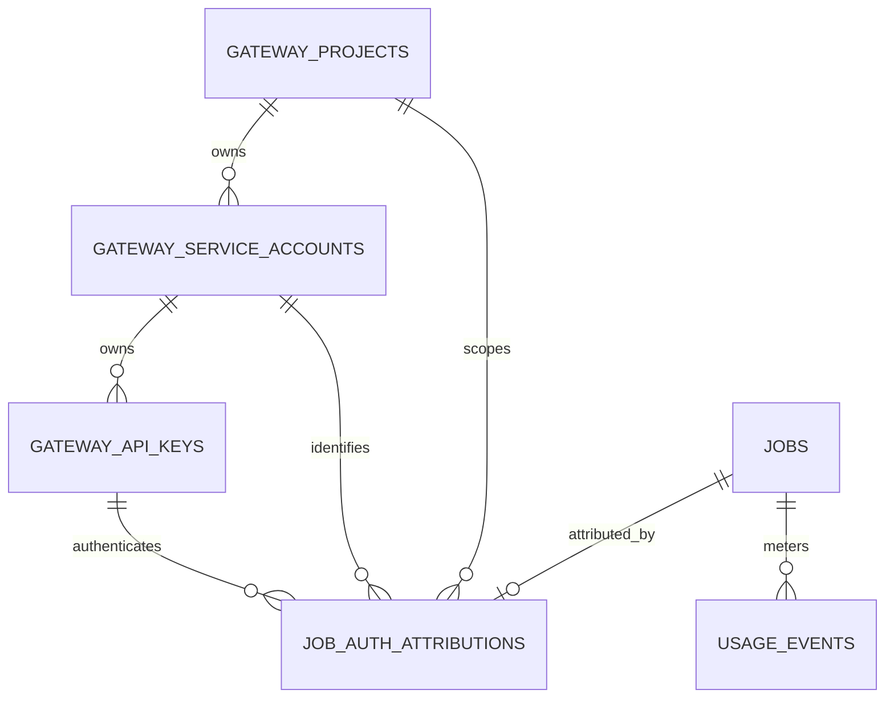

# Project Credential Attribution

Status: implemented; production acceptance still requires deployment rehearsal and load evidence.

## Decision

The platform adds one authoritative project table and one narrow, immutable job
authentication-attribution table. A project owns service accounts, a service
account owns API keys, and every newly admitted authenticated job records the
credential identity that crossed the final admission boundary.

Economic tables continue to use `job_id` as their stable join key. They do not
copy project, service-account, or API-key identifiers.

Migration `0036_project_credentials_attribution.sql` is intentionally additive.
The matching runtime performs the final credential recheck and writes each new
job attribution in the quota-reserve transaction. Applying the migration alone
does not make an older binary project-aware and does not justify a per-key
billing claim.

## Core Invariants

1. `gateway_projects` is the authority for project-to-tenant ownership. Project
   status is derived: `archived_at IS NULL` means active; a non-null value means
   archived. There is no separately mutable status column.
2. A service account's `(project_id, tenant_id)` must reference one project.
3. An API key's `(service_account_id, project_id, tenant_id)` must reference one
   service account. A key cannot be moved between accounts, projects, or tenants.
4. An `api_key` attribution contains tenant, project, service account, and key.
   The composite foreign keys reject every cross-owner combination.
5. A `legacy` attribution has no service-account or API-key identity. It may
   retain a known project, but unknown historical ownership remains unknown.
6. There is at most one authentication attribution per job, and it must have
   the same tenant as the job.
7. Authentication attribution is immutable after insertion. Database triggers
   reject `UPDATE` and `DELETE`; corrections require an explicit forward repair
   with auditable operator approval, not an application rewrite.
8. Historical jobs are not backfilled with guessed credentials. Absence of an
   attribution row means unknown coverage, not `legacy` and not the default key.
9. `authz_version` is positive and monotonic for a credential. `expires_at` and
   `deleted_at` are authorization inputs, not duplicated status fields.

The schema does not require every historical job to have an attribution row.
The compatible runtime must insert the job and its attribution in the same
transaction for all new admissions before the feature is enabled.

## Admission And Revocation Linearization

Initial token parsing and HMAC verification may use a normal indexed read. That
read is not the authorization linearization point because a key can be revoked
before durable admission.

The final quota-reserve or attach transaction must:

1. Resolve the key by primary key and join its service account and project.
2. Require active project and service account, `deleted_at IS NULL`, a valid
   time window, and the exact `authz_version` authenticated at the HTTP boundary.
3. Lock the matched project, service-account, and key rows with `FOR SHARE`.
4. Insert the job, `job_auth_attributions`, quota reservation, and initial
   metering facts in the same transaction.
5. Commit before dispatching work to a provider or CLI.

Revocation is a short `UPDATE gateway_api_keys SET deleted_at = ...` transaction.
The update conflicts with the admission transaction's shared key-row lock:

- If revocation commits first, the final recheck finds no active key and the
  job cannot be admitted.
- If admission acquires the shared lock first, revocation waits; the committed
  job remains valid and permanently attributed to that key.

Concurrent admissions use compatible shared locks, so a popular key is not
serialized request by request. The same protocol applies to image generation,
image edits, and video generation. Routes that stage or decode input before job
creation perform the recheck at final attach, after staging and before commit.

Idempotent replay never changes origin attribution. If Key B replays a request
first admitted by Key A, the existing job remains attributed to Key A; request
audit may record B separately.

## Official API Mapping

The control-plane API follows official resource shapes while keeping local
authorization and billing implementation private.

| Method | Route | Status | Local authority |
| --- | --- | --- | --- |
| `GET` | `/v1/organization/projects` | Implemented | `gateway_projects` keyset list |
| `POST` | `/v1/organization/projects` | Implemented | Create active project and server-generated ID |
| `GET` | `/v1/organization/projects/{project_id}` | Planned | Project details |
| `POST` | `/v1/organization/projects/{project_id}/archive` | Planned | Set `archived_at`; reject future admission |
| `GET` | `/v1/organization/projects/{project_id}/service_accounts` | Planned | Project-scoped service accounts |
| `POST` | `/v1/organization/projects/{project_id}/service_accounts` | Implemented | Create account and reveal its first key once |
| `GET` | `/v1/organization/projects/{project_id}/api_keys` | Implemented | Stable project-scoped key list |
| `GET` | `/v1/organization/projects/{project_id}/api_keys/{api_key_id}` | Planned | Redacted key metadata |
| `DELETE` | `/v1/organization/projects/{project_id}/service_accounts/{service_account_id}` | Implemented | Revoke the account and its owned keys |
| `DELETE` | `/v1/organization/projects/{project_id}/api_keys/{api_key_id}` | Implemented guard | Reject direct deletion of service-account-owned keys; revoke through the account |

Project and key lists use `(created_at, id)` internally. The public `after` ID
is resolved within the requested project before applying tuple comparison. A
cursor from another project is rejected and cannot enumerate that project.

The one-time API-key value exists only in the successful creation response.
List and detail responses contain redacted metadata and must never expose the
secret, HMAC, or pepper version. Creation responses use `Cache-Control: no-store`.

Reference contracts:

- [OpenAI Projects](https://developers.openai.com/api/reference/resources/admin/subresources/organization/subresources/projects)
- [OpenAI create project](https://developers.openai.com/api/reference/resources/admin/subresources/organization/subresources/projects/methods/create)
- [OpenAI create project service account](https://developers.openai.com/api/reference/resources/admin/subresources/organization/subresources/projects/subresources/service_accounts/methods/create)
- [OpenAI project API keys](https://developers.openai.com/api/reference/resources/admin/subresources/organization/subresources/projects/subresources/api_keys/methods/list)

These references define the HTTP compatibility target. They do not transfer
OpenAI's internal tenancy or authorization implementation into this platform.

## Query And Write Cost

The hot admission path adds one indexed ownership recheck and one narrow-row
insert. Composite foreign keys enforce ownership without application-side
repair queries. Shared locks allow concurrent use of one key while preserving a
clear revocation order.

Indexes are workload-specific:

- active projects: `(created_at, id)`;
- non-revoked project keys: `(project_id, created_at, id)`;
- per-key jobs: `(api_key_id, admitted_at_ms DESC, job_id DESC)`;
- per-project jobs: `(project_id, admitted_at_ms DESC, job_id DESC)`;
- job usage traversal: `(job_id, created_at_ms)`.

`last_used_at` is deliberately absent from covering indexes so its coalesced
updates can remain HOT where PostgreSQL has page space. Dynamic expiry is
checked at admission and is not encoded in a time-dependent partial-index
predicate.

Billing, rating, receipts, and ledger reads join through `job_id` only when the
caller asks for a credential dimension. Tenant-wide settlement keeps its
current access path and pays no extra identity-column write amplification.

## Local Runtime Cleanup And Artifact Retention

The provider runtime and the platform artifact store have different lifetimes.
For Codex execution, the helper copies the validated output into its durable
`output.bin`, then removes the private Codex home, workspace, generated-image
path, runtime home, and copied authentication file before publishing a
successful terminal marker. Failed and uncertain executions follow the same
cleanup path. A cleanup failure changes the outcome to
`codex_local_cleanup_failed`/`uncertain`; the platform must not report success
while CLI-local media or credentials may still be present.

`output.bin`, the executor object, and the customer artifact remain recovery
and idempotent-response authority after CLI cleanup. They contain media bytes
but no provider login material. Immediate deletion after the first HTTP
response would make safe idempotent replay impossible, so artifact deletion is
a separate retention transition: expire the response projection, delete both
artifact objects, retain the minimal idempotency and economic records, and
return the documented HTTP 410 result on later replay.

The CLI-local cleanup is implemented and covered by both a process-spool test
and a real Codex generation. Migration `0037` adds the bounded platform
artifact lifecycle. Each response snapshots its policy version and durations;
`reconcilerd` first makes replay logically expired, waits the read-drain window,
then uses a database-clock lease and epoch fence to delete customer and executor
objects outside PostgreSQL transactions. It retains artifact hashes, response
projection, idempotency binding, attribution, usage, receipt, and ledger facts.
Platform artifact retention must never be described as Codex CLI local history
cleanup: runner-journal payload retention remains a separate execution-local
recovery boundary.

## Deliberate Non-Goals

- No PostgreSQL row-level security. Trusted runtime roles and the separate
  admin read role remain the security boundary until delegated project roles
  require connection-scoped policies.
- No Redis credential cache or revocation bus. PostgreSQL is already required
  for quota admission, and the indexed recheck supplies linearizable truth.
- No project, service-account, or API-key columns copied into every usage,
  receipt, rated-usage, or ledger table.
- No ledger account per API key. A key is an attribution dimension, not the
  owner of economic value.
- No JSONB identity snapshot as the only source of truth.
- No guessed historical key attribution.
- No quota aggregation or scheduler-fairness redesign in this migration.

Scopes and delegated project grants remain separate follow-up migrations. Until
they exist, project administration is restricted to the platform-owner role;
global `api-keys:*` scopes must not be delegated as project-local authority.

## Migration And Rollback

### Upgrade

1. Back up the database and verify that every API key's `project_id` matches its
   service account. The composite foreign-key validation fails closed on dirty
   ownership data.
2. Pause service-account and API-key control-plane writes. Existing binaries do
   not provide the new non-null `tenant_id` columns and must not create
   credentials during the deployment window.
3. Apply migrations through `0036`. Project rows are derived from existing
   credentials; `proj_default` maps to `tenant_default`, while every other
   historical project preserves the old `project_id == tenant_id` behavior.
4. Deploy a compatible binary that creates projects authoritatively, supplies
   tenant ownership, performs the final `FOR SHARE` recheck, and writes job plus
   attribution atomically.
5. Resume credential writes only after runtime and negative authorization tests
   pass.

The migration adds nullable columns before backfill. Required-column checks are
validated before `SET NOT NULL`, and existing-table foreign keys are added `NOT
VALID` then validated. It takes no explicit table-wide lock. Unique indexes and
foreign-key validation still consume real database work and must be rehearsed
at production cardinality.

### Rollback

Schema versions are forward-only. After `0036` commits, rolling back only the
binary is unsupported because old credential writers omit `tenant_id`. Use a
tested forward repair or restore the pre-migration database backup. During an
uncommitted migration failure, PostgreSQL transactional DDL restores the prior
schema.

Do not drop attribution rows to roll back a feature. They are security and
billing evidence. A later contract migration may remove superseded indexes or
compatibility columns only after all readers and writers have moved forward.

## Verification Matrix

| Area | Required proof |
| --- | --- |
| Fresh migration | Apply `0000 -> 0036`; verify seed project, constraints, indexes, and migration metadata |
| Existing migration | Apply `0000 -> 0035`, insert representative legacy credentials/jobs/usage, then apply `0036` |
| Ownership | Reject project/tenant, service-account/project, and key/service-account mismatches at the database boundary |
| Historical truth | Existing jobs have no fabricated attribution; known historical coverage is reported separately |
| Immutability | Reject attribution `UPDATE` and `DELETE` |
| Admission | Image generation, image edit, and video each atomically write one complete API-key attribution |
| Legacy auth | New legacy-token jobs write `auth_kind=legacy`, no service account or key, and only a known project when authoritative |
| Revocation race | Prove both revoke-before-reserve rejection and reserve-before-revoke completion across two connections |
| Idempotency | A replay under another key returns the original job without changing its attribution |
| Pagination | Create at least 101 keys in one second; traverse without omission or duplication; reject cross-project cursors |
| Usage | Every new charged event carries the admitted `job_id`; per-key aggregation neither loses nor double-counts outputs |
| Performance | Compare same-key and distinct-key concurrent admission; inspect `EXPLAIN (ANALYZE, BUFFERS)` for 31-day key/project reads |
| Secret safety | Creation is `no-store`; lists, details, logs, traces, and OpenAPI examples contain no key value or hash material |

Production acceptance requires representative cardinality and concurrency, not
only migration success on an empty development database.
